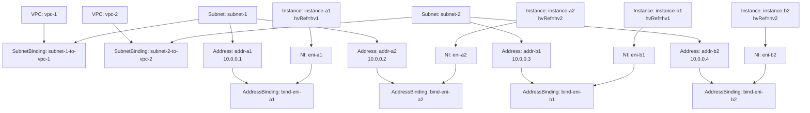

# API Mock: curl-запросы для прототипа in-cloud

| | |
|---|---|
| **Base URL** | `http://api:9006` |
| **Content-Type** | `application/json` |
| **Все операции** | `POST` |
| **Namespace** | `tenant-poc` |
| **VNI / IP** | Назначаются сервером (mock возвращает фиксированные значения) |

---

## 1. Маппинг PoC → API-ресурсы

### 1.1 Топология из HV-SETUP.md

| PoC Container | HV | VPC | IP | MAC |
|---|---|---|---|---|
| container-a1 | HV1 (10.123.0.12) | VPC-1 (VNI 100001) | 10.0.0.1 | 02:42:0a:00:00:01 |
| container-a2 | HV2 (10.123.0.5) | VPC-1 (VNI 100001) | 10.0.0.2 | 02:42:0a:00:00:02 |
| container-b1 | HV1 (10.123.0.12) | VPC-2 (VNI 100002) | 10.0.0.3 | 02:42:0a:00:00:03 |
| container-b2 | HV2 (10.123.0.5) | VPC-2 (VNI 100002) | 10.0.0.4 | 02:42:0a:00:00:04 |

### 1.2 API-ресурсы

| Тип | name | Ключевые поля |
|---|---|---|
| VPC | `vpc-1` | status.vni = 100001 |
| VPC | `vpc-2` | status.vni = 100002 |
| Subnet | `subnet-1` | spec.cidrBlock = 10.0.0.0/24 |
| Subnet | `subnet-2` | spec.cidrBlock = 10.0.0.0/24 |
| SubnetBinding | `subnet-1-to-vpc-1` | subnet-1 → vpc-1 |
| SubnetBinding | `subnet-2-to-vpc-2` | subnet-2 → vpc-2 |
| Instance | `instance-a1` | spec.hvRef = hv1 |
| Instance | `instance-b1` | spec.hvRef = hv1 |
| Instance | `instance-a2` | spec.hvRef = hv2 |
| Instance | `instance-b2` | spec.hvRef = hv2 |
| NetworkInterface | `eni-a1` | spec.instanceRef → instance-a1 |
| NetworkInterface | `eni-a2` | spec.instanceRef → instance-a2 |
| NetworkInterface | `eni-b1` | spec.instanceRef → instance-b1 |
| NetworkInterface | `eni-b2` | spec.instanceRef → instance-b2 |
| Address | `addr-a1` | private, subnet-1 → status.ip = 10.0.0.1 |
| Address | `addr-a2` | private, subnet-1 → status.ip = 10.0.0.2 |
| Address | `addr-b1` | private, subnet-2 → status.ip = 10.0.0.3 |
| Address | `addr-b2` | private, subnet-2 → status.ip = 10.0.0.4 |
| AddressBinding | `bind-eni-a1` | addr-a1 ↔ eni-a1 |
| AddressBinding | `bind-eni-a2` | addr-a2 ↔ eni-a2 |
| AddressBinding | `bind-eni-b1` | addr-b1 ↔ eni-b1 |
| AddressBinding | `bind-eni-b2` | addr-b2 ↔ eni-b2 |

### 1.3 Граф зависимостей



### 1.4 Порядок создания (из README 9.2)

```
1. VPC           — isolation domain
2. Subnet        — адресное пространство
3. SubnetBinding — Subnet → VPC
4. Instance      — VM на конкретном HV
5. NI            — сетевой интерфейс, привязан к Instance
6. Address       — IP из Subnet (IPAM аллоцирует)
7. AddressBinding — Address ↔ NI → NI переходит в available
```

---

## 2. Instance — спецификация ресурса

Ресурс Instance не описан в README секции 12. Определяем его здесь для прототипа.

**Endpoint:** `/v1/instances/{upsert|update|list|delete|watch}`

Виртуальная машина с привязкой к гипервизору. Agent watch'ит Instance'ы со своим `hvRef` и обслуживает их NI.

### Входные параметры

| название | обязательность | тип данных | значение по умолчанию |
|----------|---------------|------------|----------------------|
| `instances[]` | да | Object[] | |
| `instances[].metadata.name` | да | string | |
| `instances[].metadata.namespace` | да | string | |
| `instances[].metadata.uid` | при update | string | |
| `instances[].metadata.labels` | нет | Object | |
| `instances[].metadata.annotations` | нет | Object | |
| `instances[].spec.hvRef` | да | string | |
| `instances[].spec.comment` | нет | string | |
| `instances[].spec.description` | нет | string | |
| `instances[].spec.displayName` | нет | string | |

### Выходные параметры

| название | тип данных |
|----------|-----------|
| `instances[]` | Object[] |
| `instances[].metadata` | Object |
| `instances[].metadata.name` | string |
| `instances[].metadata.namespace` | string |
| `instances[].metadata.uid` | string |
| `instances[].metadata.labels` | Object |
| `instances[].metadata.annotations` | Object |
| `instances[].metadata.creationTimestamp` | string |
| `instances[].metadata.resourceVersion` | string |
| `instances[].spec.hvRef` | string |
| `instances[].spec.comment` | string |
| `instances[].spec.description` | string |
| `instances[].spec.displayName` | string |
| `instances[].status.state` | enum |

### Ограничения

| Поле | Правило | Ошибка |
|------|---------|--------|
| `metadata.name` | обязательное; DNS-label, 1–63 символа | `400 invalid_name` |
| `metadata.namespace` | обязательное; DNS-label | `400 invalid_namespace` |
| `metadata.uid` | запрещён при upsert; обязателен при update | `400 invalid_uid` |
| `name` + `namespace` | уникальная пара (при upsert) | `409 already_exists` |
| `spec.hvRef` | обязательное; имя гипервизора | `400 invalid_hv_ref` |
| `spec.hvRef` | **мутабельное** — меняется при live migration | — |

### Состояния (status.state)

| Состояние | Описание |
|-----------|----------|
| `pending` | Создан, Agent ещё не подтвердил |
| `running` | Agent применил конфигурацию, VM работает |
| `stopped` | VM остановлена |
| `terminated` | VM завершена, ресурс можно удалить |

---

## 3. Создание ресурсов

### Шаг 1. VPC

Создаём два VPC — isolation domain'а. VNI назначается сервером.

**Запрос:**

```bash
curl -s 'http://api:9006/v1/vpcs/upsert' \
-H 'Content-Type: application/json' \
-d '{
  "vpcs": [
    {
      "metadata": {
        "name": "vpc-1",
        "namespace": "tenant-poc"
      },
      "spec": {
        "description": "VPC for web tier",
        "displayName": "VPC 1"
      }
    },
    {
      "metadata": {
        "name": "vpc-2",
        "namespace": "tenant-poc"
      },
      "spec": {
        "description": "VPC for DB tier",
        "displayName": "VPC 2"
      }
    }
  ]
}'
```

**Ответ:**

```json
{
  "vpcs": [
    {
      "metadata": {
        "name": "vpc-1",
        "namespace": "tenant-poc",
        "uid": "11111111-1111-1111-1111-111111111111",
        "creationTimestamp": "2026-03-09T10:00:00Z",
        "resourceVersion": "1"
      },
      "spec": {
        "description": "VPC for web tier",
        "displayName": "VPC 1"
      },
      "status": {
        "vni": 100001
      }
    },
    {
      "metadata": {
        "name": "vpc-2",
        "namespace": "tenant-poc",
        "uid": "11111111-1111-1111-1111-222222222222",
        "creationTimestamp": "2026-03-09T10:00:00Z",
        "resourceVersion": "1"
      },
      "spec": {
        "description": "VPC for DB tier",
        "displayName": "VPC 2"
      },
      "status": {
        "vni": 100002
      }
    }
  ]
}
```

---

### Шаг 2. Subnet

Два Subnet'а с одинаковым CIDR — допустимо, потому что они будут в разных VPC (изоляция через VRF).

**Запрос:**

```bash
curl -s 'http://api:9006/v1/subnets/upsert' \
-H 'Content-Type: application/json' \
-d '{
  "subnets": [
    {
      "metadata": {
        "name": "subnet-1",
        "namespace": "tenant-poc"
      },
      "spec": {
        "cidrBlock": "10.0.0.0/24",
        "displayName": "Subnet VPC-1"
      }
    },
    {
      "metadata": {
        "name": "subnet-2",
        "namespace": "tenant-poc"
      },
      "spec": {
        "cidrBlock": "10.0.0.0/24",
        "displayName": "Subnet VPC-2"
      }
    }
  ]
}'
```

**Ответ:**

```json
{
  "subnets": [
    {
      "metadata": {
        "name": "subnet-1",
        "namespace": "tenant-poc",
        "uid": "22222222-1111-1111-1111-111111111111",
        "creationTimestamp": "2026-03-09T10:00:01Z",
        "resourceVersion": "2"
      },
      "spec": {
        "cidrBlock": "10.0.0.0/24",
        "displayName": "Subnet VPC-1"
      },
      "status": {
        "availableIpCount": 251
      }
    },
    {
      "metadata": {
        "name": "subnet-2",
        "namespace": "tenant-poc",
        "uid": "22222222-1111-1111-1111-222222222222",
        "creationTimestamp": "2026-03-09T10:00:01Z",
        "resourceVersion": "2"
      },
      "spec": {
        "cidrBlock": "10.0.0.0/24",
        "displayName": "Subnet VPC-2"
      },
      "status": {
        "availableIpCount": 251
      }
    }
  ]
}
```

---

### Шаг 3. SubnetBinding

Привязка Subnet к VPC. После этого Subnet входит в isolation domain VPC. Без SubnetBinding Subnet ничей.

**Запрос:**

```bash
curl -s 'http://api:9006/v1/subnet-bindings/upsert' \
-H 'Content-Type: application/json' \
-d '{
  "subnetBindings": [
    {
      "metadata": {
        "name": "subnet-1-to-vpc-1",
        "namespace": "tenant-poc"
      },
      "spec": {
        "subnetRef": {
          "name": "subnet-1",
          "namespace": "tenant-poc"
        },
        "vpcRef": {
          "name": "vpc-1",
          "namespace": "tenant-poc"
        }
      }
    },
    {
      "metadata": {
        "name": "subnet-2-to-vpc-2",
        "namespace": "tenant-poc"
      },
      "spec": {
        "subnetRef": {
          "name": "subnet-2",
          "namespace": "tenant-poc"
        },
        "vpcRef": {
          "name": "vpc-2",
          "namespace": "tenant-poc"
        }
      }
    }
  ]
}'
```

**Ответ:**

```json
{
  "subnetBindings": [
    {
      "metadata": {
        "name": "subnet-1-to-vpc-1",
        "namespace": "tenant-poc",
        "uid": "33333333-1111-1111-1111-111111111111",
        "creationTimestamp": "2026-03-09T10:00:02Z",
        "resourceVersion": "3"
      },
      "spec": {
        "subnetRef": {
          "name": "subnet-1",
          "namespace": "tenant-poc"
        },
        "vpcRef": {
          "name": "vpc-1",
          "namespace": "tenant-poc"
        }
      }
    },
    {
      "metadata": {
        "name": "subnet-2-to-vpc-2",
        "namespace": "tenant-poc",
        "uid": "33333333-1111-1111-1111-222222222222",
        "creationTimestamp": "2026-03-09T10:00:02Z",
        "resourceVersion": "3"
      },
      "spec": {
        "subnetRef": {
          "name": "subnet-2",
          "namespace": "tenant-poc"
        },
        "vpcRef": {
          "name": "vpc-2",
          "namespace": "tenant-poc"
        }
      }
    }
  ]
}
```

---

### Шаг 4. Instance

Четыре Instance — по одному на каждый контейнер PoC. Каждый Instance привязан к HV через `spec.hvRef`. Agent на HV watch'ит Instance'ы со своим `hvRef`.

**Запрос:**

```bash
curl -s 'http://api:9006/v1/instances/upsert' \
-H 'Content-Type: application/json' \
-d '{
  "instances": [
    {
      "metadata": {
        "name": "instance-a1",
        "namespace": "tenant-poc",
        "labels": {
          "vpc": "vpc-1"
        }
      },
      "spec": {
        "hvRef": "hv1",
        "displayName": "Web server 1"
      }
    },
    {
      "metadata": {
        "name": "instance-b1",
        "namespace": "tenant-poc",
        "labels": {
          "vpc": "vpc-2"
        }
      },
      "spec": {
        "hvRef": "hv1",
        "displayName": "DB server 1"
      }
    },
    {
      "metadata": {
        "name": "instance-a2",
        "namespace": "tenant-poc",
        "labels": {
          "vpc": "vpc-1"
        }
      },
      "spec": {
        "hvRef": "hv2",
        "displayName": "Web server 2"
      }
    },
    {
      "metadata": {
        "name": "instance-b2",
        "namespace": "tenant-poc",
        "labels": {
          "vpc": "vpc-2"
        }
      },
      "spec": {
        "hvRef": "hv2",
        "displayName": "DB server 2"
      }
    }
  ]
}'
```

**Ответ:**

```json
{
  "instances": [
    {
      "metadata": {
        "name": "instance-a1",
        "namespace": "tenant-poc",
        "uid": "44444444-1111-1111-1111-aaa111111111",
        "labels": {
          "vpc": "vpc-1"
        },
        "creationTimestamp": "2026-03-09T10:00:03Z",
        "resourceVersion": "4"
      },
      "spec": {
        "hvRef": "hv1",
        "displayName": "Web server 1"
      },
      "status": {
        "state": "pending"
      }
    },
    {
      "metadata": {
        "name": "instance-b1",
        "namespace": "tenant-poc",
        "uid": "44444444-1111-1111-1111-bbb111111111",
        "labels": {
          "vpc": "vpc-2"
        },
        "creationTimestamp": "2026-03-09T10:00:03Z",
        "resourceVersion": "4"
      },
      "spec": {
        "hvRef": "hv1",
        "displayName": "DB server 1"
      },
      "status": {
        "state": "pending"
      }
    },
    {
      "metadata": {
        "name": "instance-a2",
        "namespace": "tenant-poc",
        "uid": "44444444-1111-1111-1111-aaa222222222",
        "labels": {
          "vpc": "vpc-1"
        },
        "creationTimestamp": "2026-03-09T10:00:03Z",
        "resourceVersion": "4"
      },
      "spec": {
        "hvRef": "hv2",
        "displayName": "Web server 2"
      },
      "status": {
        "state": "pending"
      }
    },
    {
      "metadata": {
        "name": "instance-b2",
        "namespace": "tenant-poc",
        "uid": "44444444-1111-1111-1111-bbb222222222",
        "labels": {
          "vpc": "vpc-2"
        },
        "creationTimestamp": "2026-03-09T10:00:03Z",
        "resourceVersion": "4"
      },
      "spec": {
        "hvRef": "hv2",
        "displayName": "DB server 2"
      },
      "status": {
        "state": "pending"
      }
    }
  ]
}
```

---

### Шаг 5. NetworkInterface

Четыре NI — по одному на Instance. Каждый NI ссылается на Instance через `spec.instanceRef`. Состояние `created` — IP и MAC ещё не назначены.

**Запрос:**

```bash
curl -s 'http://api:9006/v1/network-interfaces/upsert' \
-H 'Content-Type: application/json' \
-d '{
  "networkInterfaces": [
    {
      "metadata": {
        "name": "eni-a1",
        "namespace": "tenant-poc"
      },
      "spec": {
        "instanceRef": {
          "name": "instance-a1",
          "namespace": "tenant-poc"
        },
        "displayName": "ENI for instance-a1"
      }
    },
    {
      "metadata": {
        "name": "eni-b1",
        "namespace": "tenant-poc"
      },
      "spec": {
        "instanceRef": {
          "name": "instance-b1",
          "namespace": "tenant-poc"
        },
        "displayName": "ENI for instance-b1"
      }
    },
    {
      "metadata": {
        "name": "eni-a2",
        "namespace": "tenant-poc"
      },
      "spec": {
        "instanceRef": {
          "name": "instance-a2",
          "namespace": "tenant-poc"
        },
        "displayName": "ENI for instance-a2"
      }
    },
    {
      "metadata": {
        "name": "eni-b2",
        "namespace": "tenant-poc"
      },
      "spec": {
        "instanceRef": {
          "name": "instance-b2",
          "namespace": "tenant-poc"
        },
        "displayName": "ENI for instance-b2"
      }
    }
  ]
}'
```

**Ответ:**

```json
{
  "networkInterfaces": [
    {
      "metadata": {
        "name": "eni-a1",
        "namespace": "tenant-poc",
        "uid": "55555555-1111-1111-1111-aaa111111111",
        "creationTimestamp": "2026-03-09T10:00:04Z",
        "resourceVersion": "5"
      },
      "spec": {
        "instanceRef": {
          "name": "instance-a1",
          "namespace": "tenant-poc"
        },
        "displayName": "ENI for instance-a1"
      },
      "status": {
        "state": "created",
        "privateIpAddress": "",
        "macAddress": "",
        "publicIp": "",
        "subnetRef": null,
        "vpcRef": null
      }
    },
    {
      "metadata": {
        "name": "eni-b1",
        "namespace": "tenant-poc",
        "uid": "55555555-1111-1111-1111-bbb111111111",
        "creationTimestamp": "2026-03-09T10:00:04Z",
        "resourceVersion": "5"
      },
      "spec": {
        "instanceRef": {
          "name": "instance-b1",
          "namespace": "tenant-poc"
        },
        "displayName": "ENI for instance-b1"
      },
      "status": {
        "state": "created",
        "privateIpAddress": "",
        "macAddress": "",
        "publicIp": "",
        "subnetRef": null,
        "vpcRef": null
      }
    },
    {
      "metadata": {
        "name": "eni-a2",
        "namespace": "tenant-poc",
        "uid": "55555555-1111-1111-1111-aaa222222222",
        "creationTimestamp": "2026-03-09T10:00:04Z",
        "resourceVersion": "5"
      },
      "spec": {
        "instanceRef": {
          "name": "instance-a2",
          "namespace": "tenant-poc"
        },
        "displayName": "ENI for instance-a2"
      },
      "status": {
        "state": "created",
        "privateIpAddress": "",
        "macAddress": "",
        "publicIp": "",
        "subnetRef": null,
        "vpcRef": null
      }
    },
    {
      "metadata": {
        "name": "eni-b2",
        "namespace": "tenant-poc",
        "uid": "55555555-1111-1111-1111-bbb222222222",
        "creationTimestamp": "2026-03-09T10:00:04Z",
        "resourceVersion": "5"
      },
      "spec": {
        "instanceRef": {
          "name": "instance-b2",
          "namespace": "tenant-poc"
        },
        "displayName": "ENI for instance-b2"
      },
      "status": {
        "state": "created",
        "privateIpAddress": "",
        "macAddress": "",
        "publicIp": "",
        "subnetRef": null,
        "vpcRef": null
      }
    }
  ]
}
```

---

### Шаг 6. Address (private)

Четыре приватных адреса. IPAM аллоцирует IP из CIDR подсети — в ответе появляется `status.ip`.

**Запрос:**

```bash
curl -s 'http://api:9006/v1/addresses/upsert' \
-H 'Content-Type: application/json' \
-d '{
  "addresses": [
    {
      "metadata": {
        "name": "addr-a1",
        "namespace": "tenant-poc"
      },
      "spec": {
        "type": "private",
        "subnetRef": {
          "name": "subnet-1",
          "namespace": "tenant-poc"
        }
      }
    },
    {
      "metadata": {
        "name": "addr-a2",
        "namespace": "tenant-poc"
      },
      "spec": {
        "type": "private",
        "subnetRef": {
          "name": "subnet-1",
          "namespace": "tenant-poc"
        }
      }
    },
    {
      "metadata": {
        "name": "addr-b1",
        "namespace": "tenant-poc"
      },
      "spec": {
        "type": "private",
        "subnetRef": {
          "name": "subnet-2",
          "namespace": "tenant-poc"
        }
      }
    },
    {
      "metadata": {
        "name": "addr-b2",
        "namespace": "tenant-poc"
      },
      "spec": {
        "type": "private",
        "subnetRef": {
          "name": "subnet-2",
          "namespace": "tenant-poc"
        }
      }
    }
  ]
}'
```

**Ответ:**

```json
{
  "addresses": [
    {
      "metadata": {
        "name": "addr-a1",
        "namespace": "tenant-poc",
        "uid": "66666666-1111-1111-1111-aaa111111111",
        "creationTimestamp": "2026-03-09T10:00:05Z",
        "resourceVersion": "6"
      },
      "spec": {
        "type": "private",
        "subnetRef": {
          "name": "subnet-1",
          "namespace": "tenant-poc"
        }
      },
      "status": {
        "ip": "10.0.0.1",
        "state": "allocated"
      }
    },
    {
      "metadata": {
        "name": "addr-a2",
        "namespace": "tenant-poc",
        "uid": "66666666-1111-1111-1111-aaa222222222",
        "creationTimestamp": "2026-03-09T10:00:05Z",
        "resourceVersion": "6"
      },
      "spec": {
        "type": "private",
        "subnetRef": {
          "name": "subnet-1",
          "namespace": "tenant-poc"
        }
      },
      "status": {
        "ip": "10.0.0.2",
        "state": "allocated"
      }
    },
    {
      "metadata": {
        "name": "addr-b1",
        "namespace": "tenant-poc",
        "uid": "66666666-1111-1111-1111-bbb111111111",
        "creationTimestamp": "2026-03-09T10:00:05Z",
        "resourceVersion": "6"
      },
      "spec": {
        "type": "private",
        "subnetRef": {
          "name": "subnet-2",
          "namespace": "tenant-poc"
        }
      },
      "status": {
        "ip": "10.0.0.3",
        "state": "allocated"
      }
    },
    {
      "metadata": {
        "name": "addr-b2",
        "namespace": "tenant-poc",
        "uid": "66666666-1111-1111-1111-bbb222222222",
        "creationTimestamp": "2026-03-09T10:00:05Z",
        "resourceVersion": "6"
      },
      "spec": {
        "type": "private",
        "subnetRef": {
          "name": "subnet-2",
          "namespace": "tenant-poc"
        }
      },
      "status": {
        "ip": "10.0.0.4",
        "state": "allocated"
      }
    }
  ]
}
```

---

### Шаг 7. AddressBinding

Привязка Address к NI. **Ключевой момент**: после создания AddressBinding с private Address, Status Controller:
1. Назначает MAC-адрес на NI
2. Заполняет `status.privateIpAddress`, `status.subnetRef`, `status.vpcRef`
3. Переводит NI из `created` → `available`

Agent получает watch-событие `modify` на NI и начинает reconciliation.

**Запрос:**

```bash
curl -s 'http://api:9006/v1/address-bindings/upsert' \
-H 'Content-Type: application/json' \
-d '{
  "addressBindings": [
    {
      "metadata": {
        "name": "bind-eni-a1",
        "namespace": "tenant-poc"
      },
      "spec": {
        "addressRef": {
          "name": "addr-a1",
          "namespace": "tenant-poc"
        },
        "networkInterfaceRef": {
          "name": "eni-a1",
          "namespace": "tenant-poc"
        }
      }
    },
    {
      "metadata": {
        "name": "bind-eni-a2",
        "namespace": "tenant-poc"
      },
      "spec": {
        "addressRef": {
          "name": "addr-a2",
          "namespace": "tenant-poc"
        },
        "networkInterfaceRef": {
          "name": "eni-a2",
          "namespace": "tenant-poc"
        }
      }
    },
    {
      "metadata": {
        "name": "bind-eni-b1",
        "namespace": "tenant-poc"
      },
      "spec": {
        "addressRef": {
          "name": "addr-b1",
          "namespace": "tenant-poc"
        },
        "networkInterfaceRef": {
          "name": "eni-b1",
          "namespace": "tenant-poc"
        }
      }
    },
    {
      "metadata": {
        "name": "bind-eni-b2",
        "namespace": "tenant-poc"
      },
      "spec": {
        "addressRef": {
          "name": "addr-b2",
          "namespace": "tenant-poc"
        },
        "networkInterfaceRef": {
          "name": "eni-b2",
          "namespace": "tenant-poc"
        }
      }
    }
  ]
}'
```

**Ответ:**

```json
{
  "addressBindings": [
    {
      "metadata": {
        "name": "bind-eni-a1",
        "namespace": "tenant-poc",
        "uid": "77777777-1111-1111-1111-aaa111111111",
        "creationTimestamp": "2026-03-09T10:00:06Z",
        "resourceVersion": "7"
      },
      "spec": {
        "addressRef": {
          "name": "addr-a1",
          "namespace": "tenant-poc"
        },
        "networkInterfaceRef": {
          "name": "eni-a1",
          "namespace": "tenant-poc"
        }
      }
    },
    {
      "metadata": {
        "name": "bind-eni-a2",
        "namespace": "tenant-poc",
        "uid": "77777777-1111-1111-1111-aaa222222222",
        "creationTimestamp": "2026-03-09T10:00:06Z",
        "resourceVersion": "7"
      },
      "spec": {
        "addressRef": {
          "name": "addr-a2",
          "namespace": "tenant-poc"
        },
        "networkInterfaceRef": {
          "name": "eni-a2",
          "namespace": "tenant-poc"
        }
      }
    },
    {
      "metadata": {
        "name": "bind-eni-b1",
        "namespace": "tenant-poc",
        "uid": "77777777-1111-1111-1111-bbb111111111",
        "creationTimestamp": "2026-03-09T10:00:06Z",
        "resourceVersion": "7"
      },
      "spec": {
        "addressRef": {
          "name": "addr-b1",
          "namespace": "tenant-poc"
        },
        "networkInterfaceRef": {
          "name": "eni-b1",
          "namespace": "tenant-poc"
        }
      }
    },
    {
      "metadata": {
        "name": "bind-eni-b2",
        "namespace": "tenant-poc",
        "uid": "77777777-1111-1111-1111-bbb222222222",
        "creationTimestamp": "2026-03-09T10:00:06Z",
        "resourceVersion": "7"
      },
      "spec": {
        "addressRef": {
          "name": "addr-b2",
          "namespace": "tenant-poc"
        },
        "networkInterfaceRef": {
          "name": "eni-b2",
          "namespace": "tenant-poc"
        }
      }
    }
  ]
}
```

---

## 4. Побочный эффект: NI → available

После шага 7 Status Controller обработал AddressBinding и обновил NI. Теперь NI содержат IP, MAC и ссылки на Subnet/VPC.

Agent на HV1 получает watch-событие для `eni-a1` и `eni-b1`. Agent на HV2 — для `eni-a2` и `eni-b2`. Каждый Agent разрешает цепочку `NI → Instance (hvRef) → Address → Subnet → SubnetBinding → VPC (VNI)` и применяет конфигурацию.

**Состояние NI после AddressBinding** (eni-a1 как пример):

```json
{
  "metadata": {
    "name": "eni-a1",
    "namespace": "tenant-poc",
    "uid": "55555555-1111-1111-1111-aaa111111111",
    "creationTimestamp": "2026-03-09T10:00:04Z",
    "resourceVersion": "8"
  },
  "spec": {
    "instanceRef": {
      "name": "instance-a1",
      "namespace": "tenant-poc"
    },
    "displayName": "ENI for instance-a1"
  },
  "status": {
    "state": "available",
    "privateIpAddress": "10.0.0.1",
    "macAddress": "02:42:0a:00:00:01",
    "publicIp": "",
    "subnetRef": {
      "name": "subnet-1",
      "namespace": "tenant-poc"
    },
    "vpcRef": {
      "name": "vpc-1",
      "namespace": "tenant-poc"
    }
  }
}
```

**Что Agent делает при получении этого события:**

```
NI eni-a1 available
  → Instance instance-a1 → hvRef = hv1  (это мой HV — обрабатываю)
  → Address addr-a1 → ip = 10.0.0.1
  → Subnet subnet-1 → cidr = 10.0.0.0/24
  → SubnetBinding → VPC vpc-1 → vni = 100001

Desired state:
  VRF vrf-vpc-1 table 100       (если нет — создать)
  VXLAN vxlan-100001 id 100001  (если нет — создать)
  Bridge br-100001              (если нет — создать)
  veth eni-a1-h / eni-a1-g      MAC 02:42:0a:00:00:01, IP 10.0.0.1/24
```

---

## 5. Проверка (list-запросы)

### 5.1 Все VPC в namespace

```bash
curl -s 'http://api:9006/v1/vpcs/list' \
-H 'Content-Type: application/json' \
-d '{
  "selectors": [
    {
      "fieldSelector": {
        "namespace": "tenant-poc"
      }
    }
  ]
}'
```

**Ответ:**

```json
{
  "resourceVersion": "8",
  "vpcs": [
    {
      "metadata": {
        "name": "vpc-1",
        "namespace": "tenant-poc",
        "uid": "11111111-1111-1111-1111-111111111111",
        "resourceVersion": "1"
      },
      "spec": {
        "description": "VPC for web tier",
        "displayName": "VPC 1"
      },
      "status": {
        "vni": 100001
      }
    },
    {
      "metadata": {
        "name": "vpc-2",
        "namespace": "tenant-poc",
        "uid": "11111111-1111-1111-1111-222222222222",
        "resourceVersion": "1"
      },
      "spec": {
        "description": "VPC for DB tier",
        "displayName": "VPC 2"
      },
      "status": {
        "vni": 100002
      }
    }
  ]
}
```

### 5.2 NI в VPC-1 (по status.vpcRef)

```bash
curl -s 'http://api:9006/v1/network-interfaces/list' \
-H 'Content-Type: application/json' \
-d '{
  "selectors": [
    {
      "fieldSelector": {
        "namespace": "tenant-poc",
        "refs": [
          {
            "name": "vpc-1",
            "resType": "VPC"
          }
        ]
      }
    }
  ]
}'
```

**Ответ:**

```json
{
  "resourceVersion": "8",
  "networkInterfaces": [
    {
      "metadata": {
        "name": "eni-a1",
        "namespace": "tenant-poc",
        "uid": "55555555-1111-1111-1111-aaa111111111",
        "resourceVersion": "8"
      },
      "spec": {
        "instanceRef": {
          "name": "instance-a1",
          "namespace": "tenant-poc"
        },
        "displayName": "ENI for instance-a1"
      },
      "status": {
        "state": "available",
        "privateIpAddress": "10.0.0.1",
        "macAddress": "02:42:0a:00:00:01",
        "publicIp": "",
        "subnetRef": {
          "name": "subnet-1",
          "namespace": "tenant-poc"
        },
        "vpcRef": {
          "name": "vpc-1",
          "namespace": "tenant-poc"
        }
      }
    },
    {
      "metadata": {
        "name": "eni-a2",
        "namespace": "tenant-poc",
        "uid": "55555555-1111-1111-1111-aaa222222222",
        "resourceVersion": "8"
      },
      "spec": {
        "instanceRef": {
          "name": "instance-a2",
          "namespace": "tenant-poc"
        },
        "displayName": "ENI for instance-a2"
      },
      "status": {
        "state": "available",
        "privateIpAddress": "10.0.0.2",
        "macAddress": "02:42:0a:00:00:02",
        "publicIp": "",
        "subnetRef": {
          "name": "subnet-1",
          "namespace": "tenant-poc"
        },
        "vpcRef": {
          "name": "vpc-1",
          "namespace": "tenant-poc"
        }
      }
    }
  ]
}
```

### 5.3 Instance на HV1

```bash
curl -s 'http://api:9006/v1/instances/list' \
-H 'Content-Type: application/json' \
-d '{
  "selectors": [
    {
      "fieldSelector": {
        "namespace": "tenant-poc",
        "hvRef": "hv1"
      }
    }
  ]
}'
```

**Ответ:**

```json
{
  "resourceVersion": "8",
  "instances": [
    {
      "metadata": {
        "name": "instance-a1",
        "namespace": "tenant-poc",
        "uid": "44444444-1111-1111-1111-aaa111111111",
        "labels": {
          "vpc": "vpc-1"
        },
        "resourceVersion": "4"
      },
      "spec": {
        "hvRef": "hv1",
        "displayName": "Web server 1"
      },
      "status": {
        "state": "pending"
      }
    },
    {
      "metadata": {
        "name": "instance-b1",
        "namespace": "tenant-poc",
        "uid": "44444444-1111-1111-1111-bbb111111111",
        "labels": {
          "vpc": "vpc-2"
        },
        "resourceVersion": "4"
      },
      "spec": {
        "hvRef": "hv1",
        "displayName": "DB server 1"
      },
      "status": {
        "state": "pending"
      }
    }
  ]
}
```

### 5.4 AddressBinding для конкретного NI

```bash
curl -s 'http://api:9006/v1/address-bindings/list' \
-H 'Content-Type: application/json' \
-d '{
  "selectors": [
    {
      "fieldSelector": {
        "namespace": "tenant-poc",
        "refs": [
          {
            "name": "eni-a1",
            "resType": "NetworkInterface"
          }
        ]
      }
    }
  ]
}'
```

**Ответ:**

```json
{
  "resourceVersion": "8",
  "addressBindings": [
    {
      "metadata": {
        "name": "bind-eni-a1",
        "namespace": "tenant-poc",
        "uid": "77777777-1111-1111-1111-aaa111111111",
        "resourceVersion": "7"
      },
      "spec": {
        "addressRef": {
          "name": "addr-a1",
          "namespace": "tenant-poc"
        },
        "networkInterfaceRef": {
          "name": "eni-a1",
          "namespace": "tenant-poc"
        }
      }
    }
  ]
}
```

---

## 6. Cleanup (delete)

Удаление в обратном порядке зависимостей. Тело запроса — массив идентификаторов `{ name, namespace }`.

### 6.1 AddressBinding

```bash
curl -s 'http://api:9006/v1/address-bindings/delete' \
-H 'Content-Type: application/json' \
-d '{
  "addressBindings": [
    {
      "metadata": {
        "name": "bind-eni-a1",
        "namespace": "tenant-poc"
      }
    },
    {
      "metadata": {
        "name": "bind-eni-a2",
        "namespace": "tenant-poc"
      }
    },
    {
      "metadata": {
        "name": "bind-eni-b1",
        "namespace": "tenant-poc"
      }
    },
    {
      "metadata": {
        "name": "bind-eni-b2",
        "namespace": "tenant-poc"
      }
    }
  ]
}'
```

### 6.2 Address

```bash
curl -s 'http://api:9006/v1/addresses/delete' \
-H 'Content-Type: application/json' \
-d '{
  "addresses": [
    {
      "metadata": {
        "name": "addr-a1",
        "namespace": "tenant-poc"
      }
    },
    {
      "metadata": {
        "name": "addr-a2",
        "namespace": "tenant-poc"
      }
    },
    {
      "metadata": {
        "name": "addr-b1",
        "namespace": "tenant-poc"
      }
    },
    {
      "metadata": {
        "name": "addr-b2",
        "namespace": "tenant-poc"
      }
    }
  ]
}'
```

### 6.3 NetworkInterface

```bash
curl -s 'http://api:9006/v1/network-interfaces/delete' \
-H 'Content-Type: application/json' \
-d '{
  "networkInterfaces": [
    {
      "metadata": {
        "name": "eni-a1",
        "namespace": "tenant-poc"
      }
    },
    {
      "metadata": {
        "name": "eni-a2",
        "namespace": "tenant-poc"
      }
    },
    {
      "metadata": {
        "name": "eni-b1",
        "namespace": "tenant-poc"
      }
    },
    {
      "metadata": {
        "name": "eni-b2",
        "namespace": "tenant-poc"
      }
    }
  ]
}'
```

### 6.4 Instance

```bash
curl -s 'http://api:9006/v1/instances/delete' \
-H 'Content-Type: application/json' \
-d '{
  "instances": [
    {
      "metadata": {
        "name": "instance-a1",
        "namespace": "tenant-poc"
      }
    },
    {
      "metadata": {
        "name": "instance-a2",
        "namespace": "tenant-poc"
      }
    },
    {
      "metadata": {
        "name": "instance-b1",
        "namespace": "tenant-poc"
      }
    },
    {
      "metadata": {
        "name": "instance-b2",
        "namespace": "tenant-poc"
      }
    }
  ]
}'
```

### 6.5 SubnetBinding

```bash
curl -s 'http://api:9006/v1/subnet-bindings/delete' \
-H 'Content-Type: application/json' \
-d '{
  "subnetBindings": [
    {
      "metadata": {
        "name": "subnet-1-to-vpc-1",
        "namespace": "tenant-poc"
      }
    },
    {
      "metadata": {
        "name": "subnet-2-to-vpc-2",
        "namespace": "tenant-poc"
      }
    }
  ]
}'
```

### 6.6 Subnet

```bash
curl -s 'http://api:9006/v1/subnets/delete' \
-H 'Content-Type: application/json' \
-d '{
  "subnets": [
    {
      "metadata": {
        "name": "subnet-1",
        "namespace": "tenant-poc"
      }
    },
    {
      "metadata": {
        "name": "subnet-2",
        "namespace": "tenant-poc"
      }
    }
  ]
}'
```

### 6.7 VPC

```bash
curl -s 'http://api:9006/v1/vpcs/delete' \
-H 'Content-Type: application/json' \
-d '{
  "vpcs": [
    {
      "metadata": {
        "name": "vpc-1",
        "namespace": "tenant-poc"
      }
    },
    {
      "metadata": {
        "name": "vpc-2",
        "namespace": "tenant-poc"
      }
    }
  ]
}'
```

---

## 7. Карта endpoint'ов

| Ресурс | Base path | Операции |
|--------|-----------|----------|
| **VPC** | `/v1/vpcs/` | upsert, update, list, delete, watch |
| **Subnet** | `/v1/subnets/` | upsert, update, list, delete, watch |
| **SubnetBinding** | `/v1/subnet-bindings/` | upsert, update, list, delete, watch |
| **Instance** | `/v1/instances/` | upsert, update, list, delete, watch |
| **NetworkInterface** | `/v1/network-interfaces/` | upsert, update, list, delete, watch |
| **Address** | `/v1/addresses/` | upsert, update, list, delete, watch |
| **AddressBinding** | `/v1/address-bindings/` | upsert, update, list, delete, watch |
| **Gateway** | `/v1/gateways/` | upsert, update, list, delete, watch |
| **RouteTable** | `/v1/route-tables/` | upsert, update, list, delete, watch |
| **RouteTableBinding** | `/v1/route-table-bindings/` | upsert, update, list, delete, watch |

> Gateway, RouteTable, RouteTableBinding не используются в PoC-сценарии (нет NAT/routing между VPC). Добавляются при расширении.
