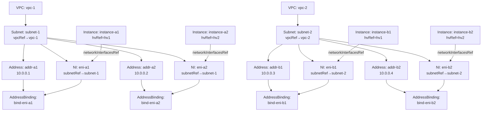

# API Mock: curl-запросы для прототипа in-cloud

| | |
|---|---|
| **Base URL** | `http://api:9006` |
| **Content-Type** | `application/json` |
| **Все операции** | `POST` |
| **Namespace** | `tenant-poc` |
| **VNI / IP** | Назначаются сервером (mock возвращает фиксированные значения) |

---

## 1. Маппинг PoC → API-ресурсы

### 1.1 Топология из HV-SETUP.md

| PoC Container | HV | VPC | IP | MAC |
|---|---|---|---|---|
| container-a1 | HV1 (10.123.0.12) | VPC-1 (VNI 100001) | 10.0.0.1 | 02:42:0a:00:00:01 |
| container-a2 | HV2 (10.123.0.5) | VPC-1 (VNI 100001) | 10.0.0.2 | 02:42:0a:00:00:02 |
| container-b1 | HV1 (10.123.0.12) | VPC-2 (VNI 100002) | 10.0.0.3 | 02:42:0a:00:00:03 |
| container-b2 | HV2 (10.123.0.5) | VPC-2 (VNI 100002) | 10.0.0.4 | 02:42:0a:00:00:04 |

### 1.2 API-ресурсы

| Тип | name | Ключевые поля |
|---|---|---|
| VPC | `vpc-1` | status.vni = 100001 |
| VPC | `vpc-2` | status.vni = 100002 |
| Subnet | `subnet-1` | spec.cidrBlock = 10.0.0.0/24, spec.vpcRef → vpc-1 |
| Subnet | `subnet-2` | spec.cidrBlock = 10.0.0.0/24, spec.vpcRef → vpc-2 |
| NetworkInterface | `eni-a1` | spec.subnetRef → subnet-1 |
| NetworkInterface | `eni-a2` | spec.subnetRef → subnet-1 |
| NetworkInterface | `eni-b1` | spec.subnetRef → subnet-2 |
| NetworkInterface | `eni-b2` | spec.subnetRef → subnet-2 |
| Instance | `instance-a1` | spec.hvRef = hv1, spec.networkInterfacesRef → [eni-a1] |
| Instance | `instance-b1` | spec.hvRef = hv1, spec.networkInterfacesRef → [eni-b1] |
| Instance | `instance-a2` | spec.hvRef = hv2, spec.networkInterfacesRef → [eni-a2] |
| Instance | `instance-b2` | spec.hvRef = hv2, spec.networkInterfacesRef → [eni-b2] |
| Address | `addr-a1` | private, subnet-1 → status.ip = 10.0.0.1 |
| Address | `addr-a2` | private, subnet-1 → status.ip = 10.0.0.2 |
| Address | `addr-b1` | private, subnet-2 → status.ip = 10.0.0.3 |
| Address | `addr-b2` | private, subnet-2 → status.ip = 10.0.0.4 |
| AddressBinding | `bind-eni-a1` | addr-a1 ↔ eni-a1 |
| AddressBinding | `bind-eni-a2` | addr-a2 ↔ eni-a2 |
| AddressBinding | `bind-eni-b1` | addr-b1 ↔ eni-b1 |
| AddressBinding | `bind-eni-b2` | addr-b2 ↔ eni-b2 |

### 1.3 Граф зависимостей



### 1.4 Порядок создания (из README 9.2)

```
1. VPC           — isolation domain
2. Subnet        — адресное пространство (spec.vpcRef → VPC)
3. NI            — сетевой интерфейс (spec.subnetRef → Subnet)
4. Address       — IP из Subnet (IPAM аллоцирует)
5. AddressBinding — Address ↔ NI → Status Controller переводит NI в available
6. Instance      — VM на HV (spec.hvRef, spec.networkInterfacesRef → [NI])
```

---

## 2. Порядок создания

Каждый шаг = один `POST` запрос. Детали каждого запроса (curl + JSON) — в `mock.md` соответствующего ресурса.

| Шаг | Ресурс | Mock-файл | Что происходит |
|-----|--------|-----------|----------------|
| 0 | Namespace | [api/namespace/mock.md](api/namespace/mock.md) | Создание tenant'а `tenant-poc` |
| 1 | VPC | [api/vpc/mock.md](api/vpc/mock.md) | 2 VPC: vpc-1 (VNI 100001), vpc-2 (VNI 100002) |
| 2 | Subnet | [api/subnet/mock.md](api/subnet/mock.md) | 2 Subnet: subnet-1 → vpc-1, subnet-2 → vpc-2 |
| 3 | NetworkInterface | [api/network-interface/mock.md](api/network-interface/mock.md) | 4 NI: eni-a1/b1 (HV1), eni-a2/b2 (HV2) |
| 4 | Address | [api/address/mock.md](api/address/mock.md) | 4 private IP: 10.0.0.1–10.0.0.4 |
| 5 | AddressBinding | [api/address-binding/mock.md](api/address-binding/mock.md) | 4 привязки Address ↔ NI → NI available |
| 6 | Instance | [api/instance/mock.md](api/instance/mock.md) | 4 Instance: a1/b1 → hv1, a2/b2 → hv2 |

---

## 3. Побочный эффект: NI → available

После шага 5 (AddressBinding) Status Controller обновляет NI: заполняет `privateIpAddress`, `macAddress`, переводит `status.state` из `created` в `available`.

Пример обновлённого NI и Agent workflow — в [api/network-interface/mock.md](api/network-interface/mock.md#побочный-эффект-ni--available).

---

## 4. Проверка (list-запросы)

| Запрос | Mock-файл |
|--------|-----------|
| Все VPC в namespace | [api/vpc/mock.md](api/vpc/mock.md#list) |
| NI в VPC-1 | [api/network-interface/mock.md](api/network-interface/mock.md#list) |
| Instance на HV1 | [api/instance/mock.md](api/instance/mock.md#list) |

---

## 5. Cleanup (delete)

Удаление в обратном порядке зависимостей:

| Шаг | Ресурс | Mock-файл |
|-----|--------|-----------|
| 1 | Instance | [api/instance/mock.md](api/instance/mock.md#delete) |
| 2 | AddressBinding | [api/address-binding/mock.md](api/address-binding/mock.md#delete) |
| 3 | Address | [api/address/mock.md](api/address/mock.md#delete) |
| 4 | NetworkInterface | [api/network-interface/mock.md](api/network-interface/mock.md#delete) |
| 5 | Subnet | [api/subnet/mock.md](api/subnet/mock.md#delete) |
| 6 | VPC | [api/vpc/mock.md](api/vpc/mock.md#delete) |
| 7 | Namespace | [api/namespace/mock.md](api/namespace/mock.md#delete) |

---

## 6. Карта endpoint'ов

| Ресурс | Base path | Операции | Документация |
|--------|-----------|----------|--------------|
| Namespace | `/v1/namespaces/` | upsert, update, list, delete, watch | [api/namespace/](api/namespace/) |
| VPC | `/v1/vpcs/` | upsert, update, list, delete, watch | [api/vpc/](api/vpc/) |
| Subnet | `/v1/subnets/` | upsert, update, list, delete, watch | [api/subnet/](api/subnet/) |
| Instance | `/v1/instances/` | upsert, update, list, delete, watch | [api/instance/](api/instance/) |
| NetworkInterface | `/v1/network-interfaces/` | upsert, update, list, delete, watch | [api/network-interface/](api/network-interface/) |
| Address | `/v1/addresses/` | upsert, update, list, delete, watch | [api/address/](api/address/) |
| AddressBinding | `/v1/address-bindings/` | upsert, update, list, delete, watch | [api/address-binding/](api/address-binding/) |
| Gateway | `/v1/gateways/` | upsert, update, list, delete, watch | [api/gateway/](api/gateway/) |
| RouteTable | `/v1/route-tables/` | upsert, update, list, delete, watch | [api/route-table/](api/route-table/) |
| RouteTableBinding | `/v1/route-table-bindings/` | upsert, update, list, delete, watch | [api/route-table-binding/](api/route-table-binding/) |

> Gateway, RouteTable, RouteTableBinding не используются в PoC-сценарии (нет NAT/routing между VPC). Добавляются при расширении.
