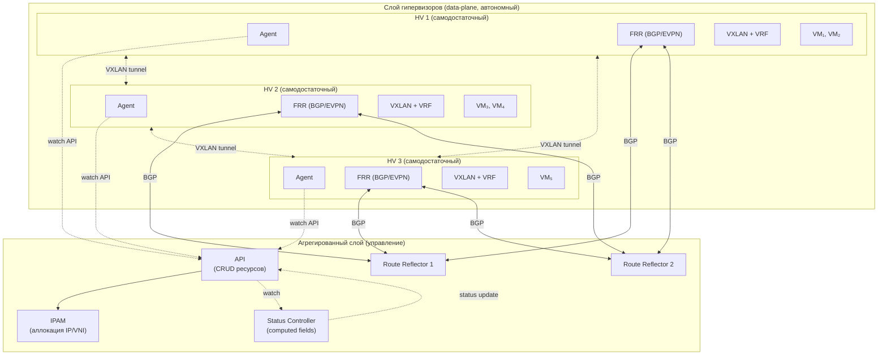
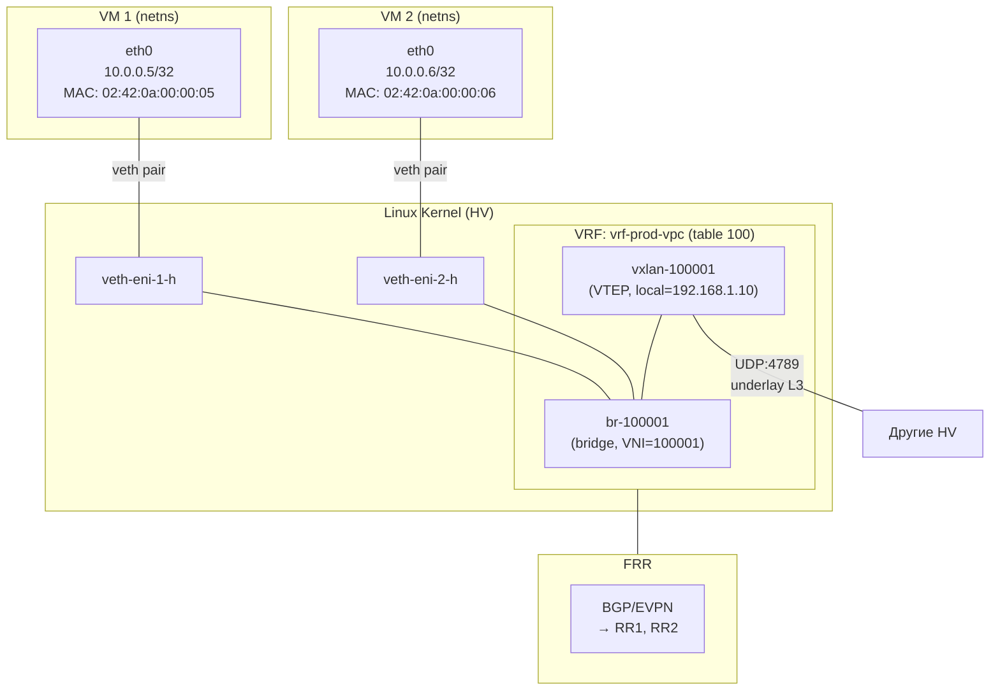
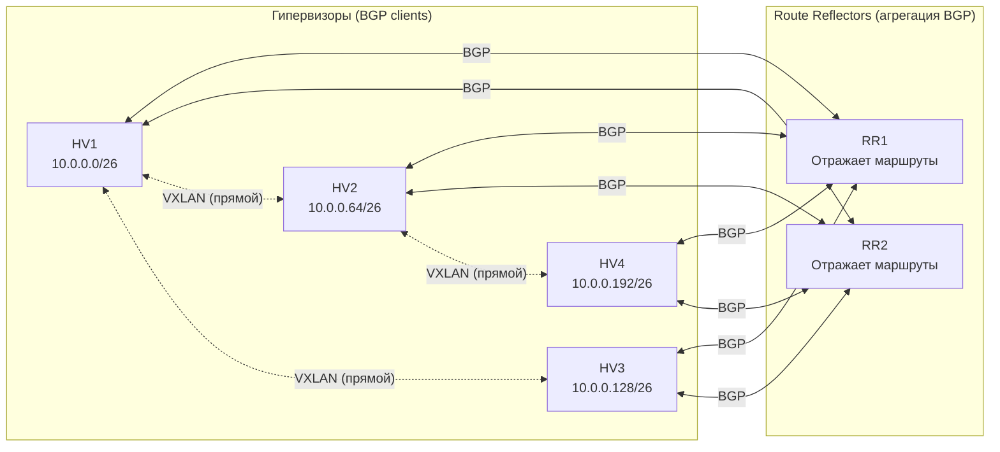
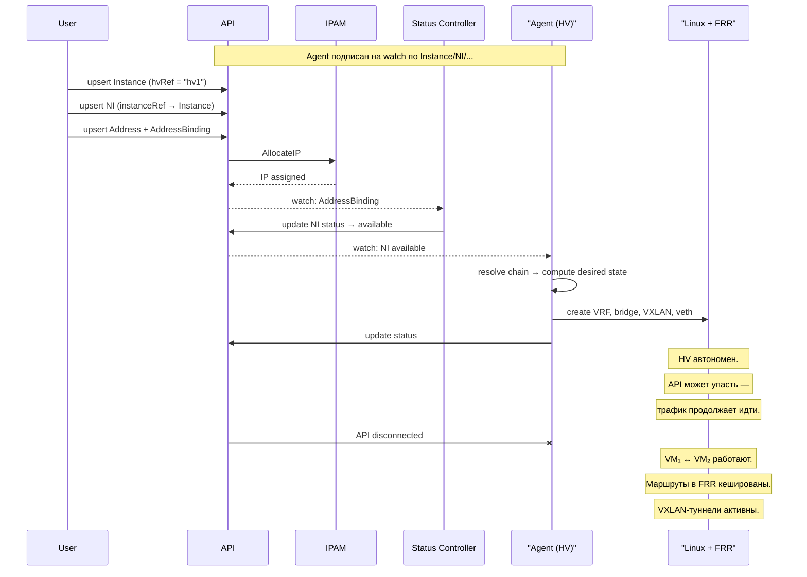
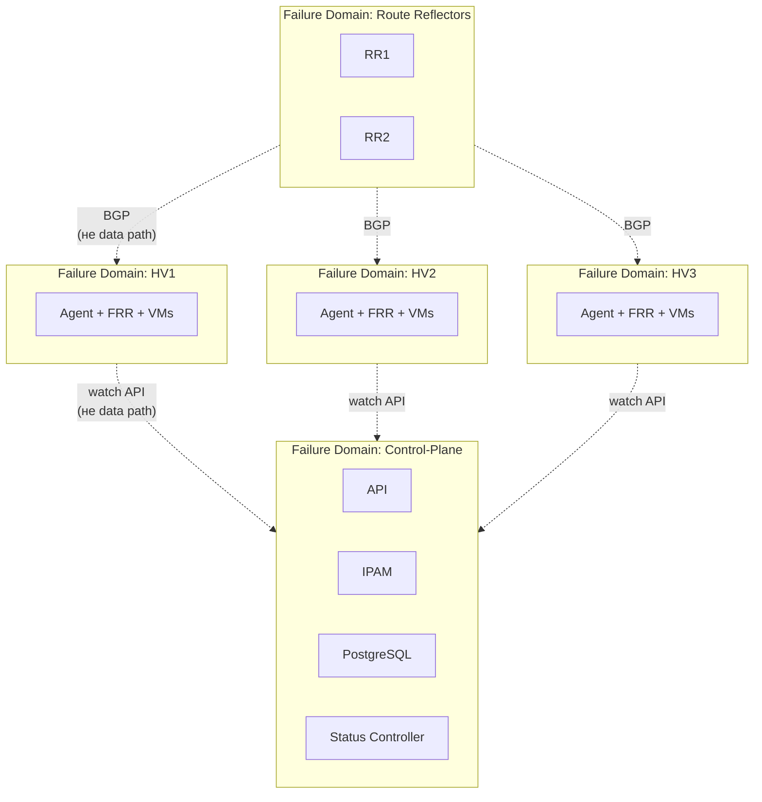
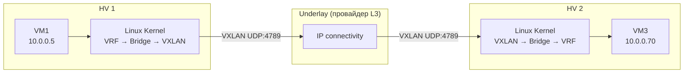
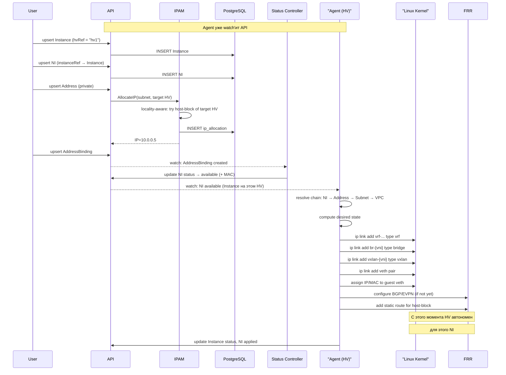
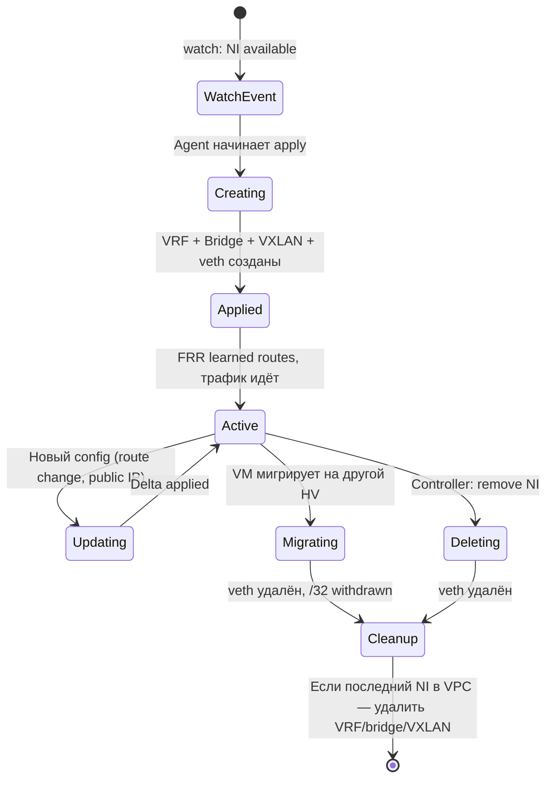

# Архитектура VPC: самодостаточные гипервизоры

| | |
|---|---|
| **Тип** | Архитектурный документ |
| **Статус** | Draft |
| **Авторы** | PRO-Robotech |
| **Создан** | 2026-03-09 |
| **Область** | Data-plane / Control-plane separation |

---

## Оглавление

1. [Ключевой принцип: самодостаточный HV](#1-ключевой-принцип-самодостаточный-hv)
2. [Два слоя системы](#2-два-слоя-системы)
3. [Архитектура гипервизора](#3-архитектура-гипервизора)
4. [Сетевой стек на HV](#4-сетевой-стек-на-hv)
5. [Агрегированный слой](#5-агрегированный-слой)
6. [Route Reflector и BGP-агрегация](#6-route-reflector-и-bgp-агрегация)
7. [Control-plane: управление, а не зависимость](#7-control-plane-управление-а-не-зависимость)
8. [Failure domains](#8-failure-domains)
9. [Потоки данных](#9-потоки-данных)
10. [Жизненный цикл NetworkInterface на HV](#10-жизненный-цикл-networkinterface-на-hv)
11. [Сводная таблица ответственности](#11-сводная-таблица-ответственности)

---

## 1. Ключевой принцип: самодостаточный HV

**Каждый гипервизор — это самодостаточный сетевой узел.** После получения конфигурации HV работает полностью автономно: маршрутизирует трафик, изолирует tenant'ов, обеспечивает связность между VM — без постоянной связи с централизованными компонентами.

```
┌─────────────────────────────────────────────────────────────────┐
│                                                                   │
│   Control-plane упал?     →  Существующие VM продолжают работать  │
│   IPAM недоступен?        →  Существующие IP остаются             │
│   API недоступен?         →  Agent работает по закешированному state│
│   Route Reflector упал?   →  BGP-таблицы на HV закешированы       │
│                                                                   │
│   Единственное что не работает: создание НОВЫХ ресурсов           │
│                                                                   │
└─────────────────────────────────────────────────────────────────┘
```

| Состояние системы | Создание новых VM/NI | Работа существующих VM | Связность между VM |
|---|---|---|---|
| Всё работает | Да | Да | Да |
| Control-plane недоступен | Нет | **Да** | **Да** |
| Route Reflector недоступен | Нет | **Да** | **Да** (кешированные маршруты) |
| Один HV упал | Да (на других HV) | Да (на других HV) | Да (между оставшимися) |

---

## 2. Два слоя системы

Система разделена на два принципиально разных слоя с разной ролью и разной критичностью.

```
┌─────────────────────────────────────────────────────────────────────────┐
│                     АГРЕГИРОВАННЫЙ СЛОЙ                                  │
│                                                                           │
│  Роль: управление, оркестрация, оптимизация                              │
│  Критичность: нужен для ИЗМЕНЕНИЙ, не для работы                         │
│                                                                           │
│  ┌──────────┐  ┌──────────┐  ┌──────────────────┐  ┌─────────────────┐  │
│  │   API    │  │   IPAM   │  │ Status Controller │  │ Route Reflector │  │
│  └──────────┘  └──────────┘  └──────────────────┘  └─────────────────┘  │
│                                                                           │
├───────────────────────────────────────────────────────────────────────────┤
│                                                                           │
│                     СЛОЙ ГИПЕРВИЗОРОВ (data-plane)                        │
│                                                                           │
│  Роль: исполнение, маршрутизация, изоляция                               │
│  Критичность: ПОСТОЯННО работает; автономен после конфигурации           │
│                                                                           │
│  ┌───────────────┐  ┌───────────────┐  ┌───────────────┐                │
│  │     HV 1      │  │     HV 2      │  │     HV 3      │   ...         │
│  │               │  │               │  │               │                │
│  │  FRR (BGP)    │  │  FRR (BGP)    │  │  FRR (BGP)    │                │
│  │  VXLAN        │  │  VXLAN        │  │  VXLAN        │                │
│  │  VRF per VPC  │  │  VRF per VPC  │  │  VRF per VPC  │                │
│  │  Agent        │  │  Agent        │  │  Agent        │                │
│  │  VM₁ VM₂      │  │  VM₃ VM₄      │  │  VM₅          │                │
│  └───────────────┘  └───────────────┘  └───────────────┘                │
│                                                                           │
└───────────────────────────────────────────────────────────────────────────┘
```



---

## 3. Архитектура гипервизора

Каждый HV — полноценный маршрутизатор с набором компонентов, достаточных для автономной работы.

### 3.1 Компоненты HV

| Компонент | Что делает | Зависит от control-plane? |
|---|---|---|
| **FRR** | BGP daemon; обменивается маршрутами с RR; хранит полную таблицу маршрутов | Нет — маршруты кешируются локально |
| **VXLAN interfaces** | Туннели к другим HV; по одному на VNI (VPC) | Нет — работает на уровне ядра Linux |
| **VRF** | Изоляция таблиц маршрутизации per VPC | Нет — конфигурация ядра Linux |
| **Bridge per VNI** | L2 bridge внутри VPC для подключения VM | Нет |
| **veth pairs** | Сетевые интерфейсы VM (NetworkInterface) | Нет |
| **Agent** | Получает конфиг от Controller; применяет локально | Частично — нужен для **изменений**, не для работы |

### 3.2 Что HV хранит и исполняет локально

```
┌──────────────────────────────────────────────────────────────────┐
│                        ГИПЕРВИЗОР (HV)                            │
│                                                                    │
│  ┌──────────────────────────────────────────────────────────┐     │
│  │                     FRR (BGP daemon)                      │     │
│  │                                                            │     │
│  │  BGP sessions:  → RR1 (underlay IP)                       │     │
│  │                  → RR2 (underlay IP)                       │     │
│  │                                                            │     │
│  │  Advertises:     10.0.0.0/26  (host-block aggregate)      │     │
│  │                  10.0.0.5/32  (leaked, migrated VM)        │     │
│  │                                                            │     │
│  │  RIB (learned):  10.0.0.64/26 via HV2                     │     │
│  │                  10.0.0.128/26 via HV3                     │     │
│  │                  10.0.0.70/32 via HV3 (leaked)             │     │
│  └──────────────────────────────────────────────────────────┘     │
│                                                                    │
│  ┌──────────────────────────────────────────────────────────┐     │
│  │                Linux Kernel Networking                      │     │
│  │                                                            │     │
│  │  VRF:    vrf-tenant-a  (table 100)                        │     │
│  │          vrf-tenant-b  (table 101)                        │     │
│  │                                                            │     │
│  │  Bridge: br-100001  (VNI 100001, master vrf-tenant-a)     │     │
│  │          br-100002  (VNI 100002, master vrf-tenant-b)     │     │
│  │                                                            │     │
│  │  VXLAN:  vxlan-100001  (id 100001, local 192.168.1.10)    │     │
│  │          vxlan-100002  (id 100002, local 192.168.1.10)    │     │
│  │                                                            │     │
│  │  veth:   veth-web-eni-1-h ←→ veth-web-eni-1-g  (VM1)     │     │
│  │          veth-db-eni-1-h  ←→ veth-db-eni-1-g   (VM2)     │     │
│  └──────────────────────────────────────────────────────────┘     │
│                                                                    │
│  ┌──────────────────────────────────────────────────────────┐     │
│  │                     Agent                                  │     │
│  │                                                            │     │
│  │  Desired state:  хранит последний конфиг от Controller    │     │
│  │  Reconciliation: diff desired ↔ actual, apply changes     │     │
│  │  Status report:  NI states → Controller                   │     │
│  └──────────────────────────────────────────────────────────┘     │
│                                                                    │
└──────────────────────────────────────────────────────────────────┘
```

### 3.3 Почему HV самодостаточен

1. **FRR хранит RIB локально.** После получения маршрутов от RR, вся таблица маршрутизации закеширована в памяти FRR и в ядре Linux. Если RR упадёт — маршруты остаются, трафик продолжает течь.

2. **VXLAN — в ядре Linux.** VXLAN-инкапсуляция/декапсуляция выполняется ядром. Не нужен внешний сервис для пересылки пакетов.

3. **VRF и bridge — stateless.** После создания VRF и bridge они работают без внешних зависимостей. Ядро Linux маршрутизирует пакеты самостоятельно.

4. **Agent хранит desired state локально.** Даже если Controller недоступен, Agent может выполнить reconciliation к последнему известному desired state (например, после перезагрузки HV).

---

## 4. Сетевой стек на HV

### 4.1 Внутренняя топология одного VPC на HV



### 4.2 Путь пакета: VM1 (HV1) → VM3 (HV2)

```
VM1 (10.0.0.5, HV1)
  │
  ▼ veth pair
veth-eni-1-g → veth-eni-1-h
  │
  ▼ bridge forwarding
br-100001 (VNI 100001)
  │
  ▼ routing lookup в VRF vrf-prod-vpc
  │   dst: 10.0.0.70 → next-hop: HV2 (192.168.1.20)
  │   (из BGP-таблицы: 10.0.0.64/26 via 192.168.1.20)
  │
  ▼ VXLAN encapsulation
vxlan-100001: outer src=192.168.1.10, outer dst=192.168.1.20, VNI=100001
  │
  ▼ underlay L3 (провайдер)
  │
  ▼ VXLAN decapsulation на HV2
vxlan-100001 → br-100001 → veth-eni-3-h → veth-eni-3-g
  │
  ▼
VM3 (10.0.0.70, HV2)
```

Весь путь — в ядре Linux + FRR. Нет центрального роутера, нет SDN-контроллера в data path.

### 4.3 Множественные VPC на одном HV

```
┌─────────────────────────────────────────────────────────────┐
│                         HV 1                                  │
│                                                               │
│  ┌─────────────────────────────────────────────────────┐     │
│  │  VRF: vrf-tenant-a  (table 100)                      │     │
│  │                                                       │     │
│  │  br-100001 ← vxlan-100001 (VNI 100001)               │     │
│  │      │                                                │     │
│  │      ├── veth-eni-1-h  (VM1, 10.0.0.5)               │     │
│  │      └── veth-eni-2-h  (VM2, 10.0.0.6)               │     │
│  └─────────────────────────────────────────────────────┘     │
│                                                               │
│  ┌─────────────────────────────────────────────────────┐     │
│  │  VRF: vrf-tenant-b  (table 101)                      │     │
│  │                                                       │     │
│  │  br-200001 ← vxlan-200001 (VNI 200001)               │     │
│  │      │                                                │     │
│  │      └── veth-eni-5-h  (VM5, 172.16.0.3)             │     │
│  └─────────────────────────────────────────────────────┘     │
│                                                               │
│  Полная изоляция: tenant-a не видит tenant-b                 │
│  VRF = отдельная таблица маршрутизации                       │
│  VNI = отдельный VXLAN overlay                               │
│                                                               │
└─────────────────────────────────────────────────────────────┘
```

Каждый VPC изолирован на уровне ядра: разные VRF, разные таблицы маршрутизации, разные VNI. Один HV обслуживает десятки VPC одновременно без конфликтов.

---

## 5. Агрегированный слой

Агрегированный слой **не участвует в data path**. Его задачи — управление и оптимизация:

### 5.1 Зачем нужен агрегированный слой

| Задача | Компонент | Почему нельзя без него | Когда нужен |
|---|---|---|---|
| **BGP route aggregation** | Route Reflector | Без RR — full-mesh BGP между HV: O(N²) сессий | Постоянно, но HV переживает временный outage |
| **IP allocation** | IPAM | HV не знает, какие IP свободны в Subnet | Только при создании/удалении Address |
| **VNI allocation** | IPAM | Нужен глобально уникальный VNI на VPC | Только при создании VPC |
| **Computed status** | Status Controller | Вычисление производных полей (NI status, MAC) при создании AddressBinding | Только при изменении связей |
| **Resource CRUD + watch** | API | Точка входа для пользователя + watch-стримы для Agent'ов | При управлении ресурсами и при watch |
| **Persistence** | PostgreSQL | Source of truth для desired state | Только при мутациях |

### 5.2 Что НЕ делает агрегированный слой

| Функция | Кто делает | Агрегированный слой |
|---|---|---|
| Маршрутизация пакетов | HV (ядро Linux + FRR) | Не участвует |
| VXLAN encap/decap | HV (ядро Linux) | Не участвует |
| Изоляция tenant'ов | HV (VRF) | Не участвует |
| Forwarding между VM | HV (bridge + routing) | Не участвует |
| NAT/SNAT | HV или NAT-узел (nftables) | Не участвует |
| ARP resolution | HV (EVPN type-2) | Не участвует |

**Ключевое:** ни один пакет данных не проходит через агрегированный слой. Весь data-plane — распределённый, живёт на HV.

---

## 6. Route Reflector и BGP-агрегация

### 6.1 Роль Route Reflector

Route Reflector (RR) — **не маршрутизатор**. Через RR не идёт трафик. RR — это оптимизация BGP-топологии:

```
Без RR (full-mesh):                  С RR:
                                      
  HV1 ←──→ HV2                        HV1 ←──→ RR1 ←──→ HV2
  HV1 ←──→ HV3                        HV1 ←──→ RR2 ←──→ HV3
  HV1 ←──→ HV4                                  │
  HV2 ←──→ HV3                        HV2 ←──→ RR1
  HV2 ←──→ HV4                        HV2 ←──→ RR2
  HV3 ←──→ HV4                        ...
                                      
  Сессий: N×(N-1)/2                   Сессий: 2×N
  100 HV = 4950 сессий               100 HV = 200 сессий
```



**BGP-маршруты идут через RR, пакеты данных — напрямую между HV.**

### 6.2 Host-block aggregation (адаптивная стратегия)

Host-block — routing-блок, назначаемый HV per (HV, Subnet) в контексте VRF конкретного VPC. HV анонсирует **один агрегированный маршрут** вместо /32 на каждую VM.

**Адаптивность:** host-block'и выделяются **lazy** (по факту, при первом NI на HV из данного Subnet) и с **адаптивным размером** в зависимости от размера Subnet:

| Размер Subnet | Стратегия | BGP-маршруты |
|---|---|---|
| Маленький (`/28` – `/25`) | **Без host-blocks.** Все IP → /32 | Максимум 126 маршрутов — незначительно |
| Средний (`/24` – `/20`) | **Lazy host-blocks, адаптивный размер** | Блок выделяется при первом NI на HV |
| Большой (`/20`+) | **Lazy host-blocks + locality-aware** | IPAM предпочитает placement на HV с блоком |

Почему lazy, а не pre-allocation: если pre-allocate /26 из /24 Subnet — хватит на 4 HV. При 100 HV в кластере 96 HV не получат блок. Lazy allocation решает эту проблему — блоки выделяются только HV, на которых реально есть NI.

```
Пример: Subnet /24, 100 HV в кластере, NI на 5 HV
                                                                  
  HV1 announces:  10.0.1.0/28   ← lazy, при первом NI           
  HV2 announces:  10.0.1.16/28  ← lazy, при первом NI           
  HV3 announces:  10.0.1.32/28  ← lazy, при первом NI           
  HV7 announces:  10.0.1.48/28  ← lazy, при первом NI           
  HV42 announces: 10.0.1.64/28  ← lazy, при первом NI           
                                                                  
  Итого: 5 маршрутов на ~50 VM (вместо 50 × /32)                
  95 HV без NI из этого Subnet → не потребляют адреса            
                                                                  
  Маленький Subnet /28: нет host-blocks, 14 × /32 routes         
  BGP даже не заметит — NI размещается на любом HV               
```

Host-block'и из разных VPC на одном HV полностью изолированы через VRF:

```
HV1 анонсирует (в разных VRF):
  VRF vrf-vpc-a:  10.0.0.0/28   (Subnet-A, VPC-A)
  VRF vrf-vpc-b:  172.16.0.0/28 (Subnet-B, VPC-B)
```

### 6.3 Сравнение с AWS: почему наша модель использует host-blocks

AWS VPC решает задачу маршрутизации **принципиально иначе** — без BGP между хостами:

```
┌──────────────────────────────────────────────────────────────┐
│                     AWS VPC (для сравнения)                    │
│                                                                │
│  Mapping Service (централизованная БД)                        │
│  ┌──────────────────────────────────────────────────────────┐ │
│  │ (VPC, virtual MAC/IP) → (physical host IP, encap params) │ │
│  │ Пушит записи на хосты с VM из того же VPC                │ │
│  └──────────────────────────────────────────────────────────┘ │
│                                                                │
│  Nitro Card — аппаратный offload encap/decap + SG             │
│  Проприетарная инкапсуляция (не VXLAN)                        │
│  Нет BGP → нет route table → нет проблемы агрегации          │
│                                                                │
│  Нам недоступно: требует custom ASIC + проприетарный стек     │
└──────────────────────────────────────────────────────────────┘
```

| Аспект | AWS | in-cloud |
|---|---|---|
| Как хост узнаёт, куда слать пакет | Mapping Service (push + кеш на Nitro) | BGP таблица от Route Reflector |
| Гранулярность маршрутов | Per-instance (каждая VM = запись) | Адаптивная: /32 или host-block |
| Проблема масштаба таблицы | Нет — нет BGP | Есть — решается агрегацией |
| Инкапсуляция | Проприетарная | VXLAN (стандарт) |
| Hardware offload | Nitro Card (custom ASIC) | Linux kernel |
| Стек | Проприетарный | Открытый (FRR, Linux, BGP EVPN) |

**Наше решение — адаптивные host-blocks — берёт лучшее из обоих миров:** стандартные протоколы (BGP/EVPN) + оптимизация через агрегацию, которая масштабируется через lazy allocation и автоматически деградирует до /32 для маленьких Subnet (где агрегация не нужна).

### 6.3 RR outage: что происходит

```
Нормальная работа:
  HV1 ↔ RR1 ↔ HV2     (BGP-маршруты обновляются)
  HV1 ←→ HV2           (VXLAN-трафик, прямой)

RR1 и RR2 упали:
  HV1 × RR1 × HV2      (новые маршруты не приходят)
  HV1 ←→ HV2            (VXLAN-трафик продолжает идти!)

Почему работает:
  - FRR на HV1 хранит все маршруты в RIB (память)
  - Ядро Linux хранит маршруты в FIB
  - VXLAN-туннели уже установлены
  - Пакеты идут по закешированным маршрутам

Что не работает при outage RR:
  - Новые HV не получат маршруты
  - Миграция VM не анонсирует /32 другим HV
  - Новые VPC/Subnet не появятся в маршрутизации
```

---

## 7. Control-plane: управление, а не зависимость

### 7.1 Принцип «watch + converge»

Agent подключается к API через watch и **самостоятельно** вычисляет desired state. Нет промежуточного контроллера в config path — Agent работает напрямую с API, как kubelet в Kubernetes:



### 7.2 Agent: watch API + локальный кеш

Agent watch'ит API и строит desired state из цепочки ресурсов:

```
Instance (spec.hvRef = "my-hv")
  └── NI (spec.instanceRef → Instance)
        └── AddressBinding → Address (status.ip)
              └── Subnet → SubnetBinding → VPC (status.vni)
                    └── RouteTableBinding → RouteTable → Gateway
```

Agent кеширует desired state локально. Это обеспечивает автономность:

| Сценарий | Поведение Agent |
|---|---|
| HV перезагрузился, API доступен | Agent подключается к watch, получает init-события, строит desired state, применяет |
| HV перезагрузился, API недоступен | Agent применяет последний закешированный desired state |
| API пушит watch-событие (изменение ресурса) | Agent пересчитывает desired state, вычисляет diff, применяет delta |
| API недоступен долго | Agent периодически пытается reconnect; текущее состояние стабильно |

```
┌──────────────────────────────────────────────────────────────┐
│                    Agent Reconciliation Loop                    │
│                                                                │
│   ┌─────────────┐     ┌──────────────┐     ┌──────────────┐  │
│   │   Desired    │     │   Actual      │     │    Diff      │  │
│   │   State      │────▶│   State       │────▶│   (delta)    │  │
│   │ (из watch    │     │ (Linux kernel │     │              │  │
│   │  или кеш)   │     │  ip, bridge,  │     │  +create NI  │  │
│   │              │     │  FRR show)    │     │  -delete NI  │  │
│   └─────────────┘     └──────────────┘     │  ~update FRR │  │
│                                              └──────┬───────┘  │
│                                                     │          │
│                                                     ▼          │
│                                              ┌──────────────┐  │
│                                              │    Apply      │  │
│                                              │  (idempotent) │  │
│                                              └──────────────┘  │
│                                                                │
└──────────────────────────────────────────────────────────────┘
```

---

## 8. Failure domains

### 8.1 Изоляция отказов



| Failure domain | Что отказывает | Blast radius |
|---|---|---|
| **Один HV** | VM на этом HV | Остальные HV не затронуты; VM на других HV работают |
| **Control-plane** | Создание/удаление ресурсов | Существующие VM и сеть работают на всех HV |
| **Route Reflectors** | Обновление маршрутов | Существующие маршруты закешированы; трафик идёт |
| **PostgreSQL** | Персистенция | Существующая конфигурация на HV сохраняется |

### 8.2 Каскадных отказов нет

Принципиальное отличие от централизованных SDN (OpenFlow, OVN central):

| Архитектура | Центральный контроллер упал | Влияние на data-plane |
|---|---|---|
| OpenFlow-based SDN | Flow rules не обновляются | Новые flow не программируются; возможна потеря связности |
| OVN (centralized) | ovn-northd / ovn-controller | Зависит от реализации; может деградировать |
| **in-cloud (наша модель)** | Status Controller / IPAM / API | **Нет влияния.** Agent + FRR + kernel routing автономны |

---

## 9. Потоки данных

### 9.1 Data-plane: трафик между VM (без участия control-plane)



Обратите внимание: в этом потоке нет ни API, ни Controller, ни RR, ни IPAM. Пакеты идут **HV → underlay → HV**, полностью в ядре Linux.

### 9.2 Control-plane: создание нового NI (единственный момент зависимости)



После конфигурации — HV работает полностью автономно. API можно выключить, и VM продолжат работать.

---

## 10. Жизненный цикл NetworkInterface на HV

### 10.1 Состояния NI на HV (с точки зрения Agent)



### 10.2 Что создаёт Agent при появлении нового NI

Предполагаем: первый NI tenant-а `tenant-a` с VPC `prod-vpc` (VNI=100001) на данном HV.

| Шаг | Команда / действие | Создаётся один раз на VPC | Создаётся на каждый NI |
|---|---|---|---|
| 1 | `ip link add vrf-prod-vpc type vrf table 100` | Да | |
| 2 | `ip link set vrf-prod-vpc up` | Да | |
| 3 | `ip link add br-100001 type bridge` | Да | |
| 4 | `ip link set br-100001 master vrf-prod-vpc` | Да | |
| 5 | `ip link set br-100001 up` | Да | |
| 6 | `ip link add vxlan-100001 type vxlan id 100001 local {underlay_ip} dstport 4789 nolearning` | Да | |
| 7 | `ip link set vxlan-100001 master br-100001` | Да | |
| 8 | `ip link set vxlan-100001 up` | Да | |
| 9 | FRR: настроить BGP EVPN для VNI 100001 в VRF | Да | |
| 10 | `ip link add veth-{ni}-h type veth peer name veth-{ni}-g` | | Да |
| 11 | `ip link set veth-{ni}-h master br-100001` | | Да |
| 12 | `ip link set veth-{ni}-h up` | | Да |
| 13 | Назначить IP/MAC на `veth-{ni}-g`, передать в VM/netns | | Да |
| 14 | Добавить static ARP и /32 route на bridge для guest IP | | Да |

При удалении NI — обратный порядок для шагов 10-14. Шаги 1-9 удаляются только когда на HV не остаётся NI из данного VPC.

### 10.3 FRR reference config (для одного VPC)

```
router bgp 65000
  bgp router-id {underlay_ip}
  no bgp default ipv4-unicast

  neighbor RR1 remote-as 65000
  neighbor RR1 update-source {underlay_ip}
  neighbor RR2 remote-as 65000
  neighbor RR2 update-source {underlay_ip}

  address-family l2vpn evpn
    neighbor RR1 activate
    neighbor RR2 activate
    advertise-all-vni
  exit-address-family

router bgp 65000 vrf vrf-prod-vpc
  address-family ipv4 unicast
    redistribute static
    redistribute connected
  exit-address-family

  address-family l2vpn evpn
    advertise ipv4 unicast
  exit-address-family

! Host-block aggregate route
ip route 10.0.0.0/26 Null0 vrf vrf-prod-vpc

! Leaked /32 для мигрированных VM (добавляется динамически)
! ip route 10.0.0.70/32 veth-eni-migrated-h vrf vrf-prod-vpc
```

---

## 11. Сводная таблица ответственности

| Функция | Где исполняется | Зависит от control-plane | Зависит от RR |
|---|---|---|---|
| Маршрутизация пакетов между VM | HV (ядро Linux) | Нет | Нет (кеш) |
| VXLAN encap/decap | HV (ядро Linux) | Нет | Нет |
| Изоляция tenant'ов (VRF) | HV (ядро Linux) | Нет | Нет |
| BGP route exchange | HV (FRR) ↔ RR | Нет | Да (но graceful при outage) |
| Host-block announcement | HV (FRR) | Нет | Да (для распространения) |
| MAC/IP learning (EVPN) | HV (FRR) ↔ RR | Нет | Да (для новых записей) |
| IP allocation | IPAM | **Да** | Нет |
| VNI allocation | IPAM | **Да** | Нет |
| NI configuration (watch + apply) | Agent watch'ит API | **Да** (для получения новых событий) | Нет |
| Computed status (NI state, MAC) | Status Controller | **Да** | Нет |
| Resource CRUD + watch | API | **Да** | Нет |
| NAT/SNAT | NAT-узел (nftables) | Нет (после конфигурации) | Нет |
| ARP resolution (local) | HV (static ARP / proxy) | Нет | Нет |
| ARP resolution (remote) | HV (EVPN type-2) | Нет | Да (для начального обучения) |

---

**Итог:** гипервизор — это автономный маршрутизатор. Agent watch'ит API и самостоятельно вычисляет desired state (как kubelet в Kubernetes). Агрегированный слой (API, IPAM, Status Controller, RR) нужен для управления и оптимизации, но не для работы data-plane. Эта архитектура обеспечивает устойчивость: даже при полном outage control-plane существующие VM продолжают работать и общаться друг с другом.
