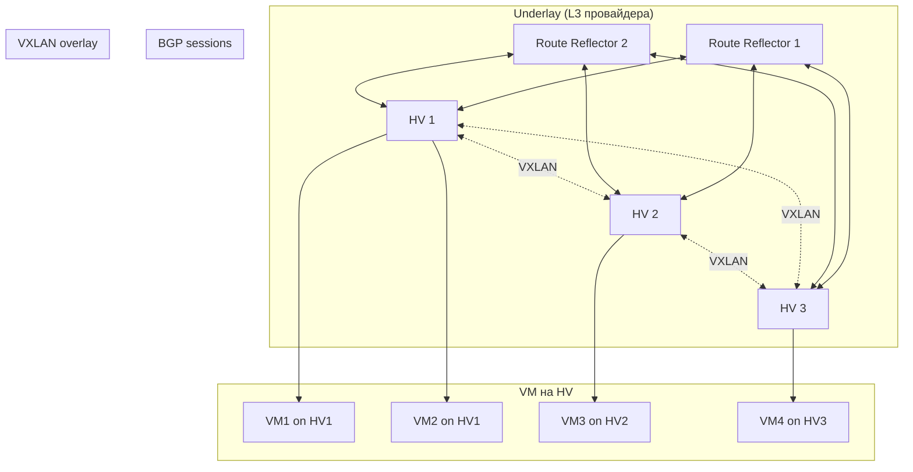
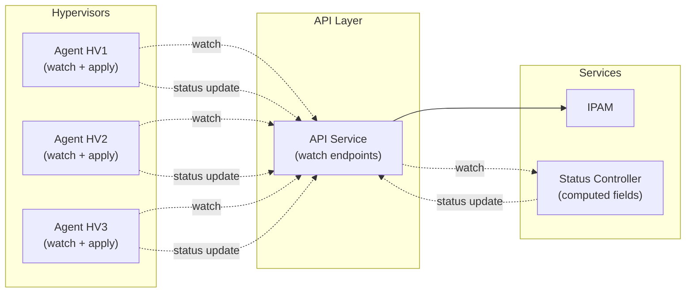
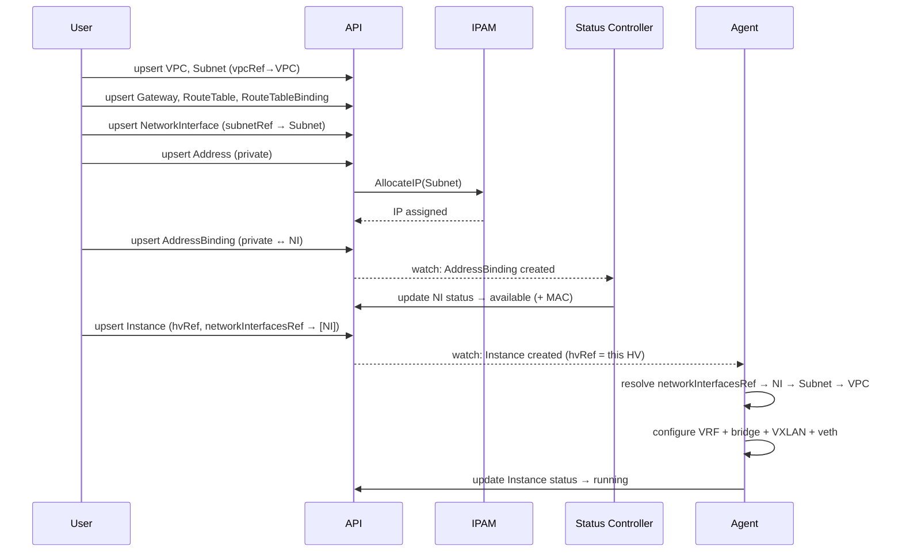

# in-cloud

| | |
|---|---|
| **Тип** | Архитектурный документ (KEP-style) |
| **Статус** | Draft |
| **Авторы** | PRO-Robotech |
| **Создан** | 2026-03-01 |
| **Область** | Networking / IaaS |

## Summary

**in-cloud** — проект IaaS-облака поверх арендованного bare metal без собственной spine-leaf фабрики. Система строит L3 overlay (VXLAN + EVPN + BGP) поверх providerской L3-сети, предоставляя пользователям AWS-подобные сетевые примитивы: VPC, Subnet, Address, NetworkInterface, Gateway, RouteTable и binding-ресурсы для связей между ними.

Kubernetes-like API (`metadata`/`spec`/`status`) обеспечивает декларативное управление ресурсами с поддержкой batch-операций, watch-стриминга и optimistic concurrency.

---

## Оглавление

1. [Motivation](#1-motivation)
2. [Архитектурный принцип](#2-архитектурный-принцип)
3. [Примитивы системы](#3-примитивы-системы)
4. [Сетевой дизайн](#4-сетевой-дизайн)
5. [Диаграмма сетевой архитектуры](#5-диаграмма-сетевой-архитектуры)
6. [Host-block aggregation и миграция](#6-host-block-aggregation-и-миграция)
7. [Control-plane](#7-control-plane)
8. [Диаграмма control-plane](#8-диаграмма-control-plane)
9. [Data flow: создание сетевого стека](#9-data-flow-создание-сетевого-стека)
10. [Стратегия роста](#10-стратегия-роста)
11. [Преимущества модели](#11-преимущества-модели)
12. [API](#12-api)
13. [Заключение](#13-заключение)

---

## 1. Motivation

### 1.1 Goals

**Цель проекта** — построить облачную платформу, функционально похожую на AWS (IaaS), но развернутую поверх арендованного bare metal без необходимости строить и эксплуатировать собственную spine-leaf фабрику.

### 1.2 Non-Goals (вне скоупа MVP)

- Scheduler (автоматический placement Instance на HV) — будет добавлен на следующих этапах; на MVP `spec.hvRef` указывается вручную
- SecurityGroups / Network ACL — будет добавлено на следующих этапах
- Load Balancer — будет добавлен на следующих этапах
- Multi-region / federation

### 1.3 Ключевые ограничения

| Ограничение | Следствие |
|-------------|-----------|
| Нет собственной фабрики | Сеть underlay предоставляет провайдер; мы работаем только на L3 |
| Арендованный bare metal | Нельзя управлять физическими коммутаторами |
| Приоритет на масштаб | Архитектура должна выдерживать сотни HV и тысячи VM без деградации |

### 1.4 Что мы хотим достичь

| Аспект | Требование | Почему это важно |
|--------|------------|------------------|
| **Число HV** | Большое (десятки и сотни) | Типичный IaaS требует горизонтального масштабирования compute |
| **Число VM** | Большое (тысячи на кластер) | Плотное размещение и эффективное использование ресурсов |
| **Топология BGP** | Без full-mesh | O(N²) сессий между N HV делает систему непрактичной при росте |
| **Сетевые bottleneck** | Отсутствие центральных | Центральный роутер — single point of failure и ограничение пропускной способности |

**Вывод:** Архитектура должна быть распределённой, масштабируемой по control-plane и data-plane, и использовать агрегацию маршрутов для минимизации churn.

---

## 2. Архитектурный принцип

### 2.1 Двухуровневая модель: Underlay и Overlay

```
┌─────────────────────────────────────────────────────────────────────────┐
│                         OVERLAY (наш контроль)                           │
│  VXLAN | VRF per tenant | BGP | IPAM                                    │
├─────────────────────────────────────────────────────────────────────────┤
│                         UNDERLAY (провайдер)                             │
│  L3 сеть провайдера | IP-связность между HV | без доступа к фабрике     │
└─────────────────────────────────────────────────────────────────────────┘
```

**Underlay** — это L3-сеть, которую предоставляет провайдер хостинга. Мы не управляем физической топологией, коммутаторами или spine-leaf. Достаточно того, что между HV есть IP-связность.

**Overlay** — наш уровень. Мы строим поверх underlay распределённую виртуальную сеть, изолированную по tenant'ам, с собственной маршрутизацией и политиками безопасности.

### 2.2 Ключевые принципы масштабирования

| Принцип | Что это значит | Как это помогает масштабированию |
|---------|----------------|----------------------------------|
| **L3-only** | Нет больших L2 broadcast-доменов | Меньше broadcast traffic, проще маршрутизация, стабильнее при масштабе |
| **Host-block aggregation** | HV анонсирует агрегированный блок, а не /32 на каждую VM | VM churn не вызывает BGP updates; стабильность control-plane |
| **Шардирование control-plane** | API, IPAM, Controller можно делить по shard'ам | Горизонтальное масштабирование сервисов управления |
| **Без full-mesh** | Route Reflector вместо N×(N-1)/2 сессий | Рост HV не даёт квадратичного роста BGP-сессий |

---

## 3. Примитивы системы

Система оперирует примитивами, знакомыми пользователям AWS и других облачных провайдеров.

### 3.1 Таблица примитивов

**Ресурсы:**

| Примитив | Аналог | Назначение |
|----------|--------|------------|
| **VPC** | VPC | Область изоляции tenant'а; не содержит адресов; один VNI на VPC |
| **Subnet** | Subnet | Сеть с CIDR; подключается к VPC |
| **Address** | Elastic IP / Private IP | IP-адрес (private из Subnet или public из пула провайдера) |
| **NetworkInterface** | Elastic Network Interface | Сетевой интерфейс; привязан к Subnet через `spec.subnetRef` |
| **Instance** | EC2 Instance (минимальный) | Виртуальная машина; привязана к HV через `spec.hvRef`; ссылается на NI через `spec.networkInterfacesRef` |
| **Gateway** | NAT Gateway | Точка выхода трафика из VPC через общий IP (SNAT) |
| **RouteTable** | Route Table | Правила маршрутизации внутри VPC |

**Binding-ресурсы (связи):**

| Примитив | Что связывает | Назначение |
|----------|---------------|------------|
| **AddressBinding** | Address ↔ NetworkInterface | Привязывает Address к NI; private → IP/MAC, NI → `available`; public → NAT-маппинг |
| **RouteTableBinding** | RouteTable ↔ Subnet / VPC | Применяет таблицу маршрутов к Subnet или ко всему VPC |

### 3.2 Поведение каждого HV

Каждый гипервизор — **самодостаточный узел**. Agent на HV подключается к API через watch и самостоятельно вычисляет desired state:

1. **Watch'ит API** — Agent подписывается на Instance (с `hvRef` = свой HV), NI, AddressBinding, Address, Subnet, VPC, RouteTable, RouteTableBinding, Gateway. Из цепочки ресурсов Agent вычисляет, какие VRF, VXLAN, bridge и veth нужно создать.
2. **Обслуживает NetworkInterface'ы** — Agent создаёт veth pair, назначает IP/MAC из данных AddressBinding. IP привязан к ресурсу Address, а не к HV, что гарантирует сохранение адреса при live migration.
3. **Анонсирует агрегат (host-block) в BGP** — для большинства локальных NI трафик попадает по агрегированному маршруту. Мигрированные NI анонсируются отдельным /32.
4. **Применяет policy локально** — правила безопасности будут исполняться на HV (SecurityGroups — следующий этап).
5. **Отчитывается в API** — Agent обновляет `status` ресурсов (NI state, Instance state) через API.

### 3.3 IP allocation vs routing aggregation

Это два разных механизма, которые не должны быть связаны:

| Механизм | Уровень | Привязка | Назначение |
|----------|---------|----------|------------|
| **IP allocation** | IPAM / Subnet | Address → NI (стабилен при миграции) | Адресация VM |
| **Host-block** | BGP / routing | HV (меняется при миграции VM) | Оптимизация BGP: агрегация маршрутов |

**Почему IP нельзя выделять из host-block HV:**

- При live migration VM переезжает на другой HV
- Если IP привязан к host-block старого HV — адрес придётся менять
- Смена IP разрывает TCP-сессии, ломает DNS, service discovery

**Правильная модель:**

- IPAM выделяет IP из Subnet при создании Address (private)
- IP остаётся с Address на весь жизненный цикл, независимо от HV
- Host-block — это routing optimization, а не источник адресов

---

## 4. Сетевой дизайн

### 4.1 Underlay

| Характеристика | Описание |
|----------------|----------|
| **Что это** | L3-сеть провайдера (арендованный DC) |
| **Управление** | Вне нашего контроля; мы не трогаем фабрику |
| **Требования** | IP-связность между всеми HV; достаточная пропускная способность |

Мы не строим spine-leaf, не настраиваем OSPF/IS-IS на физической сети. Underlay — это «чёрный ящик» L3.

### 4.2 Overlay

| Элемент | Реализация |
|---------|------------|
| **Туннели** | VXLAN |
| **VNI** | Один VNI на VPC (изоляция tenant'ов) |
| **VRF** | Per-tenant VRF на HV (изоляция таблиц маршрутизации) |
| **Тип** | L3-only — нет больших L2 сегментов; маршрутизация между subnet'ами |

**Почему VXLAN, а не Geneve:**

| Критерий | VXLAN | Geneve |
|----------|-------|--------|
| **FRR + BGP EVPN** | Нативная интеграция | Нет — Geneve работает через OVN/OVS стек |
| **Linux kernel** | Полная поддержка, EVPN signaling | Поддержка есть, но EVPN — только через OVN |
| **Hardware offload** | Практически все современные NIC | Ограниченная поддержка на старых картах |
| **Зрелость в DC** | Стандарт де-факто | Привязан к OVN/OVS экосистеме |
| **Расширяемость** | Фиксированный заголовок, 24-bit VNI | TLV options (гибче, но нам не нужно) |

Наш dataplane — **FRR + Linux kernel**, не OVN/OVS. VXLAN — единственный логичный выбор для этого стека.

### 4.3 Control-plane маршрутизации

| Компонент | Роль |
|-----------|------|
| **FRR** | BGP (и при необходимости EVPN) на каждом HV |
| **Route Reflector** | Минимум 2 шт (HA); HV — BGP clients, не full-mesh |
| **Топология** | HV ↔ RR; HV не обмениваются BGP напрямую |

**Почему RR, а не full-mesh:** При N HV full-mesh требует N×(N-1)/2 сессий. Route Reflector — 2×N сессий. Рост HV не убивает BGP.

### 4.4 Агрегация маршрутов (кратко)

- **Host-block** — каждому HV выделяется routing-блок (например, /26 или /25).
- HV анонсирует этот блок в BGP как агрегат.
- **IP allocation** — отдельный процесс; IP привязан к Address (и через AddressBinding к NI), не к HV. IPAM предпочитает выдавать IP из host-block целевого HV (locality), но не гарантирует это.
- При миграции VM: IP сохраняется, новый HV анонсирует /32 (longest prefix match).

Подробнее — в [разделе 6](#6-host-block-aggregation-и-миграция).

---

## 5. Диаграмма сетевой архитектуры

### 5.1 Общая схема

```
                        UNDERLAY (L3 провайдера)
    ┌────────────────────────────────────────────────────────────────────┐
    │                                                                      │
    │    ┌─────────┐    ┌─────────┐    ┌─────────┐    ┌─────────┐          │
    │    │   RR1   │    │   RR2   │    │   HV1   │    │   HV2   │  ...     │
    │    │(BGP RR) │    │(BGP RR) │    │         │    │         │          │
    │    └────┬────┘    └────┬────┘    └────┬────┘    └────┬────┘          │
    │         │              │              │              │               │
    │         └──────────────┴──────────────┴──────────────┘               │
    │                     L3 IP connectivity                                │
    └────────────────────────────────────────────────────────────────────┘
                                         │
                                         │ VXLAN (UDP)
                                         ▼
    ┌────────────────────────────────────────────────────────────────────┐
    │                         OVERLAY                                     │
    │                                                                      │
    │  HV1: VRF-A ─── VXLAN ─── VRF-A on HV2                              │
    │        VM1       tunnel       VM2                                   │
    │        VM2                     VM3                                  │
    │                                                                      │
    │  VNI = VPC ID                                              │
    └────────────────────────────────────────────────────────────────────┘
```

### 5.2 Mermaid: топология BGP и VXLAN



### 5.3 Путь пакета (NI → NI)

```
VM1 (HV1) → veth → bridge/veth → VXLAN encap → underlay L3 → HV2 → VXLAN decap → bridge → VM2
```

---

## 6. Host-block aggregation и миграция

### 6.1 Проблема без агрегации

Если каждый HV анонсировал бы /32 на каждую VM:
- 1000 VM на 50 HV → до 1000 BGP updates при создании/удалении
- VM churn (частые create/delete) → постоянный BGP churn
- Route Reflector и все HV обрабатывали бы тысячи маршрутов

### 6.2 Решение: host-block как routing aggregation

**Важно:** Host-block — это механизм **агрегации маршрутов в BGP**, а не механизм выделения IP.

- IP выделяется из **Subnet** через IPAM при создании Address (private)
- IP **стабилен** на весь жизненный цикл Address
- Host-block — **подсказка для BGP**: если IP попадает в host-block HV, он покрывается агрегатом

Host-block выделяется **per (HV, Subnet)** в контексте VRF конкретного VPC. IPAM **предпочитает** выдавать IP из диапазона того HV, на котором размещён NI (locality-aware allocation). Но IP не обязан принадлежать host-block текущего HV.

### 6.3 Адаптивная стратегия аллокации host-block

Host-block'и **не выделяются заранее всем HV**. Используется lazy allocation — блок назначается HV только при размещении первого NI из данного Subnet на этом HV. Размер блока адаптируется к размеру Subnet.

**Проблема фиксированных блоков:**

При фиксированном размере /26 и маленьком Subnet /24:
- Доступно всего 4 блока → только 4 HV могут получить host-block
- Если HV = 100, остальные 96 HV обслуживают VM из этого Subnet через /32 leaked routes
- При Subnet /28 (16 IP) — невозможно нарезать ни одного блока /26

**Три стратегии в зависимости от размера Subnet:**

| Размер Subnet | Стратегия | Обоснование |
|---|---|---|
| Маленький (`/28` – `/25`, до 128 IP) | **Без host-blocks.** Все IP анонсируются как /32 | Максимум 126 маршрутов — незначительно для BGP. NI размещается на любом HV без ограничений |
| Средний (`/24` – `/20`, до 4096 IP) | **Lazy host-blocks, адаптивный размер.** Блок выделяется HV при первом NI; размер блока = `subnet_size / expected_hv_count`, но не менее /28 и не более /24 | Баланс между агрегацией и гибкостью placement |
| Большой (`/20` и больше) | **Lazy host-blocks + locality-aware.** IPAM предпочитает размещать NI на HV, у которого есть свободные IP в host-block | Тысячи IP — агрегация критична для стабильности BGP |

**Пример: средний Subnet /24 на кластере из 100 HV:**

```
Subnet: 10.0.1.0/24 (251 usable IP)
NI создаются на 5 HV из 100

Шаг 1: NI на HV1 → IPAM выделяет host-block 10.0.1.0/28 для HV1 (lazy)
Шаг 2: NI на HV2 → IPAM выделяет host-block 10.0.1.16/28 для HV2 (lazy)
Шаг 3: ещё NI на HV1 → IP из уже выделенного 10.0.1.0/28
...

Результат: 5 host-blocks × /28 = 5 BGP-маршрутов (вместо 50 × /32)
95 HV без NI → не потребляют адресное пространство
```

**Пример: маленький Subnet /28:**

```
Subnet: 10.0.1.0/28 (14 usable IP)

Нет host-blocks. Каждый IP → /32 route.
14 маршрутов — BGP даже не заметит.
NI может быть размещён на любом из 100 HV.
```

### 6.4 Множественные VPC на HV: host-block per (HV, Subnet)

Host-block выделяется в контексте конкретного VPC (VRF). Один HV может иметь host-block'и из разных Subnet разных VPC:

```
HV1 анонсирует (в разных VRF):
  VRF vrf-vpc-a:  10.0.0.0/28   (host-block из Subnet-A, VPC-A)
  VRF vrf-vpc-b:  172.16.0.0/28 (host-block из Subnet-B, VPC-B)

HV2 анонсирует:
  VRF vrf-vpc-a:  10.0.0.16/28  (host-block из Subnet-A, VPC-A)
  VRF vrf-vpc-b:  172.16.0.16/28 (host-block из Subnet-B, VPC-B)
```

CIDR в разных VRF не конфликтуют — это полностью изолированные таблицы маршрутизации.

### 6.5 Пример allocation (большой Subnet)

Пусть к VPC подключён Subnet `10.0.0.0/16`. IPAM выделяет routing-block'и HV по мере необходимости (lazy):

| HV | Host-block (routing) | Количество адресов | Когда выделен |
|----|----------------------|---------------------|---|
| HV1 | 10.0.0.0/26 | 64 | При первом NI на HV1 |
| HV2 | 10.0.0.64/26 | 64 | При первом NI на HV2 |
| HV3 | 10.0.0.128/26 | 64 | При первом NI на HV3 |
| HV4 | — | — | Нет NI из этого Subnet |

### 6.7 Два типа маршрутов на HV

| Тип | Когда | BGP-анонс | Стабильность |
|-----|-------|-----------|--------------|
| **Агрегат** (host-block) | VM IP попадает в host-block этого HV | Один префикс /26 | Стабилен — не меняется при VM churn |
| **/32 (leaked route)** | VM мигрировала сюда и IP вне host-block | Отдельный /32 | Временный — до rebalancing |

### 6.8 Что анонсируется в BGP

| Событие | Без агрегации | С host-block |
|---------|---------------|--------------|
| Создана VM на HV1 с IP 10.0.0.5 | BGP update: 10.0.0.5/32 | Нет изменения (IP в host-block HV1) |
| Удалена VM 10.0.0.5 | BGP withdrawal 10.0.0.5/32 | Нет изменения |
| VM 10.0.0.5 мигрирована на HV2 | withdrawal + update | HV2 анонсирует 10.0.0.5/32 (leaked); HV1 host-block остаётся |
| Добавлен новый HV5 | — | BGP update: 10.0.1.0/26 (новый host-block) |

### 6.9 Live migration: сохранение IP

```
До миграции:
  HV1 анонсирует 10.0.0.0/26 (агрегат)
  VM с IP 10.0.0.5 живёт на HV1 → покрывается агрегатом

После миграции VM на HV2:
  HV1 по-прежнему анонсирует 10.0.0.0/26 (агрегат)
  HV2 анонсирует 10.0.0.5/32 (more-specific → побеждает в longest prefix match)
  IP не меняется, трафик уходит на HV2
```

**Longest prefix match** гарантирует, что /32 всегда побеждает /26. Трафик для мигрированной VM корректно доставляется на новый HV.

### 6.10 Rebalancing (опционально)

Со временем «leaked» /32 маршруты можно убрать:

1. IPAM перевыделяет IP из host-block нового HV (graceful IP change с DNS TTL)
2. Или: при масштабе сотен HV /32 маршрутов будет мало (миграция — редкое событие), и их можно не трогать

### 6.11 Как HV узнаёт, куда отправлять пакет

При получении пакета для `10.0.0.70`:
- BGP-таблица: `10.0.0.64/26 via HV2` (nexthop = IP HV2 в underlay)
- HV отправляет пакет в VXLAN туннель до HV2
- HV2 получает, decapsulates; доставляет локальной VM

При получении пакета для мигрированной VM `10.0.0.5` (на HV2):
- BGP-таблица: `10.0.0.5/32 via HV2` (more-specific) и `10.0.0.0/26 via HV1`
- Longest prefix match → пакет уходит на HV2

---

## 7. Control-plane

### 7.1 Компоненты

| Компонент | Функция | Этап |
|-----------|---------|------|
| **API** | REST/gRPC; CRUD для всех ресурсов; watch-стриминг событий | MVP |
| **IPAM** | Аллокация IP из Subnet, host-block для HV, VNI для VPC | MVP |
| **Status Controller** | Watch'ит API; вычисляет производные поля (NI status при AddressBinding, MAC-генерация); НЕ общается с Agent'ами | MVP |
| **Agent** (на каждом HV) | Watch'ит API; самостоятельно вычисляет desired state из цепочки ресурсов; применяет конфигурацию (FRR, VXLAN, veth); обновляет status в API | MVP |
| **Scheduler** | Placement — выбор HV для Instance (заполняет `spec.hvRef`) | Будущий этап |

### 7.2 Взаимодействие

- **API** — принимает декларативные ресурсы; вызывает IPAM для аллокации IP/VNI; предоставляет watch-стримы для всех типов ресурсов.
- **Status Controller** — watch'ит API на изменения связей (AddressBinding создан → обновить NI status → `available`; MAC-генерация). Это **не** сетевой контроллер — он не управляет Agent'ами.
- **Agent** — подключается к API через watch; подписывается на Instance (фильтр: `spec.hvRef` = этот HV), разрешает `spec.networkInterfacesRef` → NI → Subnet → VPC и связанные ресурсы; самостоятельно вычисляет desired state для своего HV; применяет локально (FRR, VXLAN, veth); отчитывается о статусе через API.

### 7.3 Модель взаимодействия: Agent → API (watch)

```
┌─────────────────────────────────────────────────────────────────┐
│                                                                   │
│  Kubernetes-like модель:                                         │
│                                                                   │
│  kubelet watch'ит API Server → Pod'ы на своём node               │
│  Agent   watch'ит API        → Instance'ы на своём HV            │
│                                                                   │
│  Контроллеры обновляют STATUS ресурсов, а не пушат в Agent'ы     │
│  Agent сам подхватывает изменения через watch                    │
│                                                                   │
└─────────────────────────────────────────────────────────────────┘
```

Agent на HV строит desired state из цепочки ресурсов:

```
NI (spec.subnetRef → Subnet)
  └── AddressBinding → Address (status.ip)
        └── Address.spec.subnetRef → Subnet
Instance (spec.hvRef = "my-hv", spec.networkInterfacesRef → [NI])
  └── Agent разрешает NI → Subnet → VPC (VNI)
        └── RouteTableBinding → RouteTable → Gateway
```

Agent watch'ит Instance (фильтр: `spec.hvRef` = этот HV), разрешает `spec.networkInterfacesRef` → NI → Subnet → VPC и при любом изменении пересчитывает desired state.

---

## 8. Диаграмма control-plane

### 8.1 ASCII-схема

```
                    ┌─────────────────────────────────────┐
                    │              API (REST/gRPC)         │
                    │  VPC | Subnet | Address | NI | ...   │
                    │  Instance | Gateway | RouteTable     │
                    └──┬──────────────┬──────────────┬────┘
                       │              │              │
          ┌────────────┤              │              ├────────────┐
          │            │              │              │            │
          ▼            ▼              ▼              ▼            ▼
   ┌──────────┐ ┌──────────┐  ┌──────────────┐ ┌──────────┐ ┌──────────┐
   │  Agent   │ │  Agent   │  │   Status     │ │  Agent   │ │  IPAM    │
   │  (HV1)  │ │  (HV2)  │  │  Controller  │ │  (HV3)  │ │ IP/VNI   │
   │          │ │          │  │  (watch API, │ │          │ │          │
   │ watch ↑  │ │ watch ↑  │  │  update      │ │ watch ↑  │ │          │
   │ status ↓ │ │ status ↓ │  │  status)     │ │ status ↓ │ │          │
   └────┬─────┘ └────┬─────┘  └──────────────┘ └────┬─────┘ └──────────┘
        │             │                               │
        ▼             ▼                               ▼
   ┌──────────┐ ┌──────────┐                    ┌──────────┐
   │ FRR,VXLAN│ │ FRR,VXLAN│                    │ FRR,VXLAN│
   │ NI(veth) │ │ NI(veth) │                    │ NI(veth) │
   └──────────┘ └──────────┘                    └──────────┘
```

Agent'ы подключаются к API через watch (стрелки ↑↓). Нет промежуточного контроллера в config path.

### 8.2 Mermaid: flow control-plane



---

## 9. Data flow: создание сетевого стека

Последовательность создания полного сетевого стека через API — от VPC до работающего NetworkInterface с маршрутизацией.

### 9.1 Пошаговый flow

```
 1. upsert VPC                       → изолированная сеть (VNI в status)
 2. upsert Subnet (vpcRef → VPC)     → сеть с CIDR, привязана к VPC
 3. upsert Gateway                   → NAT Gateway (SNAT для приватных NI)
 4. upsert RouteTable                → маршруты (0.0.0.0/0 → Gateway)
 5. upsert RouteTableBinding         → привязка RouteTable к Subnet или VPC
 6. upsert NetworkInterface          → NI (spec.subnetRef → Subnet)
 7. upsert Address (private)         → приватный IP из Subnet (IPAM аллоцирует)
 8. upsert AddressBinding            → Address(private) ↔ NI; NI → available
 9. upsert Instance                  → VM на HV (spec.hvRef, spec.networkInterfacesRef → [NI])
10. upsert Address (public, опц.)    → публичный IP из пула провайдера
11. upsert AddressBinding (опц.)     → Address(public) ↔ NI; NAT-маппинг
```

### 9.2 Что происходит на data-plane

После шага 9 (Instance создан с `networkInterfacesRef`):
1. **Agent** на целевом HV получает watch-событие (Instance с `hvRef` = этот HV)
2. **Agent** разрешает `networkInterfacesRef` → NI (status: available, IP/MAC); NI.spec.subnetRef → Subnet (spec.vpcRef) → VPC (VNI); Subnet → RouteTable → Gateway
3. **Agent** вычисляет desired state и создаёт VRF, bridge, VXLAN iface (если ещё нет для этого VPC), veth pair, назначает IP/MAC
4. **FRR/EVPN** автоматически обучает MAC/IP → VNI → nexthop
5. Если IP попадает в host-block HV — BGP не менялся. Иначе — /32 leaked route
6. **Agent** обновляет status Instance и NI в API

### 9.3 Mermaid: sequence diagram



---

## 10. Стратегия роста

### 10.1 Этапы

| Этап | Масштаб | Ключевые характеристики |
|------|---------|---------------------------|
| **MVP** | 3–20 HV | Полный сетевой стек: EVPN + 2 RR, адаптивная host-block aggregation, NAT Gateway, persistence, API + IPAM + Status Controller + Agent (watch API), минимальный Instance |
| **Production v1** | Десятки/сотни HV | Scheduler (автоматический placement), SecurityGroups, мониторинг, HA control-plane |
| **Large scale** | Сотни+ HV | Cells, шардирование control-plane, опционально fabric/DPU |

### 10.2 MVP (3–20 HV)

Сразу строим на production-ready сетевом стеке, без промежуточных костылей:

| Компонент | Реализация в MVP | Обоснование |
|-----------|-----------------|-------------|
| **VXLAN + EVPN** | FRR с BGP EVPN type-2/type-5 на каждом HV | Автоматическое обучение MAC/IP; не нужно вручную прописывать FDB и туннели |
| **Route Reflector** | 2 шт (HA), FRR | Без full-mesh; при добавлении HV — только одна BGP-сессия к каждому RR |
| **Host-block aggregation** | Адаптивная стратегия: lazy allocation, размер блока зависит от Subnet; маленькие Subnet — без блоков (/32) | BGP стабилен при churn; /32 leaked routes при миграции; NI размещается на любом HV |
| **NAT Gateway** | SNAT на выделенном узле / HV | Доступ в интернет для NI без публичного IP |
| **Persistence** | PostgreSQL (состояние ресурсов, IPAM) | Восстановление после рестарта; source of truth для desired state |
| **API** | REST/gRPC, один инстанс | CRUD для VPC, Subnet, Address, NetworkInterface, Instance, Gateway, RouteTable + binding-ресурсы; watch-стриминг |
| **IPAM** | Subnet allocation + adaptive host-block + locality-aware IP + VNI pool | Центральное управление адресным пространством |
| **Status Controller** | Watch API → вычисление производных полей (NI status, MAC) | Не общается с Agent'ами; обновляет status ресурсов в API |
| **Agent** | На каждом HV: watch API → самостоятельно вычисляет desired state → FRR, VXLAN, veth | Автономный; подключается к API через watch; отчитывается через status update |
| **Instance (минимальный)** | `spec.hvRef` (ручной placement на MVP) + `spec.networkInterfacesRef` (ссылки на NI) | Определяет на каком HV живёт VM и её NI |

**Почему EVPN сразу, а не статический VXLAN:**

- Статический VXLAN требует ручного программирования FDB и туннелей → дополнительная логика в Network controller, которую потом придётся выкинуть
- EVPN автоматизирует обучение: MAC/IP → VNI → nexthop; controller задаёт только high-level intent
- FRR поддерживает EVPN из коробки — сложность развёртывания та же
- Переход со статического VXLAN на EVPN — это миграция, а не эволюция

**Почему persistence сразу:**

- Без БД рестарт API/IPAM теряет всё состояние
- PostgreSQL — проверенное решение, минимальные ops
- Desired state в БД → Agent'ы конвергируют к нему → идемпотентность

### 10.3 Production v1 (десятки/сотни HV)

| Компонент | Эволюция от MVP |
|-----------|----------------|
| **Scheduler** | Автоматический placement: выбор HV по CPU/RAM, антиаффинити, bin-packing; заполняет `spec.hvRef` на Instance |
| **SecurityGroups** | Правила безопасности на уровне NetworkInterface |
| **Multi-tenancy** | Полная изоляция: VRF per tenant, квоты, RBAC |
| **HA control-plane** | API за load balancer; Status Controller с leader election |
| **Мониторинг** | Prometheus + алерты: BGP-сессии, churn rate, IPAM utilization |
| **Live migration** | Полный цикл: /32 leaked route → convergence → optional rebalancing |
| **Load Balancer** | L4/L7 балансировка трафика |

### 10.4 Large scale (сотни+ HV)

| Компонент | Эволюция от Production v1 |
|-----------|--------------------------|
| **Cells** | Географические/логические ячейки; RR per cell; меньше cross-cell трафика |
| **Шардирование** | API, IPAM, Controller по shard — горизонтальное масштабирование |
| **Fabric/DPU** | Переход на собственную фабрику или DPU — overlay-модель остаётся той же |
| **Hierarchical RR** | Tier-1 RR между cells, Tier-2 RR внутри cell |

---

## 11. Преимущества модели

| Преимущество | Описание |
|--------------|----------|
| **Масштаб по HV** | Рост числа HV без роста BGP-сессий благодаря Route Reflector |
| **Устойчивость к VM churn** | Создание/удаление VM не генерирует BGP updates (host-block) |
| **Нет центрального роутера** | Распределённая маршрутизация; каждый HV — граничный узел |
| **Расширяемость** | Добавление cells и shard'ов без переделки логической модели |
| **Готовность к fabric** | Переход на собственную фабрику или DPU — без смены примитивов и API |
| **Знакомая модель** | Примитивы как в AWS — низкий порог входа для пользователей |

---

## 12. API

### 12.1 Общие принципы

API построен в стилистике Kubernetes-like ресурсов (аналогично sgroups-legacy v2):

| Принцип | Описание |
|---------|----------|
| **Все операции — POST** | Даже чтение; тело запроса используется для сложных фильтров |
| **Batch** | Все операции работают с массивами ресурсов |
| **Upsert + Update** | Upsert — создание (uid генерируется); Update — изменение (uid + name обязательны) |
| **Watch** | Streaming событий (`add`/`modify`/`deleted`/`init`) от `resourceVersion` |
| **Selector-фильтрация** | `fieldSelector` + `labelSelector` в list/watch |
| **metadata + spec** | Стандартная структура для всех ресурсов |
| **Partial updates** | Отдельные endpoint'ы для обновления подмножеств полей |
| **Самодостаточность** | Каждый ресурс самодостаточен и не зависит от других; связи между ресурсами — мягкие (по name), не каскадные |

### 12.2 Модель ресурса

Каждый ресурс состоит из `metadata` (стандартные поля) и `spec` (доменные поля):

```json
{
  "metadata": {
    "name": "my-resource",
    "namespace": "tenant-a",
    "uid": "550e8400-e29b-41d4-a716-446655440000",
    "labels": {
      "env": "prod",
      "team": "infra"
    },
    "annotations": {
      "description": "..."
    },
    "creationTimestamp": "2026-03-01T12:00:00Z",
    "resourceVersion": "42"
  },
  "spec": {
    // domain-specific fields
  }
}
```

| Поле metadata | Тип | Назначение |
|---------------|-----|------------|
| `name` | string, required | Уникальное имя в namespace |
| `namespace` | string, required | Изоляция tenant'а |
| `uid` | string | UUID; сервер генерирует при upsert; обязателен (вместе с name) при update |
| `labels` | map[string]string | Для labelSelector в list/watch |
| `annotations` | map[string]string | Произвольные метаданные |
| `creationTimestamp` | string | Сервер ставит при создании (RFC 3339) |
| `resourceVersion` | string | Optimistic concurrency; монотонно растёт |

### 12.3 Стандартные операции

Каждый ресурс поддерживает 5 операций:

| Операция | Endpoint | Тело запроса | Ответ |
|----------|----------|-------------|-------|
| **upsert** | `POST /v1/{resource}/upsert` | Массив ресурсов; `name` обязателен, `uid` не указывается | Массив с server-set полями (uid, timestamps, resourceVersion) |
| **update** | `POST /v1/{resource}/update` | Массив ресурсов; `name` + `uid` обязательны одновременно | Массив обновлённых ресурсов |
| **list** | `POST /v1/{resource}/list` | `selectors[]`; пустое тело → все | `resourceVersion` + массив ресурсов |
| **delete** | `POST /v1/{resource}/delete` | Массив идентификаторов (name+namespace или uid) | Пустое тело при успехе |
| **watch** | `POST /v1/{resource}/watch` | `resourceVersion` + `selectors[]` | Streaming: `type` + массив ресурсов |

**Разница upsert и update:**

| | upsert (создание) | update (изменение) |
|-|-------------------|-------------------|
| `name` | Обязателен; уникальность в namespace | Обязателен |
| `uid` | Не указывается; сервер генерирует | Обязателен; идентифицирует ресурс |
| Семантика | Создание нового ресурса | Изменение существующего |
| Если ресурс не найден | Создаётся | Ошибка 404 |

Watch-события:

| type | Когда |
|------|-------|
| `init` | Начальное состояние при подключении |
| `add` | Ресурс создан |
| `modify` | Ресурс изменён |
| `deleted` | Ресурс удалён |

---

### 12.4 Ресурсы API

Детальная документация каждого ресурса (входные/выходные параметры, ограничения, примеры запросов/ответов) вынесена в отдельные папки.

| Ресурс | Папка | Endpoint | Описание |
|--------|-------|----------|----------|
| Namespace | [api/namespace/](api/namespace/) | `/v1/namespaces/` | Контейнер изоляции tenant'а |
| VPC | [api/vpc/](api/vpc/) | `/v1/vpcs/` | Виртуальная сеть (L3 isolation domain, VNI в status) |
| Subnet | [api/subnet/](api/subnet/) | `/v1/subnets/` | Подсеть с CIDR, привязана к VPC (`spec.vpcRef`) |
| NetworkInterface | [api/network-interface/](api/network-interface/) | `/v1/network-interfaces/` | Сетевой интерфейс в Subnet (`spec.subnetRef`) |
| Address | [api/address/](api/address/) | `/v1/addresses/` | IP-адрес: `private` (IPAM) или `public` (Elastic IP) |
| AddressBinding | [api/address-binding/](api/address-binding/) | `/v1/address-bindings/` | Привязка Address ↔ NI |
| Instance | [api/instance/](api/instance/) | `/v1/instances/` | VM на HV (`spec.hvRef`, `spec.networkInterfacesRef`) |
| Gateway | [api/gateway/](api/gateway/) | `/v1/gateways/` | NAT Gateway (SNAT для приватных NI) |
| RouteTable | [api/route-table/](api/route-table/) | `/v1/route-tables/` | Таблица маршрутов (routes → Gateway/Address) |
| RouteTableBinding | [api/route-table-binding/](api/route-table-binding/) | `/v1/route-table-bindings/` | Привязка RouteTable к Subnet или VPC |

Каждая папка содержит:
- `upsert.md` — создание/обновление: входные/выходные параметры, ограничения, примеры
- `list.md` — выборка с селекторами
- `watch.md` — SSE-подписка на изменения
- `delete.md` — удаление
- `mock.md` — данные для PoC-сценария (конкретные curl + ответы)

> Все операции — `POST`. Формат запроса/ответа, модель ресурса и стандартные операции описаны выше в секциях 12.1–12.3.

---

### 12.5 Карта всех endpoint'ов

| Ресурс | Base path | Операции | Partial updates |
|--------|-----------|----------|-----------------|
| **VPC** | `/v1/vpcs/` | upsert, update, list, delete, watch | — |
| **Subnet** | `/v1/subnets/` | upsert, update, list, delete, watch | — |
| **Address** | `/v1/addresses/` | upsert, update, list, delete, watch | — |
| **NetworkInterface** | `/v1/network-interfaces/` | upsert, update, list, delete, watch | — |
| **Instance** | `/v1/instances/` | upsert, update, list, delete, watch | — |
| **Gateway** | `/v1/gateways/` | upsert, update, list, delete, watch | — |
| **RouteTable** | `/v1/route-tables/` | upsert, update, list, delete, watch | — |
| **AddressBinding** | `/v1/address-bindings/` | upsert, update, list, delete, watch | — |
| **RouteTableBinding** | `/v1/route-table-bindings/` | upsert, update, list, delete, watch | — |

---

## 13. Заключение

**in-cloud** — архитектура IaaS-облака, построенная на принципах:

1. **Overlay поверх underlay** — без управления физической сетью провайдера.
2. **L3-only и агрегация** — масштаб через host-block aggregation и Route Reflector.
3. **Распределённый control-plane** — API, IPAM, Network Controller, Agent.
4. **Декларативная ресурсная модель** — Kubernetes-like API с `metadata`/`spec`/`status`.

**Ресурсы MVP:**

| Тип | Ресурсы |
|-----|---------|
| Прямые | VPC, Subnet, Address, NetworkInterface, Instance, Gateway, RouteTable |
| Binding | AddressBinding, RouteTableBinding |

**Технологический стек MVP:**

| Слой | Технология |
|------|-----------|
| Overlay | VXLAN + EVPN (BGP) |
| Routing daemon | FRR |
| Топология BGP | Route Reflector (2 шт, HA) |
| Persistence | PostgreSQL |
| API | REST/gRPC, Kubernetes-like |
| Data-plane | Linux kernel (veth, bridge, VXLAN) |

Документ описывает целевое состояние и путь от MVP (сетевой стек) до production (compute, security) и large scale (cells, шардирование).
