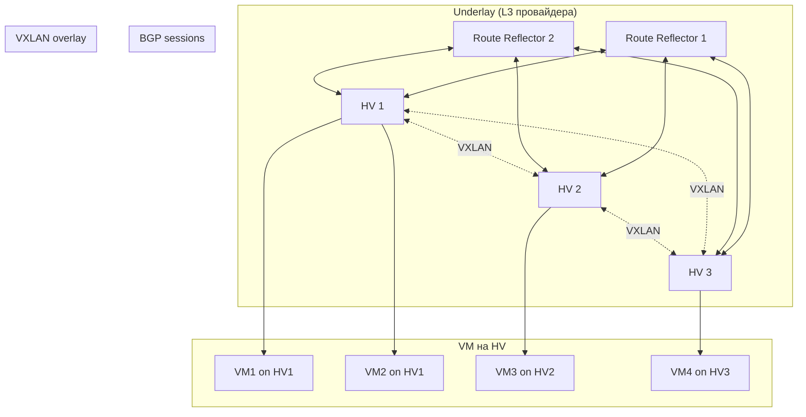
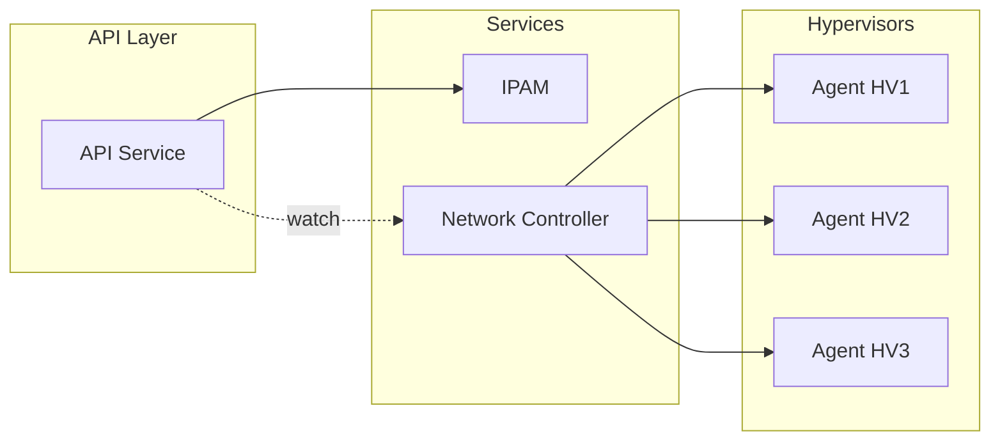
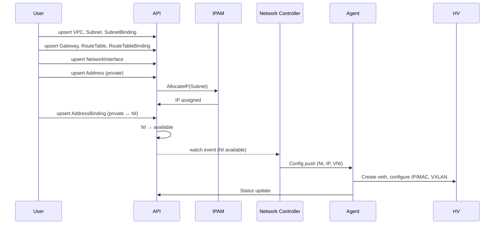

# in-cloud

| | |
|---|---|
| **Тип** | Архитектурный документ (KEP-style) |
| **Статус** | Draft |
| **Авторы** | PRO-Robotech |
| **Создан** | 2026-03-01 |
| **Область** | Networking / IaaS |

## Summary

**in-cloud** — проект IaaS-облака поверх арендованного bare metal без собственной spine-leaf фабрики. Система строит L3 overlay (VXLAN + EVPN + BGP) поверх providerской L3-сети, предоставляя пользователям AWS-подобные сетевые примитивы: VPC, Subnet, Address, NetworkInterface, Gateway, RouteTable и binding-ресурсы для связей между ними.

Kubernetes-like API (`metadata`/`spec`/`status`) обеспечивает декларативное управление ресурсами с поддержкой batch-операций, watch-стриминга и optimistic concurrency.

---

## Оглавление

1. [Motivation](#1-motivation)
2. [Архитектурный принцип](#2-архитектурный-принцип)
3. [Примитивы системы](#3-примитивы-системы)
4. [Сетевой дизайн](#4-сетевой-дизайн)
5. [Диаграмма сетевой архитектуры](#5-диаграмма-сетевой-архитектуры)
6. [Host-block aggregation и миграция](#6-host-block-aggregation-и-миграция)
7. [Control-plane](#7-control-plane)
8. [Диаграмма control-plane](#8-диаграмма-control-plane)
9. [Data flow: создание сетевого стека](#9-data-flow-создание-сетевого-стека)
10. [Стратегия роста](#10-стратегия-роста)
11. [Преимущества модели](#11-преимущества-модели)
12. [API](#12-api)
13. [Заключение](#13-заключение)

---

## 1. Motivation

### 1.1 Goals

**Цель проекта** — построить облачную платформу, функционально похожую на AWS (IaaS), но развернутую поверх арендованного bare metal без необходимости строить и эксплуатировать собственную spine-leaf фабрику.

### 1.2 Non-Goals (вне скоупа MVP)

- Compute orchestration (Instance, Scheduler) — будет добавлено на следующих этапах
- SecurityGroups / Network ACL — будет добавлено на следующих этапах
- Load Balancer — будет добавлен на следующих этапах
- Multi-region / federation

### 1.3 Ключевые ограничения

| Ограничение | Следствие |
|-------------|-----------|
| Нет собственной фабрики | Сеть underlay предоставляет провайдер; мы работаем только на L3 |
| Арендованный bare metal | Нельзя управлять физическими коммутаторами |
| Приоритет на масштаб | Архитектура должна выдерживать сотни HV и тысячи VM без деградации |

### 1.4 Что мы хотим достичь

| Аспект | Требование | Почему это важно |
|--------|------------|------------------|
| **Число HV** | Большое (десятки и сотни) | Типичный IaaS требует горизонтального масштабирования compute |
| **Число VM** | Большое (тысячи на кластер) | Плотное размещение и эффективное использование ресурсов |
| **Топология BGP** | Без full-mesh | O(N²) сессий между N HV делает систему непрактичной при росте |
| **Сетевые bottleneck** | Отсутствие центральных | Центральный роутер — single point of failure и ограничение пропускной способности |

**Вывод:** Архитектура должна быть распределённой, масштабируемой по control-plane и data-plane, и использовать агрегацию маршрутов для минимизации churn.

---

## 2. Архитектурный принцип

### 2.1 Двухуровневая модель: Underlay и Overlay

```
┌─────────────────────────────────────────────────────────────────────────┐
│                         OVERLAY (наш контроль)                           │
│  VXLAN | VRF per tenant | BGP | IPAM                                    │
├─────────────────────────────────────────────────────────────────────────┤
│                         UNDERLAY (провайдер)                             │
│  L3 сеть провайдера | IP-связность между HV | без доступа к фабрике     │
└─────────────────────────────────────────────────────────────────────────┘
```

**Underlay** — это L3-сеть, которую предоставляет провайдер хостинга. Мы не управляем физической топологией, коммутаторами или spine-leaf. Достаточно того, что между HV есть IP-связность.

**Overlay** — наш уровень. Мы строим поверх underlay распределённую виртуальную сеть, изолированную по tenant'ам, с собственной маршрутизацией и политиками безопасности.

### 2.2 Ключевые принципы масштабирования

| Принцип | Что это значит | Как это помогает масштабированию |
|---------|----------------|----------------------------------|
| **L3-only** | Нет больших L2 broadcast-доменов | Меньше broadcast traffic, проще маршрутизация, стабильнее при масштабе |
| **Host-block aggregation** | HV анонсирует агрегированный блок, а не /32 на каждую VM | VM churn не вызывает BGP updates; стабильность control-plane |
| **Шардирование control-plane** | API, IPAM, Controller можно делить по shard'ам | Горизонтальное масштабирование сервисов управления |
| **Без full-mesh** | Route Reflector вместо N×(N-1)/2 сессий | Рост HV не даёт квадратичного роста BGP-сессий |

---

## 3. Примитивы системы

Система оперирует примитивами, знакомыми пользователям AWS и других облачных провайдеров.

### 3.1 Таблица примитивов

**Ресурсы:**

| Примитив | Аналог | Назначение |
|----------|--------|------------|
| **VPC** | VPC | Область изоляции tenant'а; не содержит адресов; один VNI на VPC |
| **Subnet** | Subnet | Сеть с CIDR; подключается к VPC |
| **Address** | Elastic IP / Private IP | IP-адрес (private из Subnet или public из пула провайдера) |
| **NetworkInterface** | Elastic Network Interface | Сетевой интерфейс; самостоятельный ресурс без привязок |
| **Gateway** | NAT Gateway | Точка выхода трафика из VPC через общий IP (SNAT) |
| **RouteTable** | Route Table | Правила маршрутизации внутри VPC |

**Binding-ресурсы (связи):**

| Примитив | Что связывает | Назначение |
|----------|---------------|------------|
| **SubnetBinding** | Subnet ↔ VPC | Подключает Subnet к VPC |
| **AddressBinding** | Address ↔ NetworkInterface | Привязывает Address к NI; private → IP/MAC, NI → `available`; public → NAT-маппинг |
| **RouteTableBinding** | RouteTable ↔ Subnet / VPC | Применяет таблицу маршрутов к Subnet или ко всему VPC |

### 3.2 Поведение каждого HV

Каждый гипервизор:

1. **Обслуживает NetworkInterface'ы** — Agent создаёт veth pair, назначает IP/MAC из данных AddressBinding. IP привязан к ресурсу Address, а не к HV, что гарантирует сохранение адреса при live migration.
2. **Анонсирует агрегат (host-block) в BGP** — для большинства локальных NI трафик попадает по агрегированному маршруту. Мигрированные NI анонсируются отдельным /32.
3. **Применяет policy локально** — правила безопасности будут исполняться на HV (SecurityGroups — следующий этап).

### 3.3 IP allocation vs routing aggregation

Это два разных механизма, которые не должны быть связаны:

| Механизм | Уровень | Привязка | Назначение |
|----------|---------|----------|------------|
| **IP allocation** | IPAM / Subnet | Address → NI (стабилен при миграции) | Адресация VM |
| **Host-block** | BGP / routing | HV (меняется при миграции VM) | Оптимизация BGP: агрегация маршрутов |

**Почему IP нельзя выделять из host-block HV:**

- При live migration VM переезжает на другой HV
- Если IP привязан к host-block старого HV — адрес придётся менять
- Смена IP разрывает TCP-сессии, ломает DNS, service discovery

**Правильная модель:**

- IPAM выделяет IP из Subnet при создании Address (private)
- IP остаётся с Address на весь жизненный цикл, независимо от HV
- Host-block — это routing optimization, а не источник адресов

---

## 4. Сетевой дизайн

### 4.1 Underlay

| Характеристика | Описание |
|----------------|----------|
| **Что это** | L3-сеть провайдера (арендованный DC) |
| **Управление** | Вне нашего контроля; мы не трогаем фабрику |
| **Требования** | IP-связность между всеми HV; достаточная пропускная способность |

Мы не строим spine-leaf, не настраиваем OSPF/IS-IS на физической сети. Underlay — это «чёрный ящик» L3.

### 4.2 Overlay

| Элемент | Реализация |
|---------|------------|
| **Туннели** | VXLAN |
| **VNI** | Один VNI на VPC (изоляция tenant'ов) |
| **VRF** | Per-tenant VRF на HV (изоляция таблиц маршрутизации) |
| **Тип** | L3-only — нет больших L2 сегментов; маршрутизация между subnet'ами |

**Почему VXLAN, а не Geneve:**

| Критерий | VXLAN | Geneve |
|----------|-------|--------|
| **FRR + BGP EVPN** | Нативная интеграция | Нет — Geneve работает через OVN/OVS стек |
| **Linux kernel** | Полная поддержка, EVPN signaling | Поддержка есть, но EVPN — только через OVN |
| **Hardware offload** | Практически все современные NIC | Ограниченная поддержка на старых картах |
| **Зрелость в DC** | Стандарт де-факто | Привязан к OVN/OVS экосистеме |
| **Расширяемость** | Фиксированный заголовок, 24-bit VNI | TLV options (гибче, но нам не нужно) |

Наш dataplane — **FRR + Linux kernel**, не OVN/OVS. VXLAN — единственный логичный выбор для этого стека.

### 4.3 Control-plane маршрутизации

| Компонент | Роль |
|-----------|------|
| **FRR** | BGP (и при необходимости EVPN) на каждом HV |
| **Route Reflector** | Минимум 2 шт (HA); HV — BGP clients, не full-mesh |
| **Топология** | HV ↔ RR; HV не обмениваются BGP напрямую |

**Почему RR, а не full-mesh:** При N HV full-mesh требует N×(N-1)/2 сессий. Route Reflector — 2×N сессий. Рост HV не убивает BGP.

### 4.4 Агрегация маршрутов (кратко)

- **Host-block** — каждому HV выделяется routing-блок (например, /26 или /25).
- HV анонсирует этот блок в BGP как агрегат.
- **IP allocation** — отдельный процесс; IP привязан к Address (и через AddressBinding к NI), не к HV. IPAM предпочитает выдавать IP из host-block целевого HV (locality), но не гарантирует это.
- При миграции VM: IP сохраняется, новый HV анонсирует /32 (longest prefix match).

Подробнее — в [разделе 6](#6-host-block-aggregation-и-миграция).

---

## 5. Диаграмма сетевой архитектуры

### 5.1 Общая схема

```
                        UNDERLAY (L3 провайдера)
    ┌────────────────────────────────────────────────────────────────────┐
    │                                                                      │
    │    ┌─────────┐    ┌─────────┐    ┌─────────┐    ┌─────────┐          │
    │    │   RR1   │    │   RR2   │    │   HV1   │    │   HV2   │  ...     │
    │    │(BGP RR) │    │(BGP RR) │    │         │    │         │          │
    │    └────┬────┘    └────┬────┘    └────┬────┘    └────┬────┘          │
    │         │              │              │              │               │
    │         └──────────────┴──────────────┴──────────────┘               │
    │                     L3 IP connectivity                                │
    └────────────────────────────────────────────────────────────────────┘
                                         │
                                         │ VXLAN (UDP)
                                         ▼
    ┌────────────────────────────────────────────────────────────────────┐
    │                         OVERLAY                                     │
    │                                                                      │
    │  HV1: VRF-A ─── VXLAN ─── VRF-A on HV2                              │
    │        VM1       tunnel       VM2                                   │
    │        VM2                     VM3                                  │
    │                                                                      │
    │  VNI = VPC ID                                              │
    └────────────────────────────────────────────────────────────────────┘
```

### 5.2 Mermaid: топология BGP и VXLAN



### 5.3 Путь пакета (NI → NI)

```
VM1 (HV1) → veth → bridge/veth → VXLAN encap → underlay L3 → HV2 → VXLAN decap → bridge → VM2
```

---

## 6. Host-block aggregation и миграция

### 6.1 Проблема без агрегации

Если каждый HV анонсировал бы /32 на каждую VM:
- 1000 VM на 50 HV → до 1000 BGP updates при создании/удалении
- VM churn (частые create/delete) → постоянный BGP churn
- Route Reflector и все HV обрабатывали бы тысячи маршрутов

### 6.2 Решение: host-block как routing aggregation

**Важно:** Host-block — это механизм **агрегации маршрутов в BGP**, а не механизм выделения IP.

- IP выделяется из **Subnet** через IPAM при создании Address (private)
- IP **стабилен** на весь жизненный цикл Address
- Host-block — **подсказка для BGP**: если IP попадает в host-block HV, он покрывается агрегатом

Каждому HV выделяется routing-block. IPAM **предпочитает** выдавать IP из диапазона того HV, на котором размещён NI (locality-aware allocation). Но IP не обязан принадлежать host-block текущего HV.

### 6.3 Пример allocation

Пусть к VPC подключён Subnet `10.0.0.0/16`. IPAM выделяет routing-block'и HV:

| HV | Host-block (routing) | Количество адресов |
|----|----------------------|---------------------|
| HV1 | 10.0.0.0/26 | 64 |
| HV2 | 10.0.0.64/26 | 64 |
| HV3 | 10.0.0.128/26 | 64 |
| HV4 | 10.0.0.192/26 | 64 |

### 6.4 Два типа маршрутов на HV

| Тип | Когда | BGP-анонс | Стабильность |
|-----|-------|-----------|--------------|
| **Агрегат** (host-block) | VM IP попадает в host-block этого HV | Один префикс /26 | Стабилен — не меняется при VM churn |
| **/32 (leaked route)** | VM мигрировала сюда и IP вне host-block | Отдельный /32 | Временный — до rebalancing |

### 6.5 Что анонсируется в BGP

| Событие | Без агрегации | С host-block |
|---------|---------------|--------------|
| Создана VM на HV1 с IP 10.0.0.5 | BGP update: 10.0.0.5/32 | Нет изменения (IP в host-block HV1) |
| Удалена VM 10.0.0.5 | BGP withdrawal 10.0.0.5/32 | Нет изменения |
| VM 10.0.0.5 мигрирована на HV2 | withdrawal + update | HV2 анонсирует 10.0.0.5/32 (leaked); HV1 host-block остаётся |
| Добавлен новый HV5 | — | BGP update: 10.0.1.0/26 (новый host-block) |

### 6.6 Live migration: сохранение IP

```
До миграции:
  HV1 анонсирует 10.0.0.0/26 (агрегат)
  VM с IP 10.0.0.5 живёт на HV1 → покрывается агрегатом

После миграции VM на HV2:
  HV1 по-прежнему анонсирует 10.0.0.0/26 (агрегат)
  HV2 анонсирует 10.0.0.5/32 (more-specific → побеждает в longest prefix match)
  IP не меняется, трафик уходит на HV2
```

**Longest prefix match** гарантирует, что /32 всегда побеждает /26. Трафик для мигрированной VM корректно доставляется на новый HV.

### 6.7 Rebalancing (опционально)

Со временем «leaked» /32 маршруты можно убрать:

1. IPAM перевыделяет IP из host-block нового HV (graceful IP change с DNS TTL)
2. Или: при масштабе сотен HV /32 маршрутов будет мало (миграция — редкое событие), и их можно не трогать

### 6.8 Как HV узнаёт, куда отправлять пакет

При получении пакета для `10.0.0.70`:
- BGP-таблица: `10.0.0.64/26 via HV2` (nexthop = IP HV2 в underlay)
- HV отправляет пакет в VXLAN туннель до HV2
- HV2 получает, decapsulates; доставляет локальной VM

При получении пакета для мигрированной VM `10.0.0.5` (на HV2):
- BGP-таблица: `10.0.0.5/32 via HV2` (more-specific) и `10.0.0.0/26 via HV1`
- Longest prefix match → пакет уходит на HV2

---

## 7. Control-plane

### 7.1 Компоненты

| Компонент | Функция | Этап |
|-----------|---------|------|
| **API** | REST/gRPC; CRUD для всех сетевых ресурсов | MVP |
| **IPAM** | Аллокация IP из Subnet, host-block для HV, VNI для VPC | MVP |
| **Network Controller** | Программирование сети на HV (VXLAN, BGP, routes); watch API → push config | MVP |
| **Agent** (на каждом HV) | Применение конфигурации: FRR, VXLAN, NetworkInterface | MVP |
| **Scheduler** | Placement — выбор HV для Instance (compute) | Будущий этап |

### 7.2 Взаимодействие

- **API** — принимает декларативные ресурсы; вызывает IPAM для аллокации IP/VNI.
- **Network Controller** — watch'ит API на изменения ресурсов (NI → available); формирует целевое состояние и пушит его Agent'ам.
- **Agent** — получает конфиг, применяет локально (FRR, VXLAN, veth), отчитывается о статусе.

---

## 8. Диаграмма control-plane

### 8.1 ASCII-схема

```
                    ┌─────────────────────────────────────┐
                    │              API (REST/gRPC)         │
                    │  VPC | Subnet | Address | NI | ...   │
                    └───────────────────┬─────────────────┘
                                        │
                    ┌───────────────────┼───────────────────┐
                    │                                       │
                    ▼                                       ▼
             ┌──────────────┐                       ┌──────────────┐
             │     IPAM     │                       │   Network    │
             │  IP / VNI    │                       │  Controller  │
             │  Host-block  │                       │  (watch API) │
             └──────────────┘                       └──────┬───────┘
                                                           │
                    ┌──────────────────────────────────────┤
                    │                  │                    │
                    ▼                  ▼                    ▼
             ┌──────────────┐   ┌──────────────┐   ┌──────────────┐
             │   Agent      │   │   Agent      │   │   Agent      │
             │   (HV1)      │   │   (HV2)      │   │   (HV3)      │
             └──────┬───────┘   └──────┬───────┘   └──────┬───────┘
                    │                  │                    │
                    ▼                  ▼                    ▼
             ┌──────────────┐   ┌──────────────┐   ┌──────────────┐
             │  FRR, VXLAN  │   │  FRR, VXLAN  │   │  FRR, VXLAN  │
             │  NI (veth)   │   │  NI (veth)   │   │  NI (veth)   │
             └──────────────┘   └──────────────┘   └──────────────┘
```

### 8.2 Mermaid: flow control-plane



---

## 9. Data flow: создание сетевого стека

Последовательность создания полного сетевого стека через API — от VPC до работающего NetworkInterface с маршрутизацией.

### 9.1 Пошаговый flow

```
 1. upsert VPC                       → изолированная сеть (VNI в status)
 2. upsert Subnet                    → сеть с CIDR
 3. upsert SubnetBinding             → Subnet ↔ VPC
 4. upsert Gateway                   → NAT Gateway (SNAT для приватных NI)
 5. upsert RouteTable                → маршруты (0.0.0.0/0 → Gateway)
 6. upsert RouteTableBinding         → привязка RouteTable к Subnet или VPC
 7. upsert NetworkInterface          → пустой NI (состояние created)
 8. upsert Address (private)         → приватный IP из Subnet (IPAM аллоцирует)
 9. upsert AddressBinding            → Address(private) ↔ NI; NI → available
10. upsert Address (public, опц.)    → публичный IP из пула провайдера
11. upsert AddressBinding (опц.)     → Address(public) ↔ NI; NAT-маппинг
```

### 9.2 Что происходит на data-plane

После шага 9 (NI переходит в `available`):
1. **Network Controller** получает watch-событие и формирует конфиг для Agent на целевом HV
2. **Agent** на HV создаёт veth pair, подключает к bridge/namespace, назначает IP/MAC
3. **FRR/EVPN** автоматически обучает MAC/IP → VNI → nexthop
4. Если IP попадает в host-block HV — BGP не менялся. Иначе — /32 leaked route

### 9.3 Mermaid: sequence diagram



---

## 10. Стратегия роста

### 10.1 Этапы

| Этап | Масштаб | Ключевые характеристики |
|------|---------|---------------------------|
| **MVP** | 3–20 HV | Полный сетевой стек: EVPN + 2 RR, host-block aggregation, NAT Gateway, persistence, API + IPAM + Network Controller + Agent |
| **Production v1** | Десятки/сотни HV | Compute (Instance, Scheduler), SecurityGroups, мониторинг, HA control-plane |
| **Large scale** | Сотни+ HV | Cells, шардирование control-plane, опционально fabric/DPU |

### 10.2 MVP (3–20 HV)

Сразу строим на production-ready сетевом стеке, без промежуточных костылей:

| Компонент | Реализация в MVP | Обоснование |
|-----------|-----------------|-------------|
| **VXLAN + EVPN** | FRR с BGP EVPN type-2/type-5 на каждом HV | Автоматическое обучение MAC/IP; не нужно вручную прописывать FDB и туннели |
| **Route Reflector** | 2 шт (HA), FRR | Без full-mesh; при добавлении HV — только одна BGP-сессия к каждому RR |
| **Host-block aggregation** | IPAM выделяет /26 routing-block на HV | BGP стабилен при churn; /32 leaked routes при миграции |
| **NAT Gateway** | SNAT на выделенном узле / HV | Доступ в интернет для NI без публичного IP |
| **Persistence** | PostgreSQL (состояние ресурсов, IPAM) | Восстановление после рестарта; source of truth для desired state |
| **API** | REST/gRPC, один инстанс | CRUD для VPC, Subnet, Address, NetworkInterface, Gateway, RouteTable + binding-ресурсы |
| **IPAM** | Subnet allocation + host-block + locality-aware IP + VNI pool | Центральное управление адресным пространством |
| **Network Controller** | Watch API → программирование VXLAN/EVPN/routes через Agent | Синхронизация desired → actual state |
| **Agent** | На каждом HV: FRR, VXLAN, NetworkInterface (veth) | Исполнение конфигурации |

**Почему EVPN сразу, а не статический VXLAN:**

- Статический VXLAN требует ручного программирования FDB и туннелей → дополнительная логика в Network controller, которую потом придётся выкинуть
- EVPN автоматизирует обучение: MAC/IP → VNI → nexthop; controller задаёт только high-level intent
- FRR поддерживает EVPN из коробки — сложность развёртывания та же
- Переход со статического VXLAN на EVPN — это миграция, а не эволюция

**Почему persistence сразу:**

- Без БД рестарт API/IPAM теряет всё состояние
- PostgreSQL — проверенное решение, минимальные ops
- Desired state в БД → Agent'ы конвергируют к нему → идемпотентность

### 10.3 Production v1 (десятки/сотни HV)

| Компонент | Эволюция от MVP |
|-----------|----------------|
| **Compute** | Instance, Scheduler (placement по CPU/RAM, антиаффинити, bin-packing) |
| **SecurityGroups** | Правила безопасности на уровне NetworkInterface |
| **Multi-tenancy** | Полная изоляция: VRF per tenant, квоты, RBAC |
| **HA control-plane** | API и Controller за load balancer; leader election |
| **Мониторинг** | Prometheus + алерты: BGP-сессии, churn rate, IPAM utilization |
| **Live migration** | Полный цикл: /32 leaked route → convergence → optional rebalancing |
| **Load Balancer** | L4/L7 балансировка трафика |

### 10.4 Large scale (сотни+ HV)

| Компонент | Эволюция от Production v1 |
|-----------|--------------------------|
| **Cells** | Географические/логические ячейки; RR per cell; меньше cross-cell трафика |
| **Шардирование** | API, IPAM, Controller по shard — горизонтальное масштабирование |
| **Fabric/DPU** | Переход на собственную фабрику или DPU — overlay-модель остаётся той же |
| **Hierarchical RR** | Tier-1 RR между cells, Tier-2 RR внутри cell |

---

## 11. Преимущества модели

| Преимущество | Описание |
|--------------|----------|
| **Масштаб по HV** | Рост числа HV без роста BGP-сессий благодаря Route Reflector |
| **Устойчивость к VM churn** | Создание/удаление VM не генерирует BGP updates (host-block) |
| **Нет центрального роутера** | Распределённая маршрутизация; каждый HV — граничный узел |
| **Расширяемость** | Добавление cells и shard'ов без переделки логической модели |
| **Готовность к fabric** | Переход на собственную фабрику или DPU — без смены примитивов и API |
| **Знакомая модель** | Примитивы как в AWS — низкий порог входа для пользователей |

---

## 12. API

### 12.1 Общие принципы

API построен в стилистике Kubernetes-like ресурсов (аналогично sgroups-legacy v2):

| Принцип | Описание |
|---------|----------|
| **Все операции — POST** | Даже чтение; тело запроса используется для сложных фильтров |
| **Batch** | Все операции работают с массивами ресурсов |
| **Upsert + Update** | Upsert — создание (uid генерируется); Update — изменение (uid + name обязательны) |
| **Watch** | Streaming событий (`add`/`modify`/`deleted`/`init`) от `resourceVersion` |
| **Selector-фильтрация** | `fieldSelector` + `labelSelector` в list/watch |
| **metadata + spec** | Стандартная структура для всех ресурсов |
| **Partial updates** | Отдельные endpoint'ы для обновления подмножеств полей |
| **Самодостаточность** | Каждый ресурс самодостаточен и не зависит от других; связи между ресурсами — мягкие (по name), не каскадные |

### 12.2 Модель ресурса

Каждый ресурс состоит из `metadata` (стандартные поля) и `spec` (доменные поля):

```json
{
  "metadata": {
    "name": "my-resource",
    "namespace": "tenant-a",
    "uid": "550e8400-e29b-41d4-a716-446655440000",
    "labels": { "env": "prod", "team": "infra" },
    "annotations": { "description": "..." },
    "creationTimestamp": "2026-03-01T12:00:00Z",
    "resourceVersion": "42"
  },
  "spec": {
    // domain-specific fields
  }
}
```

| Поле metadata | Тип | Назначение |
|---------------|-----|------------|
| `name` | string, required | Уникальное имя в namespace |
| `namespace` | string, required | Изоляция tenant'а |
| `uid` | string | UUID; сервер генерирует при upsert; обязателен (вместе с name) при update |
| `labels` | map[string]string | Для labelSelector в list/watch |
| `annotations` | map[string]string | Произвольные метаданные |
| `creationTimestamp` | string | Сервер ставит при создании (RFC 3339) |
| `resourceVersion` | string | Optimistic concurrency; монотонно растёт |

### 12.3 Стандартные операции

Каждый ресурс поддерживает 5 операций:

| Операция | Endpoint | Тело запроса | Ответ |
|----------|----------|-------------|-------|
| **upsert** | `POST /v1/{resource}/upsert` | Массив ресурсов; `name` обязателен, `uid` не указывается | Массив с server-set полями (uid, timestamps, resourceVersion) |
| **update** | `POST /v1/{resource}/update` | Массив ресурсов; `name` + `uid` обязательны одновременно | Массив обновлённых ресурсов |
| **list** | `POST /v1/{resource}/list` | `selectors[]`; пустое тело → все | `resourceVersion` + массив ресурсов |
| **delete** | `POST /v1/{resource}/delete` | Массив идентификаторов (name+namespace или uid) | Пустое тело при успехе |
| **watch** | `POST /v1/{resource}/watch` | `resourceVersion` + `selectors[]` | Streaming: `type` + массив ресурсов |

**Разница upsert и update:**

| | upsert (создание) | update (изменение) |
|-|-------------------|-------------------|
| `name` | Обязателен; уникальность в namespace | Обязателен |
| `uid` | Не указывается; сервер генерирует | Обязателен; идентифицирует ресурс |
| Семантика | Создание нового ресурса | Изменение существующего |
| Если ресурс не найден | Создаётся | Ошибка 404 |

Watch-события:

| type | Когда |
|------|-------|
| `init` | Начальное состояние при подключении |
| `add` | Ресурс создан |
| `modify` | Ресурс изменён |
| `deleted` | Ресурс удалён |

---

### 12.4 VPC

Область изоляции. VPC не содержит адресов — это чистый isolation domain. Адресные пространства определяются Subnet'ами, которые подключаются к VPC.

**Endpoint:** `/v1/vpcs/{upsert|update|list|delete|watch}`

#### Входные параметры

- `vpcs[]` — массив ресурсов VPC
- `vpcs[].metadata.name` — уникальное имя VPC в namespace
- `vpcs[].metadata.namespace` — namespace (изоляция tenant'а)
- `vpcs[].metadata.uid` — UUID; сервер генерирует при upsert; обязателен при update
- `vpcs[].metadata.labels` — метки для labelSelector
- `vpcs[].metadata.annotations` — произвольные аннотации
- `vpcs[].spec.comment` — комментарий
- `vpcs[].spec.description` — описание
- `vpcs[].spec.displayName` — отображаемое имя

| название | обязательность | тип данных | значение по умолчанию |
|----------|---------------|------------|----------------------|
| `vpcs[]` | да | Object[] | |
| `vpcs[].metadata.name` | да | string | |
| `vpcs[].metadata.namespace` | да | string | |
| `vpcs[].metadata.uid` | при update | string | |
| `vpcs[].metadata.labels` | нет | Object | |
| `vpcs[].metadata.annotations` | нет | Object | |
| `vpcs[].spec.comment` | нет | string | |
| `vpcs[].spec.description` | нет | string | |
| `vpcs[].spec.displayName` | нет | string | |

#### Ограничения

| Поле | Правило | Ошибка |
|------|---------|--------|
| `metadata.name` | обязательное; DNS-label, 1–63 символа, `^[a-z0-9][a-z0-9\-]{0,61}[a-z0-9]$` | `400 invalid_name` |
| `metadata.namespace` | обязательное; тот же формат что `name` | `400 invalid_namespace` |
| `metadata.uid` | запрещён при upsert; обязателен при update; UUID v4 | `400 invalid_uid` |
| `metadata.labels` | ключ: `^[a-z0-9\-_.\/]{1,63}$`; значение: `^.{0,63}$` | `400 invalid_labels` |
| `metadata.annotations` | ключ: `^[a-z0-9\-_.\/]{1,253}$`; значение: без ограничений | `400 invalid_annotations` |
| `name` + `namespace` | уникальная пара (при upsert) | `409 already_exists` |
| `spec.description` | макс. 256 символов | `400 invalid_description` |
| `spec.displayName` | макс. 128 символов | `400 invalid_display_name` |
| `spec.comment` | макс. 256 символов | `400 invalid_comment` |

> Нет обязательных spec-полей помимо стандартных строковых.

#### Пример использования (Создание)

```bash
curl 'api:9006/v1/vpcs/upsert' \
--header 'Content-Type: application/json' \
--data '{
  "vpcs": [
    {
      "metadata": {
        "name": "prod-vpc",
        "namespace": "tenant-a",
        "labels": { "env": "prod" }
      },
      "spec": {
        "description": "Production VPC",
        "displayName": "Prod VPC"
      }
    }
  ]
}'
```

#### Выходные параметры

- `vpcs[]` — массив VPC
- `vpcs[].metadata` — стандартные метаданные
- `vpcs[].metadata.name` — имя VPC
- `vpcs[].metadata.namespace` — namespace
- `vpcs[].metadata.uid` — UUID
- `vpcs[].metadata.labels` — метки
- `vpcs[].metadata.annotations` — аннотации
- `vpcs[].metadata.creationTimestamp` — время создания (RFC 3339)
- `vpcs[].metadata.resourceVersion` — версия ресурса
- `vpcs[].spec.comment` — комментарий
- `vpcs[].spec.description` — описание
- `vpcs[].spec.displayName` — отображаемое имя
- `vpcs[].status.vni` — VXLAN VNI; назначается сервером из пула

| название | тип данных |
|----------|-----------|
| `vpcs[]` | Object[] |
| `vpcs[].metadata` | Object |
| `vpcs[].metadata.name` | string |
| `vpcs[].metadata.namespace` | string |
| `vpcs[].metadata.uid` | string |
| `vpcs[].metadata.labels` | Object |
| `vpcs[].metadata.annotations` | Object |
| `vpcs[].metadata.creationTimestamp` | string |
| `vpcs[].metadata.resourceVersion` | string |
| `vpcs[].spec.comment` | string |
| `vpcs[].spec.description` | string |
| `vpcs[].spec.displayName` | string |
| `vpcs[].status.vni` | int |

#### Пример ответа

```json
{
  "vpcs": [
    {
      "metadata": {
        "name": "prod-vpc",
        "namespace": "tenant-a",
        "uid": "a1b2c3d4-...",
        "labels": { "env": "prod" },
        "creationTimestamp": "2026-03-01T12:00:00Z",
        "resourceVersion": "1"
      },
      "spec": {
        "description": "Production VPC",
        "displayName": "Prod VPC"
      },
      "status": {
        "vni": 100001
      }
    }
  ]
}
```

#### List

```bash
curl 'api:9006/v1/vpcs/list' \
--header 'Content-Type: application/json' \
--data '{
  "selectors": [
    {
      "fieldSelector": {
        "name": "prod-vpc",
        "namespace": "tenant-a"
      },
      "labelSelector": {
        "env": "prod"
      }
    }
  ]
}'
```

**Ответ:**

```json
{
  "resourceVersion": "55",
  "vpcs": [
    {
      "metadata": {
        "name": "prod-vpc",
        "namespace": "tenant-a",
        "uid": "a1b2c3d4-...",
        "labels": { "env": "prod" },
        "creationTimestamp": "2026-03-01T12:00:00Z",
        "resourceVersion": "1"
      },
      "spec": {
        "description": "Production VPC",
        "displayName": "Prod VPC"
      },
      "status": {
        "vni": 100001
      }
    }
  ]
}
```

#### Watch

```bash
curl 'api:9006/v1/vpcs/watch' \
--header 'Content-Type: application/json' \
--data '{
  "resourceVersion": "55",
  "selectors": [
    {
      "labelSelector": { "env": "prod" }
    }
  ]
}'
```

**Формат события:**

```json
{
  "type": "modify",
  "vpcs": [
    {
      "metadata": { "name": "prod-vpc", "namespace": "tenant-a", "uid": "a1b2c3d4-...", "resourceVersion": "56" },
      "spec": { "description": "Production VPC", "displayName": "Prod VPC" },
      "status": { "vni": 100001 }
    }
  ]
}
```

---

### 12.5 Subnet

Сеть с адресным пространством. Самостоятельный ресурс. Связь с VPC определяется через SubnetBinding.

**Endpoint:** `/v1/subnets/{upsert|update|list|delete|watch}`

#### Входные параметры

- `subnets[]` — массив ресурсов Subnet
- `subnets[].metadata.name` — уникальное имя Subnet в namespace
- `subnets[].metadata.namespace` — namespace (изоляция tenant'а)
- `subnets[].metadata.uid` — UUID; сервер генерирует при upsert; обязателен при update
- `subnets[].metadata.labels` — метки для labelSelector
- `subnets[].metadata.annotations` — произвольные аннотации
- `subnets[].spec.cidrBlock` — CIDR подсети (e.g. `10.0.1.0/24`)
- `subnets[].spec.comment` — комментарий
- `subnets[].spec.description` — описание
- `subnets[].spec.displayName` — отображаемое имя

| название | обязательность | тип данных | значение по умолчанию |
|----------|---------------|------------|----------------------|
| `subnets[]` | да | Object[] | |
| `subnets[].metadata.name` | да | string | |
| `subnets[].metadata.namespace` | да | string | |
| `subnets[].metadata.uid` | при update | string | |
| `subnets[].metadata.labels` | нет | Object | |
| `subnets[].metadata.annotations` | нет | Object | |
| `subnets[].spec.cidrBlock` | да | string | |
| `subnets[].spec.comment` | нет | string | |
| `subnets[].spec.description` | нет | string | |
| `subnets[].spec.displayName` | нет | string | |

#### Ограничения

| Поле | Правило | Ошибка |
|------|---------|--------|
| `metadata.name` | обязательное; DNS-label, 1–63 символа, `^[a-z0-9][a-z0-9\-]{0,61}[a-z0-9]$` | `400 invalid_name` |
| `metadata.namespace` | обязательное; тот же формат что `name` | `400 invalid_namespace` |
| `metadata.uid` | запрещён при upsert; обязателен при update; UUID v4 | `400 invalid_uid` |
| `metadata.labels` | ключ: `^[a-z0-9\-_.\/]{1,63}$`; значение: `^.{0,63}$` | `400 invalid_labels` |
| `metadata.annotations` | ключ: `^[a-z0-9\-_.\/]{1,253}$`; значение: без ограничений | `400 invalid_annotations` |
| `name` + `namespace` | уникальная пара (при upsert) | `409 already_exists` |
| `spec.cidrBlock` | обязательное; валидный IPv4 CIDR; префикс `/16` – `/28` | `400 invalid_cidr_block` |
| `spec.cidrBlock` | неизменяемое (immutable) | `400 immutable_field` |
| `spec.description` | макс. 256 символов | `400 invalid_description` |
| `spec.displayName` | макс. 128 символов | `400 invalid_display_name` |
| `spec.comment` | макс. 256 символов | `400 invalid_comment` |

#### Пример использования (Создание)

```bash
curl 'api:9006/v1/subnets/upsert' \
--header 'Content-Type: application/json' \
--data '{
  "subnets": [
    {
      "metadata": {
        "name": "web-subnet",
        "namespace": "tenant-a",
        "labels": { "tier": "web" }
      },
      "spec": {
        "cidrBlock": "10.0.1.0/24",
        "displayName": "Web tier subnet"
      }
    }
  ]
}'
```

#### Выходные параметры

- `subnets[]` — массив Subnet
- `subnets[].metadata` — стандартные метаданные
- `subnets[].metadata.name` — имя Subnet
- `subnets[].metadata.namespace` — namespace
- `subnets[].metadata.uid` — UUID
- `subnets[].metadata.labels` — метки
- `subnets[].metadata.annotations` — аннотации
- `subnets[].metadata.creationTimestamp` — время создания (RFC 3339)
- `subnets[].metadata.resourceVersion` — версия ресурса
- `subnets[].spec.cidrBlock` — CIDR подсети
- `subnets[].spec.comment` — комментарий
- `subnets[].spec.description` — описание
- `subnets[].spec.displayName` — отображаемое имя
- `subnets[].status.availableIpCount` — количество свободных IP в подсети

| название | тип данных |
|----------|-----------|
| `subnets[]` | Object[] |
| `subnets[].metadata` | Object |
| `subnets[].metadata.name` | string |
| `subnets[].metadata.namespace` | string |
| `subnets[].metadata.uid` | string |
| `subnets[].metadata.labels` | Object |
| `subnets[].metadata.annotations` | Object |
| `subnets[].metadata.creationTimestamp` | string |
| `subnets[].metadata.resourceVersion` | string |
| `subnets[].spec.cidrBlock` | string |
| `subnets[].spec.comment` | string |
| `subnets[].spec.description` | string |
| `subnets[].spec.displayName` | string |
| `subnets[].status.availableIpCount` | int |

#### Пример ответа

```json
{
  "subnets": [
    {
      "metadata": {
        "name": "web-subnet",
        "namespace": "tenant-a",
        "uid": "b2c3d4e5-...",
        "labels": { "tier": "web" },
        "creationTimestamp": "2026-03-01T12:01:00Z",
        "resourceVersion": "1"
      },
      "spec": {
        "cidrBlock": "10.0.1.0/24",
        "displayName": "Web tier subnet"
      },
      "status": {
        "availableIpCount": 251
      }
    }
  ]
}
```

#### List

```bash
curl 'api:9006/v1/subnets/list' \
--header 'Content-Type: application/json' \
--data '{
  "selectors": [
    {
      "fieldSelector": {
        "namespace": "tenant-a"
      },
      "labelSelector": {
        "tier": "web"
      }
    }
  ]
}'
```

**Ответ:**

```json
{
  "resourceVersion": "60",
  "subnets": [
    {
      "metadata": {
        "name": "web-subnet",
        "namespace": "tenant-a",
        "uid": "b2c3d4e5-...",
        "labels": { "tier": "web" },
        "creationTimestamp": "2026-03-01T12:01:00Z",
        "resourceVersion": "1"
      },
      "spec": {
        "cidrBlock": "10.0.1.0/24",
        "displayName": "Web tier subnet"
      },
      "status": {
        "availableIpCount": 251
      }
    }
  ]
}
```

#### Watch

```bash
curl 'api:9006/v1/subnets/watch' \
--header 'Content-Type: application/json' \
--data '{
  "resourceVersion": "60",
  "selectors": [
    {
      "labelSelector": { "tier": "web" }
    }
  ]
}'
```

**Формат события:**

```json
{
  "type": "modify",
  "subnets": [
    {
      "metadata": { "name": "web-subnet", "namespace": "tenant-a", "uid": "b2c3d4e5-...", "resourceVersion": "61" },
      "spec": { "cidrBlock": "10.0.1.0/24", "displayName": "Web tier subnet" },
      "status": { "availableIpCount": 250 }
    }
  ]
}
```

---

### 12.6 SubnetBinding

Связь между Subnet и VPC. Самостоятельный ресурс. Subnet без SubnetBinding не принадлежит ни одному VPC.

**Endpoint:** `/v1/subnet-bindings/{upsert|update|list|delete|watch}`

#### Входные параметры

- `subnetBindings[]` — массив ресурсов SubnetBinding
- `subnetBindings[].metadata.name` — уникальное имя SubnetBinding в namespace
- `subnetBindings[].metadata.namespace` — namespace (изоляция tenant'а)
- `subnetBindings[].metadata.uid` — UUID; сервер генерирует при upsert; обязателен при update
- `subnetBindings[].metadata.labels` — метки для labelSelector
- `subnetBindings[].metadata.annotations` — произвольные аннотации
- `subnetBindings[].spec.subnetRef` — ссылка на Subnet: `{ name, namespace }`
- `subnetBindings[].spec.vpcRef` — ссылка на VPC: `{ name, namespace }`
- `subnetBindings[].spec.comment` — комментарий
- `subnetBindings[].spec.description` — описание
- `subnetBindings[].spec.displayName` — отображаемое имя

| название | обязательность | тип данных | значение по умолчанию |
|----------|---------------|------------|----------------------|
| `subnetBindings[]` | да | Object[] | |
| `subnetBindings[].metadata.name` | да | string | |
| `subnetBindings[].metadata.namespace` | да | string | |
| `subnetBindings[].metadata.uid` | при update | string | |
| `subnetBindings[].metadata.labels` | нет | Object | |
| `subnetBindings[].metadata.annotations` | нет | Object | |
| `subnetBindings[].spec.subnetRef` | да | Object | |
| `subnetBindings[].spec.subnetRef.name` | да | string | |
| `subnetBindings[].spec.subnetRef.namespace` | да | string | |
| `subnetBindings[].spec.vpcRef` | да | Object | |
| `subnetBindings[].spec.vpcRef.name` | да | string | |
| `subnetBindings[].spec.vpcRef.namespace` | да | string | |
| `subnetBindings[].spec.comment` | нет | string | |
| `subnetBindings[].spec.description` | нет | string | |
| `subnetBindings[].spec.displayName` | нет | string | |

#### Ограничения

| Поле | Правило | Ошибка |
|------|---------|--------|
| `metadata.name` | обязательное; DNS-label, 1–63 символа, `^[a-z0-9][a-z0-9\-]{0,61}[a-z0-9]$` | `400 invalid_name` |
| `metadata.namespace` | обязательное; тот же формат что `name` | `400 invalid_namespace` |
| `metadata.uid` | запрещён при upsert; обязателен при update; UUID v4 | `400 invalid_uid` |
| `metadata.labels` | ключ: `^[a-z0-9\-_.\/]{1,63}$`; значение: `^.{0,63}$` | `400 invalid_labels` |
| `metadata.annotations` | ключ: `^[a-z0-9\-_.\/]{1,253}$`; значение: без ограничений | `400 invalid_annotations` |
| `name` + `namespace` | уникальная пара (при upsert) | `409 already_exists` |
| `spec.subnetRef` | обязательное; `{ name, namespace }`; Subnet должен существовать | `404 referenced_resource_not_found` |
| `spec.subnetRef` | один Subnet — один SubnetBinding (Subnet не может принадлежать нескольким VPC) | `409 already_bound` |
| `spec.subnetRef` | неизменяемое (immutable) | `400 immutable_field` |
| `spec.vpcRef` | обязательное; `{ name, namespace }`; VPC должен существовать | `404 referenced_resource_not_found` |
| `spec.vpcRef` | неизменяемое (immutable) | `400 immutable_field` |
| CIDR Subnet | не должен пересекаться с другими Subnet в том же VPC | `409 cidr_overlap` |
| `spec.description` | макс. 256 символов | `400 invalid_description` |
| `spec.displayName` | макс. 128 символов | `400 invalid_display_name` |
| `spec.comment` | макс. 256 символов | `400 invalid_comment` |

#### Пример использования (Создание)

```bash
curl 'api:9006/v1/subnet-bindings/upsert' \
--header 'Content-Type: application/json' \
--data '{
  "subnetBindings": [
    {
      "metadata": {
        "name": "web-subnet-to-prod-vpc",
        "namespace": "tenant-a"
      },
      "spec": {
        "subnetRef": { "name": "web-subnet", "namespace": "tenant-a" },
        "vpcRef": { "name": "prod-vpc", "namespace": "tenant-a" }
      }
    }
  ]
}'
```

#### Выходные параметры

- `subnetBindings[]` — массив SubnetBinding
- `subnetBindings[].metadata` — стандартные метаданные
- `subnetBindings[].metadata.name` — имя SubnetBinding
- `subnetBindings[].metadata.namespace` — namespace
- `subnetBindings[].metadata.uid` — UUID
- `subnetBindings[].metadata.labels` — метки
- `subnetBindings[].metadata.annotations` — аннотации
- `subnetBindings[].metadata.creationTimestamp` — время создания (RFC 3339)
- `subnetBindings[].metadata.resourceVersion` — версия ресурса
- `subnetBindings[].spec.subnetRef` — ссылка на Subnet
- `subnetBindings[].spec.vpcRef` — ссылка на VPC
- `subnetBindings[].spec.comment` — комментарий
- `subnetBindings[].spec.description` — описание
- `subnetBindings[].spec.displayName` — отображаемое имя

| название | тип данных |
|----------|-----------|
| `subnetBindings[]` | Object[] |
| `subnetBindings[].metadata` | Object |
| `subnetBindings[].metadata.name` | string |
| `subnetBindings[].metadata.namespace` | string |
| `subnetBindings[].metadata.uid` | string |
| `subnetBindings[].metadata.labels` | Object |
| `subnetBindings[].metadata.annotations` | Object |
| `subnetBindings[].metadata.creationTimestamp` | string |
| `subnetBindings[].metadata.resourceVersion` | string |
| `subnetBindings[].spec.subnetRef` | Object |
| `subnetBindings[].spec.vpcRef` | Object |
| `subnetBindings[].spec.comment` | string |
| `subnetBindings[].spec.description` | string |
| `subnetBindings[].spec.displayName` | string |

#### Пример ответа

```json
{
  "subnetBindings": [
    {
      "metadata": {
        "name": "web-subnet-to-prod-vpc",
        "namespace": "tenant-a",
        "uid": "d4e5f6a7-...",
        "creationTimestamp": "2026-03-01T12:01:30Z",
        "resourceVersion": "1"
      },
      "spec": {
        "subnetRef": { "name": "web-subnet", "namespace": "tenant-a" },
        "vpcRef": { "name": "prod-vpc", "namespace": "tenant-a" }
      }
    }
  ]
}
```

#### List (с refs)

```bash
curl 'api:9006/v1/subnet-bindings/list' \
--header 'Content-Type: application/json' \
--data '{
  "selectors": [
    {
      "fieldSelector": {
        "namespace": "tenant-a",
        "refs": [
          { "name": "prod-vpc", "resType": "VPC" }
        ]
      }
    }
  ]
}'
```

**Ответ:**

```json
{
  "resourceVersion": "65",
  "subnetBindings": [
    {
      "metadata": {
        "name": "web-subnet-to-prod-vpc",
        "namespace": "tenant-a",
        "uid": "d4e5f6a7-...",
        "creationTimestamp": "2026-03-01T12:01:30Z",
        "resourceVersion": "1"
      },
      "spec": {
        "subnetRef": { "name": "web-subnet", "namespace": "tenant-a" },
        "vpcRef": { "name": "prod-vpc", "namespace": "tenant-a" }
      }
    }
  ]
}
```

> `refs` позволяет фильтровать по ссылкам: найти все SubnetBinding, связанные с конкретным VPC или Subnet.

#### Watch

```bash
curl 'api:9006/v1/subnet-bindings/watch' \
--header 'Content-Type: application/json' \
--data '{
  "resourceVersion": "65",
  "selectors": [
    {
      "fieldSelector": {
        "refs": [
          { "name": "prod-vpc", "resType": "VPC" }
        ]
      }
    }
  ]
}'
```

**Формат события:**

```json
{
  "type": "add",
  "subnetBindings": [
    {
      "metadata": { "name": "db-subnet-to-prod-vpc", "namespace": "tenant-a", "uid": "e5f6a7b8-...", "resourceVersion": "66" },
      "spec": {
        "subnetRef": { "name": "db-subnet", "namespace": "tenant-a" },
        "vpcRef": { "name": "prod-vpc", "namespace": "tenant-a" }
      }
    }
  ]
}
```

---

### 12.7 Address

IP-адрес. Два типа:

- `private` — приватный IP; аллоцируется из CIDR Subnet (через `subnetRef`); IPAM назначает автоматически
- `public` — публичный IP (аналог AWS Elastic IP); резервируется из пула провайдера

Address — самостоятельный ресурс. Привязка к NetworkInterface выполняется через `AddressBinding`.

**Endpoint:** `/v1/addresses/{upsert|update|list|delete|watch}`

#### Входные параметры

- `addresses[]` — массив ресурсов Address
- `addresses[].metadata.name` — уникальное имя Address в namespace
- `addresses[].metadata.namespace` — namespace (изоляция tenant'а)
- `addresses[].metadata.uid` — UUID; сервер генерирует при upsert; обязателен при update
- `addresses[].metadata.labels` — метки для labelSelector
- `addresses[].metadata.annotations` — произвольные аннотации
- `addresses[].spec.type` — тип адреса: `private` или `public`
- `addresses[].spec.subnetRef` — ссылка на Subnet: `{ name, namespace }` (только при `type: private`; IPAM аллоцирует IP из CIDR)
- `addresses[].spec.comment` — комментарий
- `addresses[].spec.description` — описание
- `addresses[].spec.displayName` — отображаемое имя

| название | обязательность | тип данных | значение по умолчанию |
|----------|---------------|------------|----------------------|
| `addresses[]` | да | Object[] | |
| `addresses[].metadata.name` | да | string | |
| `addresses[].metadata.namespace` | да | string | |
| `addresses[].metadata.uid` | при update | string | |
| `addresses[].metadata.labels` | нет | Object | |
| `addresses[].metadata.annotations` | нет | Object | |
| `addresses[].spec.type` | да | enum (`private` / `public`) | |
| `addresses[].spec.subnetRef` | да (при `type: private`) | Object | |
| `addresses[].spec.subnetRef.name` | да (при `type: private`) | string | |
| `addresses[].spec.subnetRef.namespace` | да (при `type: private`) | string | |
| `addresses[].spec.comment` | нет | string | |
| `addresses[].spec.description` | нет | string | |
| `addresses[].spec.displayName` | нет | string | |

#### Ограничения

| Поле | Правило | Ошибка |
|------|---------|--------|
| `metadata.name` | обязательное; DNS-label, 1–63 символа, `^[a-z0-9][a-z0-9\-]{0,61}[a-z0-9]$` | `400 invalid_name` |
| `metadata.namespace` | обязательное; тот же формат что `name` | `400 invalid_namespace` |
| `metadata.uid` | запрещён при upsert; обязателен при update; UUID v4 | `400 invalid_uid` |
| `metadata.labels` | ключ: `^[a-z0-9\-_.\/]{1,63}$`; значение: `^.{0,63}$` | `400 invalid_labels` |
| `metadata.annotations` | ключ: `^[a-z0-9\-_.\/]{1,253}$`; значение: без ограничений | `400 invalid_annotations` |
| `name` + `namespace` | уникальная пара (при upsert) | `409 already_exists` |
| `spec.type` | обязательное; `private` или `public` | `400 invalid_address_type` |
| `spec.type` | неизменяемое (immutable) | `400 immutable_field` |
| `spec.subnetRef` | обязательное при `type: private`; `{ name, namespace }`; Subnet должен существовать | `404 referenced_resource_not_found` |
| `spec.subnetRef` | запрещён при `type: public` | `400 subnet_not_allowed_for_public` |
| `spec.subnetRef` (private) | в подсети должны быть свободные IP | `409 subnet_exhausted` |
| `spec.subnetRef` | неизменяемое (immutable) | `400 immutable_field` |
| `spec.description` | макс. 256 символов | `400 invalid_description` |
| `spec.displayName` | макс. 128 символов | `400 invalid_display_name` |
| `spec.comment` | макс. 256 символов | `400 invalid_comment` |

#### Пример использования (Создание приватного IP)

```bash
curl 'api:9006/v1/addresses/upsert' \
--header 'Content-Type: application/json' \
--data '{
  "addresses": [
    {
      "metadata": {
        "name": "web-private-ip",
        "namespace": "tenant-a"
      },
      "spec": {
        "type": "private",
        "subnetRef": { "name": "web-subnet", "namespace": "tenant-a" },
        "description": "Private IP for web server"
      }
    }
  ]
}'
```

#### Пример использования (Создание публичного IP)

```bash
curl 'api:9006/v1/addresses/upsert' \
--header 'Content-Type: application/json' \
--data '{
  "addresses": [
    {
      "metadata": {
        "name": "web-eip-1",
        "namespace": "tenant-a",
        "labels": { "role": "web" }
      },
      "spec": {
        "type": "public",
        "description": "Elastic IP for web server"
      }
    }
  ]
}'
```

#### Выходные параметры

- `addresses[]` — массив Address
- `addresses[].metadata` — стандартные метаданные
- `addresses[].metadata.name` — имя Address
- `addresses[].metadata.namespace` — namespace
- `addresses[].metadata.uid` — UUID
- `addresses[].metadata.labels` — метки
- `addresses[].metadata.annotations` — аннотации
- `addresses[].metadata.creationTimestamp` — время создания (RFC 3339)
- `addresses[].metadata.resourceVersion` — версия ресурса
- `addresses[].spec.type` — тип адреса
- `addresses[].spec.subnetRef` — ссылка на Subnet (при `type: private`)
- `addresses[].spec.comment` — комментарий
- `addresses[].spec.description` — описание
- `addresses[].spec.displayName` — отображаемое имя
- `addresses[].status.ip` — аллоцированный IP-адрес (приватный или публичный)
- `addresses[].status.state` — состояние: `allocated`, `released`

| название | тип данных |
|----------|-----------|
| `addresses[]` | Object[] |
| `addresses[].metadata` | Object |
| `addresses[].metadata.name` | string |
| `addresses[].metadata.namespace` | string |
| `addresses[].metadata.uid` | string |
| `addresses[].metadata.labels` | Object |
| `addresses[].metadata.annotations` | Object |
| `addresses[].metadata.creationTimestamp` | string |
| `addresses[].metadata.resourceVersion` | string |
| `addresses[].spec.type` | enum |
| `addresses[].spec.subnetRef` | Object |
| `addresses[].spec.comment` | string |
| `addresses[].spec.description` | string |
| `addresses[].spec.displayName` | string |
| `addresses[].status.ip` | string |
| `addresses[].status.state` | enum |

#### Пример ответа (приватный IP)

```json
{
  "addresses": [
    {
      "metadata": {
        "name": "web-private-ip",
        "namespace": "tenant-a",
        "uid": "e2f3a4b5-...",
        "creationTimestamp": "2026-03-01T12:02:00Z",
        "resourceVersion": "1"
      },
      "spec": {
        "type": "private",
        "subnetRef": { "name": "web-subnet", "namespace": "tenant-a" },
        "description": "Private IP for web server"
      },
      "status": {
        "ip": "10.0.1.12",
        "state": "allocated"
      }
    }
  ]
}
```

#### Пример ответа (публичный IP)

```json
{
  "addresses": [
    {
      "metadata": {
        "name": "web-eip-1",
        "namespace": "tenant-a",
        "uid": "f1a2b3c4-...",
        "labels": { "role": "web" },
        "creationTimestamp": "2026-03-01T12:03:00Z",
        "resourceVersion": "1"
      },
      "spec": {
        "type": "public",
        "description": "Elastic IP for web server"
      },
      "status": {
        "ip": "203.0.113.42",
        "state": "allocated"
      }
    }
  ]
}
```

#### List (с refs)

```bash
curl 'api:9006/v1/addresses/list' \
--header 'Content-Type: application/json' \
--data '{
  "selectors": [
    {
      "fieldSelector": {
        "namespace": "tenant-a",
        "refs": [
          { "name": "web-subnet", "resType": "Subnet" }
        ]
      }
    }
  ]
}'
```

**Ответ:**

```json
{
  "resourceVersion": "70",
  "addresses": [
    {
      "metadata": {
        "name": "web-private-ip",
        "namespace": "tenant-a",
        "uid": "e2f3a4b5-...",
        "creationTimestamp": "2026-03-01T12:02:00Z",
        "resourceVersion": "1"
      },
      "spec": {
        "type": "private",
        "subnetRef": { "name": "web-subnet", "namespace": "tenant-a" },
        "description": "Private IP for web server"
      },
      "status": {
        "ip": "10.0.1.12",
        "state": "allocated"
      }
    }
  ]
}
```

> `refs` с `resType: "Subnet"` — найти все Address, привязанные к конкретной подсети.

#### Watch

```bash
curl 'api:9006/v1/addresses/watch' \
--header 'Content-Type: application/json' \
--data '{
  "resourceVersion": "70",
  "selectors": [
    {
      "fieldSelector": {
        "refs": [
          { "name": "web-subnet", "resType": "Subnet" }
        ]
      }
    }
  ]
}'
```

**Формат события:**

```json
{
  "type": "add",
  "addresses": [
    {
      "metadata": { "name": "web-private-ip-2", "namespace": "tenant-a", "uid": "f3a4b5c6-...", "resourceVersion": "71" },
      "spec": {
        "type": "private",
        "subnetRef": { "name": "web-subnet", "namespace": "tenant-a" }
      },
      "status": { "ip": "10.0.1.13", "state": "allocated" }
    }
  ]
}
```

---

### 12.8 NetworkInterface

Виртуальный сетевой интерфейс (VNIC) на хосте. Создаётся независимо. Приватный и публичный IP назначаются через ресурсы `Address` + `AddressBinding`.

**Endpoint:** `/v1/network-interfaces/{upsert|update|list|delete|watch}`

**Переходы состояний:**

```
CREATED ──AddressBinding(private Address)──▶ AVAILABLE
```

#### Входные параметры

- `networkInterfaces[]` — массив ресурсов NetworkInterface
- `networkInterfaces[].metadata.name` — уникальное имя NetworkInterface в namespace
- `networkInterfaces[].metadata.namespace` — namespace (изоляция tenant'а)
- `networkInterfaces[].metadata.uid` — UUID; сервер генерирует при upsert; обязателен при update
- `networkInterfaces[].metadata.labels` — метки для labelSelector
- `networkInterfaces[].metadata.annotations` — произвольные аннотации
- `networkInterfaces[].spec.comment` — комментарий
- `networkInterfaces[].spec.description` — описание
- `networkInterfaces[].spec.displayName` — отображаемое имя

| название | обязательность | тип данных | значение по умолчанию |
|----------|---------------|------------|----------------------|
| `networkInterfaces[]` | да | Object[] | |
| `networkInterfaces[].metadata.name` | да | string | |
| `networkInterfaces[].metadata.namespace` | да | string | |
| `networkInterfaces[].metadata.uid` | при update | string | |
| `networkInterfaces[].metadata.labels` | нет | Object | |
| `networkInterfaces[].metadata.annotations` | нет | Object | |
| `networkInterfaces[].spec.comment` | нет | string | |
| `networkInterfaces[].spec.description` | нет | string | |
| `networkInterfaces[].spec.displayName` | нет | string | |

#### Ограничения

| Поле | Правило | Ошибка |
|------|---------|--------|
| `metadata.name` | обязательное; DNS-label, 1–63 символа, `^[a-z0-9][a-z0-9\-]{0,61}[a-z0-9]$` | `400 invalid_name` |
| `metadata.namespace` | обязательное; тот же формат что `name` | `400 invalid_namespace` |
| `metadata.uid` | запрещён при upsert; обязателен при update; UUID v4 | `400 invalid_uid` |
| `metadata.labels` | ключ: `^[a-z0-9\-_.\/]{1,63}$`; значение: `^.{0,63}$` | `400 invalid_labels` |
| `metadata.annotations` | ключ: `^[a-z0-9\-_.\/]{1,253}$`; значение: без ограничений | `400 invalid_annotations` |
| `name` + `namespace` | уникальная пара (при upsert) | `409 already_exists` |
| `spec.description` | макс. 256 символов | `400 invalid_description` |
| `spec.displayName` | макс. 128 символов | `400 invalid_display_name` |
| `spec.comment` | макс. 256 символов | `400 invalid_comment` |

> Нет обязательных spec-полей помимо стандартных строковых.

#### Пример использования (Создание)

```bash
curl 'api:9006/v1/network-interfaces/upsert' \
--header 'Content-Type: application/json' \
--data '{
  "networkInterfaces": [
    {
      "metadata": {
        "name": "web-eni-1",
        "namespace": "tenant-a",
        "labels": { "role": "web" }
      },
      "spec": {
        "description": "Primary ENI for web-server-1",
        "displayName": "Web ENI 1"
      }
    }
  ]
}'
```

#### Выходные параметры

- `networkInterfaces[]` — массив NetworkInterface
- `networkInterfaces[].metadata` — стандартные метаданные
- `networkInterfaces[].metadata.name` — имя NetworkInterface
- `networkInterfaces[].metadata.namespace` — namespace
- `networkInterfaces[].metadata.uid` — UUID
- `networkInterfaces[].metadata.labels` — метки
- `networkInterfaces[].metadata.annotations` — аннотации
- `networkInterfaces[].metadata.creationTimestamp` — время создания (RFC 3339)
- `networkInterfaces[].metadata.resourceVersion` — версия ресурса
- `networkInterfaces[].spec.comment` — комментарий
- `networkInterfaces[].spec.description` — описание
- `networkInterfaces[].spec.displayName` — отображаемое имя
- `networkInterfaces[].status.state` — состояние: `created`, `available`
- `networkInterfaces[].status.privateIpAddress` — приватный IP (из AddressBinding с private Address)
- `networkInterfaces[].status.macAddress` — MAC-адрес (генерируется при привязке private Address)
- `networkInterfaces[].status.publicIp` — публичный IP (из AddressBinding с public Address, NAT-маппинг)
- `networkInterfaces[].status.subnetRef` — ссылка на Subnet: `{ name, namespace }` (из private Address → subnetRef)
- `networkInterfaces[].status.vpcRef` — ссылка на VPC: `{ name, namespace }` (из SubnetBinding)

| название | тип данных |
|----------|-----------|
| `networkInterfaces[]` | Object[] |
| `networkInterfaces[].metadata` | Object |
| `networkInterfaces[].metadata.name` | string |
| `networkInterfaces[].metadata.namespace` | string |
| `networkInterfaces[].metadata.uid` | string |
| `networkInterfaces[].metadata.labels` | Object |
| `networkInterfaces[].metadata.annotations` | Object |
| `networkInterfaces[].metadata.creationTimestamp` | string |
| `networkInterfaces[].metadata.resourceVersion` | string |
| `networkInterfaces[].spec.comment` | string |
| `networkInterfaces[].spec.description` | string |
| `networkInterfaces[].spec.displayName` | string |
| `networkInterfaces[].status.state` | enum |
| `networkInterfaces[].status.privateIpAddress` | string |
| `networkInterfaces[].status.macAddress` | string |
| `networkInterfaces[].status.publicIp` | string |
| `networkInterfaces[].status.subnetRef` | Object |
| `networkInterfaces[].status.vpcRef` | Object |

#### Пример ответа

Состояние `created` — ресурс существует, но ещё не привязан ни к одному Address.

```json
{
  "networkInterfaces": [
    {
      "metadata": {
        "name": "web-eni-1",
        "namespace": "tenant-a",
        "uid": "e5f6a7b8-...",
        "labels": { "role": "web" },
        "creationTimestamp": "2026-03-01T12:04:00Z",
        "resourceVersion": "1"
      },
      "spec": {
        "description": "Primary ENI for web-server-1",
        "displayName": "Web ENI 1"
      },
      "status": {
        "state": "created",
        "privateIpAddress": "",
        "macAddress": "",
        "publicIp": "",
        "subnetRef": null,
        "vpcRef": null
      }
    }
  ]
}
```

#### List (с refs)

```bash
curl 'api:9006/v1/network-interfaces/list' \
--header 'Content-Type: application/json' \
--data '{
  "selectors": [
    {
      "fieldSelector": {
        "namespace": "tenant-a",
        "refs": [
          { "name": "web-subnet", "resType": "Subnet" }
        ]
      },
      "labelSelector": {
        "role": "web"
      }
    }
  ]
}'
```

> `refs` для NetworkInterface фильтрует по `status.subnetRef` / `status.vpcRef` — ссылкам, которые появляются после AddressBinding.

**Ответ:**

```json
{
  "resourceVersion": "80",
  "networkInterfaces": [
    {
      "metadata": {
        "name": "web-eni-1",
        "namespace": "tenant-a",
        "uid": "e5f6a7b8-...",
        "labels": { "role": "web" },
        "creationTimestamp": "2026-03-01T12:04:00Z",
        "resourceVersion": "3"
      },
      "spec": {
        "description": "Primary ENI for web-server-1",
        "displayName": "Web ENI 1"
      },
      "status": {
        "state": "available",
        "privateIpAddress": "10.0.1.12",
        "macAddress": "02:42:0a:00:01:0c",
        "publicIp": "203.0.113.42",
        "subnetRef": { "name": "web-subnet", "namespace": "tenant-a" },
        "vpcRef": { "name": "prod-vpc", "namespace": "tenant-a" }
      }
    }
  ]
}
```

#### Watch

```bash
curl 'api:9006/v1/network-interfaces/watch' \
--header 'Content-Type: application/json' \
--data '{
  "resourceVersion": "80",
  "selectors": [
    {
      "labelSelector": { "role": "web" }
    }
  ]
}'
```

**Формат события:**

```json
{
  "type": "modify",
  "networkInterfaces": [
    {
      "metadata": { "name": "web-eni-1", "namespace": "tenant-a", "uid": "e5f6a7b8-...", "resourceVersion": "81" },
      "spec": { "description": "Primary ENI for web-server-1", "displayName": "Web ENI 1" },
      "status": {
        "state": "available",
        "privateIpAddress": "10.0.1.12",
        "macAddress": "02:42:0a:00:01:0c",
        "publicIp": "203.0.113.42",
        "subnetRef": { "name": "web-subnet", "namespace": "tenant-a" },
        "vpcRef": { "name": "prod-vpc", "namespace": "tenant-a" }
      }
    }
  ]
}
```

---

### 12.9 AddressBinding

Связь между Address и NetworkInterface. При привязке приватного Address NI получает IP и MAC, переходит из `created` → `available`. При привязке публичного Address создаётся 1:1 NAT-маппинг.

**Endpoint:** `/v1/address-bindings/{upsert|update|list|delete|watch}`

#### Входные параметры

- `addressBindings[]` — массив ресурсов AddressBinding
- `addressBindings[].metadata.name` — уникальное имя AddressBinding в namespace
- `addressBindings[].metadata.namespace` — namespace (изоляция tenant'а)
- `addressBindings[].metadata.uid` — UUID; сервер генерирует при upsert; обязателен при update
- `addressBindings[].metadata.labels` — метки для labelSelector
- `addressBindings[].metadata.annotations` — произвольные аннотации
- `addressBindings[].spec.addressRef` — ссылка на Address: `{ name, namespace }`
- `addressBindings[].spec.networkInterfaceRef` — ссылка на NetworkInterface: `{ name, namespace }`
- `addressBindings[].spec.comment` — комментарий
- `addressBindings[].spec.description` — описание
- `addressBindings[].spec.displayName` — отображаемое имя

| название | обязательность | тип данных | значение по умолчанию |
|----------|---------------|------------|----------------------|
| `addressBindings[]` | да | Object[] | |
| `addressBindings[].metadata.name` | да | string | |
| `addressBindings[].metadata.namespace` | да | string | |
| `addressBindings[].metadata.uid` | при update | string | |
| `addressBindings[].metadata.labels` | нет | Object | |
| `addressBindings[].metadata.annotations` | нет | Object | |
| `addressBindings[].spec.addressRef` | да | Object | |
| `addressBindings[].spec.addressRef.name` | да | string | |
| `addressBindings[].spec.addressRef.namespace` | да | string | |
| `addressBindings[].spec.networkInterfaceRef` | да | Object | |
| `addressBindings[].spec.networkInterfaceRef.name` | да | string | |
| `addressBindings[].spec.networkInterfaceRef.namespace` | да | string | |
| `addressBindings[].spec.comment` | нет | string | |
| `addressBindings[].spec.description` | нет | string | |
| `addressBindings[].spec.displayName` | нет | string | |

#### Ограничения

| Поле | Правило | Ошибка |
|------|---------|--------|
| `metadata.name` | обязательное; DNS-label, 1–63 символа, `^[a-z0-9][a-z0-9\-]{0,61}[a-z0-9]$` | `400 invalid_name` |
| `metadata.namespace` | обязательное; тот же формат что `name` | `400 invalid_namespace` |
| `metadata.uid` | запрещён при upsert; обязателен при update; UUID v4 | `400 invalid_uid` |
| `metadata.labels` | ключ: `^[a-z0-9\-_.\/]{1,63}$`; значение: `^.{0,63}$` | `400 invalid_labels` |
| `metadata.annotations` | ключ: `^[a-z0-9\-_.\/]{1,253}$`; значение: без ограничений | `400 invalid_annotations` |
| `name` + `namespace` | уникальная пара (при upsert) | `409 already_exists` |
| `spec.addressRef` | обязательное; `{ name, namespace }`; Address должен существовать | `404 referenced_resource_not_found` |
| `spec.addressRef` | Address не должен быть уже привязан к другому NI | `409 already_bound` |
| `spec.addressRef` | неизменяемое (immutable) | `400 immutable_field` |
| `spec.networkInterfaceRef` | обязательное; `{ name, namespace }`; NI должен существовать | `404 referenced_resource_not_found` |
| `spec.networkInterfaceRef` | неизменяемое (immutable) | `400 immutable_field` |
| `spec.networkInterfaceRef` (private Address) | у NI не должно быть уже привязанного private Address | `409 already_bound` |
| `spec.networkInterfaceRef` (public Address) | NI должен быть в состоянии `available` (уже имеет private Address) | `400 network_interface_not_available` |
| `spec.description` | макс. 256 символов | `400 invalid_description` |
| `spec.displayName` | макс. 128 символов | `400 invalid_display_name` |
| `spec.comment` | макс. 256 символов | `400 invalid_comment` |

#### Пример использования (Привязка приватного IP к NI)

```bash
curl 'api:9006/v1/address-bindings/upsert' \
--header 'Content-Type: application/json' \
--data '{
  "addressBindings": [
    {
      "metadata": {
        "name": "web-eni-1-private",
        "namespace": "tenant-a"
      },
      "spec": {
        "addressRef": { "name": "web-private-ip", "namespace": "tenant-a" },
        "networkInterfaceRef": { "name": "web-eni-1", "namespace": "tenant-a" }
      }
    }
  ]
}'
```

#### Пример использования (Привязка публичного IP к NI — NAT-маппинг)

```bash
curl 'api:9006/v1/address-bindings/upsert' \
--header 'Content-Type: application/json' \
--data '{
  "addressBindings": [
    {
      "metadata": {
        "name": "web-eni-1-public",
        "namespace": "tenant-a"
      },
      "spec": {
        "addressRef": { "name": "web-eip-1", "namespace": "tenant-a" },
        "networkInterfaceRef": { "name": "web-eni-1", "namespace": "tenant-a" }
      }
    }
  ]
}'
```

#### Выходные параметры

- `addressBindings[]` — массив AddressBinding
- `addressBindings[].metadata` — стандартные метаданные
- `addressBindings[].metadata.name` — имя AddressBinding
- `addressBindings[].metadata.namespace` — namespace
- `addressBindings[].metadata.uid` — UUID
- `addressBindings[].metadata.labels` — метки
- `addressBindings[].metadata.annotations` — аннотации
- `addressBindings[].metadata.creationTimestamp` — время создания (RFC 3339)
- `addressBindings[].metadata.resourceVersion` — версия ресурса
- `addressBindings[].spec.addressRef` — ссылка на Address
- `addressBindings[].spec.networkInterfaceRef` — ссылка на NetworkInterface
- `addressBindings[].spec.comment` — комментарий
- `addressBindings[].spec.description` — описание
- `addressBindings[].spec.displayName` — отображаемое имя

| название | тип данных |
|----------|-----------|
| `addressBindings[]` | Object[] |
| `addressBindings[].metadata` | Object |
| `addressBindings[].metadata.name` | string |
| `addressBindings[].metadata.namespace` | string |
| `addressBindings[].metadata.uid` | string |
| `addressBindings[].metadata.labels` | Object |
| `addressBindings[].metadata.annotations` | Object |
| `addressBindings[].metadata.creationTimestamp` | string |
| `addressBindings[].metadata.resourceVersion` | string |
| `addressBindings[].spec.addressRef` | Object |
| `addressBindings[].spec.networkInterfaceRef` | Object |
| `addressBindings[].spec.comment` | string |
| `addressBindings[].spec.description` | string |
| `addressBindings[].spec.displayName` | string |

#### Пример ответа

```json
{
  "addressBindings": [
    {
      "metadata": {
        "name": "web-eni-1-private",
        "namespace": "tenant-a",
        "uid": "a9b8c7d6-...",
        "creationTimestamp": "2026-03-01T12:04:30Z",
        "resourceVersion": "1"
      },
      "spec": {
        "addressRef": { "name": "web-private-ip", "namespace": "tenant-a" },
        "networkInterfaceRef": { "name": "web-eni-1", "namespace": "tenant-a" }
      }
    }
  ]
}
```

#### List (с refs)

```bash
curl 'api:9006/v1/address-bindings/list' \
--header 'Content-Type: application/json' \
--data '{
  "selectors": [
    {
      "fieldSelector": {
        "namespace": "tenant-a",
        "refs": [
          { "name": "web-eni-1", "resType": "NetworkInterface" }
        ]
      }
    }
  ]
}'
```

> `refs` позволяет найти все AddressBinding, связанные с конкретным NetworkInterface или Address.

**Ответ:**

```json
{
  "resourceVersion": "85",
  "addressBindings": [
    {
      "metadata": {
        "name": "web-eni-1-private",
        "namespace": "tenant-a",
        "uid": "a9b8c7d6-...",
        "creationTimestamp": "2026-03-01T12:04:30Z",
        "resourceVersion": "1"
      },
      "spec": {
        "addressRef": { "name": "web-private-ip", "namespace": "tenant-a" },
        "networkInterfaceRef": { "name": "web-eni-1", "namespace": "tenant-a" }
      }
    },
    {
      "metadata": {
        "name": "web-eni-1-public",
        "namespace": "tenant-a",
        "uid": "b0c9d8e7-...",
        "creationTimestamp": "2026-03-01T12:05:00Z",
        "resourceVersion": "1"
      },
      "spec": {
        "addressRef": { "name": "web-eip-1", "namespace": "tenant-a" },
        "networkInterfaceRef": { "name": "web-eni-1", "namespace": "tenant-a" }
      }
    }
  ]
}
```

#### Watch

```bash
curl 'api:9006/v1/address-bindings/watch' \
--header 'Content-Type: application/json' \
--data '{
  "resourceVersion": "85",
  "selectors": [
    {
      "fieldSelector": {
        "refs": [
          { "name": "web-eni-1", "resType": "NetworkInterface" }
        ]
      }
    }
  ]
}'
```

**Формат события:**

```json
{
  "type": "deleted",
  "addressBindings": [
    {
      "metadata": { "name": "web-eni-1-public", "namespace": "tenant-a", "uid": "b0c9d8e7-...", "resourceVersion": "86" },
      "spec": {
        "addressRef": { "name": "web-eip-1", "namespace": "tenant-a" },
        "networkInterfaceRef": { "name": "web-eni-1", "namespace": "tenant-a" }
      }
    }
  ]
}
```

---

### 12.10 Gateway

NAT Gateway. Позволяет NI без публичного Address выходить в интернет через общий IP шлюза (SNAT).

Gateway — самостоятельный ресурс без прямых ссылок на VPC/Subnet. Связь с VPC/Subnet определяется через RouteTable (маршрут `target.gatewayRef`) и RouteTableBinding.

**Endpoint:** `/v1/gateways/{upsert|update|list|delete|watch}`

#### Входные параметры

- `gateways[]` — массив ресурсов Gateway
- `gateways[].metadata.name` — уникальное имя Gateway в namespace
- `gateways[].metadata.namespace` — namespace (изоляция tenant'а)
- `gateways[].metadata.uid` — UUID; сервер генерирует при upsert; обязателен при update
- `gateways[].metadata.labels` — метки для labelSelector
- `gateways[].metadata.annotations` — произвольные аннотации
- `gateways[].spec.comment` — комментарий
- `gateways[].spec.description` — описание
- `gateways[].spec.displayName` — отображаемое имя

| название | обязательность | тип данных | значение по умолчанию |
|----------|---------------|------------|----------------------|
| `gateways[]` | да | Object[] | |
| `gateways[].metadata.name` | да | string | |
| `gateways[].metadata.namespace` | да | string | |
| `gateways[].metadata.uid` | при update | string | |
| `gateways[].metadata.labels` | нет | Object | |
| `gateways[].metadata.annotations` | нет | Object | |
| `gateways[].spec.comment` | нет | string | |
| `gateways[].spec.description` | нет | string | |
| `gateways[].spec.displayName` | нет | string | |

#### Ограничения

| Поле | Правило | Ошибка |
|------|---------|--------|
| `metadata.name` | обязательное; DNS-label, 1–63 символа, `^[a-z0-9][a-z0-9\-]{0,61}[a-z0-9]$` | `400 invalid_name` |
| `metadata.namespace` | обязательное; тот же формат что `name` | `400 invalid_namespace` |
| `metadata.uid` | запрещён при upsert; обязателен при update; UUID v4 | `400 invalid_uid` |
| `metadata.labels` | ключ: `^[a-z0-9\-_.\/]{1,63}$`; значение: `^.{0,63}$` | `400 invalid_labels` |
| `metadata.annotations` | ключ: `^[a-z0-9\-_.\/]{1,253}$`; значение: без ограничений | `400 invalid_annotations` |
| `name` + `namespace` | уникальная пара (при upsert) | `409 already_exists` |
| `spec.description` | макс. 256 символов | `400 invalid_description` |
| `spec.displayName` | макс. 128 символов | `400 invalid_display_name` |
| `spec.comment` | макс. 256 символов | `400 invalid_comment` |

> Gateway имеет единственный тип — NAT. Дополнительных spec-полей, кроме стандартных строковых, нет.

#### Пример использования

```bash
curl 'api:9006/v1/gateways/upsert' \
--header 'Content-Type: application/json' \
--data '{
  "gateways": [
    {
      "metadata": {
        "name": "prod-nat",
        "namespace": "tenant-a"
      },
      "spec": {
        "description": "NAT Gateway for private subnets"
      }
    }
  ]
}'
```

#### Выходные параметры

- `gateways[]` — массив Gateway
- `gateways[].metadata` — стандартные метаданные
- `gateways[].metadata.name` — имя Gateway
- `gateways[].metadata.namespace` — namespace
- `gateways[].metadata.uid` — UUID
- `gateways[].metadata.labels` — метки
- `gateways[].metadata.annotations` — аннотации
- `gateways[].metadata.creationTimestamp` — время создания (RFC 3339)
- `gateways[].metadata.resourceVersion` — версия ресурса
- `gateways[].spec.comment` — комментарий
- `gateways[].spec.description` — описание
- `gateways[].spec.displayName` — отображаемое имя
- `gateways[].status.state` — состояние: `available`, `creating`, `deleting`, `error`
- `gateways[].status.publicIp` — публичный IP шлюза, через который идёт SNAT

| название | тип данных |
|----------|-----------|
| `gateways[]` | Object[] |
| `gateways[].metadata` | Object |
| `gateways[].metadata.name` | string |
| `gateways[].metadata.namespace` | string |
| `gateways[].metadata.uid` | string |
| `gateways[].metadata.labels` | Object |
| `gateways[].metadata.annotations` | Object |
| `gateways[].metadata.creationTimestamp` | string |
| `gateways[].metadata.resourceVersion` | string |
| `gateways[].spec.comment` | string |
| `gateways[].spec.description` | string |
| `gateways[].spec.displayName` | string |
| `gateways[].status.state` | enum |
| `gateways[].status.publicIp` | string |

#### Пример ответа

```json
{
  "gateways": [
    {
      "metadata": {
        "name": "prod-nat",
        "namespace": "tenant-a",
        "uid": "c3d4e5f6-...",
        "creationTimestamp": "2026-03-01T12:02:30Z",
        "resourceVersion": "1"
      },
      "spec": {
        "description": "NAT Gateway for private subnets"
      },
      "status": {
        "state": "available",
        "publicIp": "203.0.113.10"
      }
    }
  ]
}
```

#### List

```bash
curl 'api:9006/v1/gateways/list' \
--header 'Content-Type: application/json' \
--data '{
  "selectors": [
    {
      "fieldSelector": {
        "namespace": "tenant-a"
      }
    }
  ]
}'
```

**Ответ:**

```json
{
  "resourceVersion": "90",
  "gateways": [
    {
      "metadata": {
        "name": "prod-nat",
        "namespace": "tenant-a",
        "uid": "c3d4e5f6-...",
        "creationTimestamp": "2026-03-01T12:02:30Z",
        "resourceVersion": "1"
      },
      "spec": {
        "description": "NAT Gateway for private subnets"
      },
      "status": {
        "state": "available",
        "publicIp": "203.0.113.10"
      }
    }
  ]
}
```

#### Watch

```bash
curl 'api:9006/v1/gateways/watch' \
--header 'Content-Type: application/json' \
--data '{
  "resourceVersion": "90"
}'
```

**Формат события:**

```json
{
  "type": "modify",
  "gateways": [
    {
      "metadata": { "name": "prod-nat", "namespace": "tenant-a", "uid": "c3d4e5f6-...", "resourceVersion": "91" },
      "spec": { "description": "NAT Gateway for private subnets" },
      "status": { "state": "available", "publicIp": "203.0.113.10" }
    }
  ]
}
```

---

### 12.11 RouteTable

Правила маршрутизации внутри VPC. Определяет, куда направлять трафик из Subnet. RouteTable — самостоятельный ресурс без привязки к Subnet/VPC. Привязка выполняется через `RouteTableBinding`.

**Endpoint:** `/v1/route-tables/{upsert|update|list|delete|watch}`

#### Входные параметры

- `routeTables[]` — массив ресурсов RouteTable
- `routeTables[].metadata.name` — уникальное имя RouteTable в namespace
- `routeTables[].metadata.namespace` — namespace (изоляция tenant'а)
- `routeTables[].metadata.uid` — UUID; сервер генерирует при upsert; обязателен при update
- `routeTables[].metadata.labels` — метки для labelSelector
- `routeTables[].metadata.annotations` — произвольные аннотации
- `routeTables[].spec.routes[]` — массив статических маршрутов
- `routeTables[].spec.routes[].destinationCidrBlock` — CIDR назначения (e.g. `0.0.0.0/0`)
- `routeTables[].spec.routes[].target` — куда направлять (oneOf: `gatewayRef` или `addressRef`)
- `routeTables[].spec.routes[].target.gatewayRef` — ссылка на Gateway: `{ name, namespace }`
- `routeTables[].spec.routes[].target.addressRef` — ссылка на Address: `{ name, namespace }`
- `routeTables[].spec.comment` — комментарий
- `routeTables[].spec.description` — описание
- `routeTables[].spec.displayName` — отображаемое имя

| название | обязательность | тип данных | значение по умолчанию |
|----------|---------------|------------|----------------------|
| `routeTables[]` | да | Object[] | |
| `routeTables[].metadata.name` | да | string | |
| `routeTables[].metadata.namespace` | да | string | |
| `routeTables[].metadata.uid` | при update | string | |
| `routeTables[].metadata.labels` | нет | Object | |
| `routeTables[].metadata.annotations` | нет | Object | |
| `routeTables[].spec.routes[]` | нет | Object[] | |
| `routeTables[].spec.routes[].destinationCidrBlock` | да | string | |
| `routeTables[].spec.routes[].target` | да | Object | |
| `routeTables[].spec.routes[].target.gatewayRef` | oneOf | Object | |
| `routeTables[].spec.routes[].target.gatewayRef.name` | условно | string | |
| `routeTables[].spec.routes[].target.gatewayRef.namespace` | условно | string | |
| `routeTables[].spec.routes[].target.addressRef` | oneOf | Object | |
| `routeTables[].spec.routes[].target.addressRef.name` | условно | string | |
| `routeTables[].spec.routes[].target.addressRef.namespace` | условно | string | |
| `routeTables[].spec.comment` | нет | string | |
| `routeTables[].spec.description` | нет | string | |
| `routeTables[].spec.displayName` | нет | string | |

#### Ограничения

| Поле | Правило | Ошибка |
|------|---------|--------|
| `metadata.name` | обязательное; DNS-label, 1–63 символа, `^[a-z0-9][a-z0-9\-]{0,61}[a-z0-9]$` | `400 invalid_name` |
| `metadata.namespace` | обязательное; тот же формат что `name` | `400 invalid_namespace` |
| `metadata.uid` | запрещён при upsert; обязателен при update; UUID v4 | `400 invalid_uid` |
| `metadata.labels` | ключ: `^[a-z0-9\-_.\/]{1,63}$`; значение: `^.{0,63}$` | `400 invalid_labels` |
| `metadata.annotations` | ключ: `^[a-z0-9\-_.\/]{1,253}$`; значение: без ограничений | `400 invalid_annotations` |
| `name` + `namespace` | уникальная пара (при upsert) | `409 already_exists` |
| `spec.routes[].destinationCidrBlock` | обязательное; валидный IPv4 CIDR или `0.0.0.0/0` | `400 invalid_destination_cidr` |
| `spec.routes[].target` | обязательное; ровно одно из: `gatewayRef`, `addressRef` | `400 invalid_route_target` |
| `spec.routes[].target.gatewayRef` | если указан — `{ name, namespace }`; Gateway должен существовать | `404 referenced_resource_not_found` |
| `spec.routes[].target.addressRef` | если указан — `{ name, namespace }`; Address должен существовать | `404 referenced_resource_not_found` |
| `spec.routes[]` | `destinationCidrBlock` уникален в массиве (нет дублей) | `400 duplicate_destination` |
| `spec.description` | макс. 256 символов | `400 invalid_description` |
| `spec.displayName` | макс. 128 символов | `400 invalid_display_name` |
| `spec.comment` | макс. 256 символов | `400 invalid_comment` |

#### Пример использования

```bash
curl 'api:9006/v1/route-tables/upsert' \
--header 'Content-Type: application/json' \
--data '{
  "routeTables": [
    {
      "metadata": {
        "name": "private-rt",
        "namespace": "tenant-a"
      },
      "spec": {
        "routes": [
          {
            "destinationCidrBlock": "0.0.0.0/0",
            "target": { "gatewayRef": { "name": "prod-nat", "namespace": "tenant-a" } }
          }
        ],
        "description": "Route table for private subnets"
      }
    }
  ]
}'
```

#### Выходные параметры

- `routeTables[]` — массив RouteTable
- `routeTables[].metadata` — стандартные метаданные
- `routeTables[].metadata.name` — имя RouteTable
- `routeTables[].metadata.namespace` — namespace
- `routeTables[].metadata.uid` — UUID
- `routeTables[].metadata.labels` — метки
- `routeTables[].metadata.annotations` — аннотации
- `routeTables[].metadata.creationTimestamp` — время создания (RFC 3339)
- `routeTables[].metadata.resourceVersion` — версия ресурса
- `routeTables[].spec.routes[]` — массив маршрутов
- `routeTables[].spec.routes[].destinationCidrBlock` — CIDR назначения
- `routeTables[].spec.routes[].target` — цель маршрута
- `routeTables[].spec.comment` — комментарий
- `routeTables[].spec.description` — описание
- `routeTables[].spec.displayName` — отображаемое имя

| название | тип данных |
|----------|-----------|
| `routeTables[]` | Object[] |
| `routeTables[].metadata` | Object |
| `routeTables[].metadata.name` | string |
| `routeTables[].metadata.namespace` | string |
| `routeTables[].metadata.uid` | string |
| `routeTables[].metadata.labels` | Object |
| `routeTables[].metadata.annotations` | Object |
| `routeTables[].metadata.creationTimestamp` | string |
| `routeTables[].metadata.resourceVersion` | string |
| `routeTables[].spec.routes[]` | Object[] |
| `routeTables[].spec.routes[].destinationCidrBlock` | string |
| `routeTables[].spec.routes[].target` | Object |
| `routeTables[].spec.comment` | string |
| `routeTables[].spec.description` | string |
| `routeTables[].spec.displayName` | string |

#### Пример ответа

```json
{
  "routeTables": [
    {
      "metadata": {
        "name": "private-rt",
        "namespace": "tenant-a",
        "uid": "d5e6f7a8-...",
        "creationTimestamp": "2026-03-01T12:03:00Z",
        "resourceVersion": "1"
      },
      "spec": {
        "routes": [
          {
            "destinationCidrBlock": "0.0.0.0/0",
            "target": { "gatewayRef": { "name": "prod-nat", "namespace": "tenant-a" } }
          }
        ],
        "description": "Route table for private subnets"
      }
    }
  ]
}
```

#### List (с refs)

```bash
curl 'api:9006/v1/route-tables/list' \
--header 'Content-Type: application/json' \
--data '{
  "selectors": [
    {
      "fieldSelector": {
        "namespace": "tenant-a",
        "refs": [
          { "name": "prod-nat", "resType": "Gateway" }
        ]
      }
    }
  ]
}'
```

> `refs` позволяет найти все RouteTable, содержащие маршруты через конкретный Gateway или Address.

**Ответ:**

```json
{
  "resourceVersion": "95",
  "routeTables": [
    {
      "metadata": {
        "name": "private-rt",
        "namespace": "tenant-a",
        "uid": "d5e6f7a8-...",
        "creationTimestamp": "2026-03-01T12:03:00Z",
        "resourceVersion": "1"
      },
      "spec": {
        "routes": [
          {
            "destinationCidrBlock": "0.0.0.0/0",
            "target": { "gatewayRef": { "name": "prod-nat", "namespace": "tenant-a" } }
          }
        ],
        "description": "Route table for private subnets"
      }
    }
  ]
}
```

#### Watch

```bash
curl 'api:9006/v1/route-tables/watch' \
--header 'Content-Type: application/json' \
--data '{
  "resourceVersion": "95",
  "selectors": [
    {
      "fieldSelector": {
        "refs": [
          { "name": "prod-nat", "resType": "Gateway" }
        ]
      }
    }
  ]
}'
```

**Формат события:**

```json
{
  "type": "modify",
  "routeTables": [
    {
      "metadata": { "name": "private-rt", "namespace": "tenant-a", "uid": "d5e6f7a8-...", "resourceVersion": "96" },
      "spec": {
        "routes": [
          { "destinationCidrBlock": "0.0.0.0/0", "target": { "gatewayRef": { "name": "prod-nat", "namespace": "tenant-a" } } },
          { "destinationCidrBlock": "10.1.0.0/16", "target": { "addressRef": { "name": "peering-ip", "namespace": "tenant-a" } } }
        ],
        "description": "Route table for private subnets"
      }
    }
  ]
}
```

---

### 12.12 RouteTableBinding

Связь между RouteTable и Subnet или VPC. Самостоятельный ресурс.

**Приоритет:** Binding на Subnet имеет приоритет над Binding на VPC. Если у Subnet есть собственный RouteTableBinding, VPC-level binding для него игнорируется.

**Endpoint:** `/v1/route-table-bindings/{upsert|update|list|delete|watch}`

#### Входные параметры

- `routeTableBindings[]` — массив ресурсов RouteTableBinding
- `routeTableBindings[].metadata.name` — уникальное имя RouteTableBinding в namespace
- `routeTableBindings[].metadata.namespace` — namespace (изоляция tenant'а)
- `routeTableBindings[].metadata.uid` — UUID; сервер генерирует при upsert; обязателен при update
- `routeTableBindings[].metadata.labels` — метки для labelSelector
- `routeTableBindings[].metadata.annotations` — произвольные аннотации
- `routeTableBindings[].spec.routeTableRef` — ссылка на RouteTable: `{ name, namespace }`
- `routeTableBindings[].spec.target` — цель привязки (oneOf по `type`)
- `routeTableBindings[].spec.target.type` — тип цели: `subnet` или `vpc`
- `routeTableBindings[].spec.target.ref` — ссылка на целевой ресурс (Subnet или VPC): `{ name, namespace }`
- `routeTableBindings[].spec.comment` — комментарий
- `routeTableBindings[].spec.description` — описание
- `routeTableBindings[].spec.displayName` — отображаемое имя

| название | обязательность | тип данных | значение по умолчанию |
|----------|---------------|------------|----------------------|
| `routeTableBindings[]` | да | Object[] | |
| `routeTableBindings[].metadata.name` | да | string | |
| `routeTableBindings[].metadata.namespace` | да | string | |
| `routeTableBindings[].metadata.uid` | при update | string | |
| `routeTableBindings[].metadata.labels` | нет | Object | |
| `routeTableBindings[].metadata.annotations` | нет | Object | |
| `routeTableBindings[].spec.routeTableRef` | да | Object | |
| `routeTableBindings[].spec.routeTableRef.name` | да | string | |
| `routeTableBindings[].spec.routeTableRef.namespace` | да | string | |
| `routeTableBindings[].spec.target` | да | Object | |
| `routeTableBindings[].spec.target.type` | да | enum (`subnet` / `vpc`) | |
| `routeTableBindings[].spec.target.ref` | да | Object | |
| `routeTableBindings[].spec.target.ref.name` | да | string | |
| `routeTableBindings[].spec.target.ref.namespace` | да | string | |
| `routeTableBindings[].spec.comment` | нет | string | |
| `routeTableBindings[].spec.description` | нет | string | |
| `routeTableBindings[].spec.displayName` | нет | string | |

#### Ограничения

| Поле | Правило | Ошибка |
|------|---------|--------|
| `metadata.name` | обязательное; DNS-label, 1–63 символа, `^[a-z0-9][a-z0-9\-]{0,61}[a-z0-9]$` | `400 invalid_name` |
| `metadata.namespace` | обязательное; тот же формат что `name` | `400 invalid_namespace` |
| `metadata.uid` | запрещён при upsert; обязателен при update; UUID v4 | `400 invalid_uid` |
| `metadata.labels` | ключ: `^[a-z0-9\-_.\/]{1,63}$`; значение: `^.{0,63}$` | `400 invalid_labels` |
| `metadata.annotations` | ключ: `^[a-z0-9\-_.\/]{1,253}$`; значение: без ограничений | `400 invalid_annotations` |
| `name` + `namespace` | уникальная пара (при upsert) | `409 already_exists` |
| `spec.routeTableRef` | обязательное; `{ name, namespace }`; RouteTable должен существовать | `404 referenced_resource_not_found` |
| `spec.routeTableRef` | неизменяемое (immutable) | `400 immutable_field` |
| `spec.target` | обязательное; объект с `type` + `ref` | `400 invalid_target` |
| `spec.target.type` | обязательное; `subnet` или `vpc` | `400 invalid_target_type` |
| `spec.target.type` | неизменяемое (immutable) | `400 immutable_field` |
| `spec.target.ref` | обязательное; `{ name, namespace }`; целевой ресурс (Subnet или VPC) должен существовать | `404 referenced_resource_not_found` |
| `spec.target.ref` | неизменяемое (immutable) | `400 immutable_field` |
| `target` (type=subnet) | один RouteTableBinding на Subnet | `409 subnet_already_bound` |
| `target` (type=vpc) | один RouteTableBinding уровня VPC на VPC | `409 vpc_already_bound` |
| `spec.description` | макс. 256 символов | `400 invalid_description` |
| `spec.displayName` | макс. 128 символов | `400 invalid_display_name` |
| `spec.comment` | макс. 256 символов | `400 invalid_comment` |

#### Пример использования (Привязка к Subnet)

```bash
curl 'api:9006/v1/route-table-bindings/upsert' \
--header 'Content-Type: application/json' \
--data '{
  "routeTableBindings": [
    {
      "metadata": {
        "name": "web-subnet-rt-binding",
        "namespace": "tenant-a"
      },
      "spec": {
        "routeTableRef": { "name": "private-rt", "namespace": "tenant-a" },
        "target": { "type": "subnet", "ref": { "name": "web-subnet", "namespace": "tenant-a" } }
      }
    }
  ]
}'
```

#### Пример использования (Привязка к VPC — общая таблица маршрутов)

```bash
curl 'api:9006/v1/route-table-bindings/upsert' \
--header 'Content-Type: application/json' \
--data '{
  "routeTableBindings": [
    {
      "metadata": {
        "name": "prod-vpc-default-rt",
        "namespace": "tenant-a"
      },
      "spec": {
        "routeTableRef": { "name": "private-rt", "namespace": "tenant-a" },
        "target": { "type": "vpc", "ref": { "name": "prod-vpc", "namespace": "tenant-a" } }
      }
    }
  ]
}'
```

#### Выходные параметры

- `routeTableBindings[]` — массив RouteTableBinding
- `routeTableBindings[].metadata` — стандартные метаданные
- `routeTableBindings[].metadata.name` — имя RouteTableBinding
- `routeTableBindings[].metadata.namespace` — namespace
- `routeTableBindings[].metadata.uid` — UUID
- `routeTableBindings[].metadata.labels` — метки
- `routeTableBindings[].metadata.annotations` — аннотации
- `routeTableBindings[].metadata.creationTimestamp` — время создания (RFC 3339)
- `routeTableBindings[].metadata.resourceVersion` — версия ресурса
- `routeTableBindings[].spec.routeTableRef` — ссылка на RouteTable
- `routeTableBindings[].spec.target` — цель привязки
- `routeTableBindings[].spec.target.type` — тип цели
- `routeTableBindings[].spec.target.ref` — ссылка на целевой ресурс
- `routeTableBindings[].spec.comment` — комментарий
- `routeTableBindings[].spec.description` — описание
- `routeTableBindings[].spec.displayName` — отображаемое имя

| название | тип данных |
|----------|-----------|
| `routeTableBindings[]` | Object[] |
| `routeTableBindings[].metadata` | Object |
| `routeTableBindings[].metadata.name` | string |
| `routeTableBindings[].metadata.namespace` | string |
| `routeTableBindings[].metadata.uid` | string |
| `routeTableBindings[].metadata.labels` | Object |
| `routeTableBindings[].metadata.annotations` | Object |
| `routeTableBindings[].metadata.creationTimestamp` | string |
| `routeTableBindings[].metadata.resourceVersion` | string |
| `routeTableBindings[].spec.routeTableRef` | Object |
| `routeTableBindings[].spec.target` | Object |
| `routeTableBindings[].spec.target.type` | enum |
| `routeTableBindings[].spec.target.ref` | Object |
| `routeTableBindings[].spec.comment` | string |
| `routeTableBindings[].spec.description` | string |
| `routeTableBindings[].spec.displayName` | string |

#### Пример ответа

```json
{
  "routeTableBindings": [
    {
      "metadata": {
        "name": "web-subnet-rt-binding",
        "namespace": "tenant-a",
        "uid": "f6a7b8c9-...",
        "creationTimestamp": "2026-03-01T12:05:00Z",
        "resourceVersion": "1"
      },
      "spec": {
        "routeTableRef": { "name": "private-rt", "namespace": "tenant-a" },
        "target": { "type": "subnet", "ref": { "name": "web-subnet", "namespace": "tenant-a" } }
      }
    }
  ]
}
```

#### List (с refs)

```bash
curl 'api:9006/v1/route-table-bindings/list' \
--header 'Content-Type: application/json' \
--data '{
  "selectors": [
    {
      "fieldSelector": {
        "namespace": "tenant-a",
        "refs": [
          { "name": "private-rt", "resType": "RouteTable" }
        ]
      }
    }
  ]
}'
```

> `refs` позволяет найти все RouteTableBinding, связанные с конкретным RouteTable, Subnet или VPC.

**Ответ:**

```json
{
  "resourceVersion": "100",
  "routeTableBindings": [
    {
      "metadata": {
        "name": "web-subnet-rt-binding",
        "namespace": "tenant-a",
        "uid": "f6a7b8c9-...",
        "creationTimestamp": "2026-03-01T12:05:00Z",
        "resourceVersion": "1"
      },
      "spec": {
        "routeTableRef": { "name": "private-rt", "namespace": "tenant-a" },
        "target": { "type": "subnet", "ref": { "name": "web-subnet", "namespace": "tenant-a" } }
      }
    },
    {
      "metadata": {
        "name": "prod-vpc-default-rt",
        "namespace": "tenant-a",
        "uid": "a7b8c9d0-...",
        "creationTimestamp": "2026-03-01T12:05:30Z",
        "resourceVersion": "1"
      },
      "spec": {
        "routeTableRef": { "name": "private-rt", "namespace": "tenant-a" },
        "target": { "type": "vpc", "ref": { "name": "prod-vpc", "namespace": "tenant-a" } }
      }
    }
  ]
}
```

#### Watch

```bash
curl 'api:9006/v1/route-table-bindings/watch' \
--header 'Content-Type: application/json' \
--data '{
  "resourceVersion": "100",
  "selectors": [
    {
      "fieldSelector": {
        "refs": [
          { "name": "web-subnet", "resType": "Subnet" }
        ]
      }
    }
  ]
}'
```

**Формат события:**

```json
{
  "type": "add",
  "routeTableBindings": [
    {
      "metadata": { "name": "web-subnet-rt-binding", "namespace": "tenant-a", "uid": "f6a7b8c9-...", "resourceVersion": "101" },
      "spec": {
        "routeTableRef": { "name": "private-rt", "namespace": "tenant-a" },
        "target": { "type": "subnet", "ref": { "name": "web-subnet", "namespace": "tenant-a" } }
      }
    }
  ]
}
```

**Два сценария доступа NI в интернет:**

```
Сценарий 1: Публичный IP (1:1 NAT через Address)
──────────────────────────────────────────────────
NI ↔ AddressBinding(private) + AddressBinding(public)
Публичный Address создаёт 1:1 NAT-маппинг (publicIP ↔ privateIP)

Сценарий 2: NAT Gateway (общий публичный IP)
──────────────────────────────────────────────────
NI ↔ AddressBinding(private) [без публичного Address]
Subnet ↔ RouteTableBinding ↔ RouteTable(0.0.0.0/0 → NAT Gateway)
```

---

### 12.13 Карта всех endpoint'ов

| Ресурс | Base path | Операции | Partial updates |
|--------|-----------|----------|-----------------|
| **VPC** | `/v1/vpcs/` | upsert, update, list, delete, watch | — |
| **Subnet** | `/v1/subnets/` | upsert, update, list, delete, watch | — |
| **Address** | `/v1/addresses/` | upsert, update, list, delete, watch | — |
| **NetworkInterface** | `/v1/network-interfaces/` | upsert, update, list, delete, watch | — |
| **Gateway** | `/v1/gateways/` | upsert, update, list, delete, watch | — |
| **RouteTable** | `/v1/route-tables/` | upsert, update, list, delete, watch | — |
| **SubnetBinding** | `/v1/subnet-bindings/` | upsert, update, list, delete, watch | — |
| **AddressBinding** | `/v1/address-bindings/` | upsert, update, list, delete, watch | — |
| **RouteTableBinding** | `/v1/route-table-bindings/` | upsert, update, list, delete, watch | — |

---

## 13. Заключение

**in-cloud** — архитектура IaaS-облака, построенная на принципах:

1. **Overlay поверх underlay** — без управления физической сетью провайдера.
2. **L3-only и агрегация** — масштаб через host-block aggregation и Route Reflector.
3. **Распределённый control-plane** — API, IPAM, Network Controller, Agent.
4. **Декларативная ресурсная модель** — Kubernetes-like API с `metadata`/`spec`/`status`.

**Ресурсы MVP:**

| Тип | Ресурсы |
|-----|---------|
| Прямые | VPC, Subnet, Address, NetworkInterface, Gateway, RouteTable |
| Binding | SubnetBinding, AddressBinding, RouteTableBinding |

**Технологический стек MVP:**

| Слой | Технология |
|------|-----------|
| Overlay | VXLAN + EVPN (BGP) |
| Routing daemon | FRR |
| Топология BGP | Route Reflector (2 шт, HA) |
| Persistence | PostgreSQL |
| API | REST/gRPC, Kubernetes-like |
| Data-plane | Linux kernel (veth, bridge, VXLAN) |

Документ описывает целевое состояние и путь от MVP (сетевой стек) до production (compute, security) и large scale (cells, шардирование).
